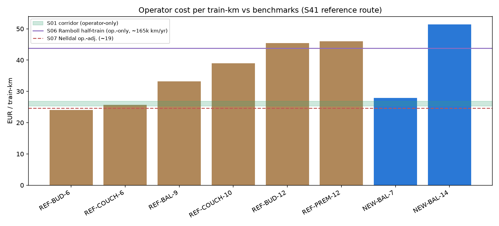
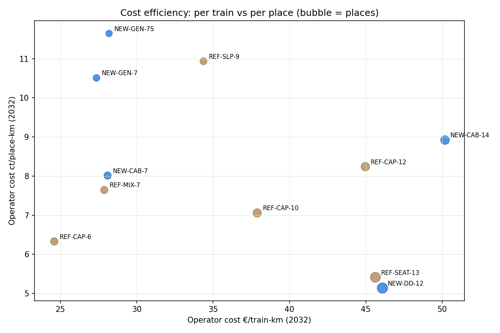
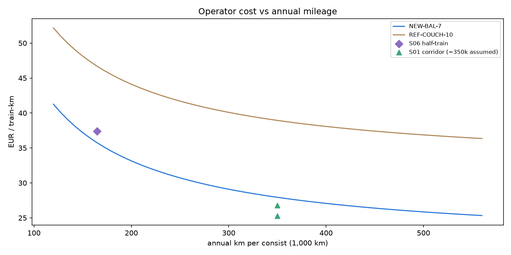
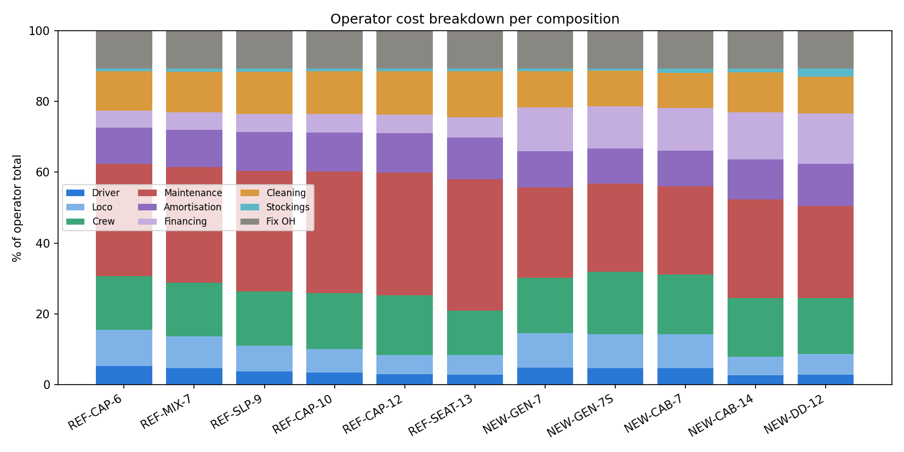

# Composition Cost Calibration — Parameter Documentation

> ### ⚠️ Especially worth to review
> *For review by Back-on-Track — these are the decisions and weak points where domain judgement adds most value, ordered by leverage:*
>
> 1. **Refurbished coach maintenance 1.05 €/coach-km** — highest-impact, lowest-confidence number in the calibration (constructed ×1.3 uplift, zero observations). Does anyone in the network have real workshop-cost experience with legacy night stock (European Sleeper)? → *Coach maintenance (refurbished)*
> 2. **Crew staffing** — now designed per coach in the composition workbook (0 seat / 0.5 couchette / 1 sleeper / 2 dining car + Zugchef 1.19/2.38); review whether these per-coach factors match operational reality. → *Cabin crew cost*
> 3. **Refurbished availability 0.80** — constructed, no observation; any real fleet-reserve figure? → *Coach availability (refurbished)*
> 4. **S01 (nox model) provenance and conventions** — price basis of the 2030 columns (nominal vs compilation-era) and assumed utilization; both flagged TO_VERIFY and both matter downstream. → *Locomotive lease step 4b, Benchmark reconciliation*
> 5. **Loco lease RFQ** — an indicative quote from ELL/Akiem/Railpool via the BoT network would settle the rate, its escalation, the 230 km/h premium and the French €500M/27-loco reading in one step. → *Locomotive full-service lease*
> 6. **Target EBIT 0.10** — a policy choice (ES plan level), deliberately above the PSO-frame 0.03; is that the right advocacy stance? → *Target EBIT margin*
> 7. **Stabling/Abstellung** — the S06 comparison surfaced a cost line (~1–2 €/tkm) our stack may not carry anywhere; needs a calc.py check. → *Benchmark reconciliation*
> 8. **S16 CNL transaction (€40M)** — secondary press, primary 2016 source still wanted. → *Coach purchase cost*

**Contents:** [The eight standard compositions](#the-eight-standard-compositions) · [Calibrated values per composition](#calibrated-values-per-standard-composition) · [What feeds the database](#what-feeds-the-database-and-what-does-not) · [Results & benchmarks](#results-at-a-glance--operator-cost-per-train-km) · [Sensitivity master table](#sensitivity-master-table) · [Parameter documentation](#parameter-by-parameter-documentation) (collapsible) · [Source register](#source-register)

*Generated by `02_calibration.ipynb` on 2026-07-12. Do not edit by hand — re-run the notebook to regenerate.*

This document explains, for every cost parameter of the night train composition model, **which value we use, where it comes from, and why**. It covers operator-controllable costs only; track access, station charges, shunting, parking and traction energy are separate calibration workstreams.

## The eight standard compositions

Redesigned 2026-07-22 on the composition workbook: every composition is an
explicit ordered list of **real coach types** with per-class sections
(length, weight and crew per section). Composition ids stay synthetic;
descriptions anchor to real operations ("similar to"). Crew model:
sum of coach crew factors **plus the Zugchef factor** (1.19 attendant-
equivalents, doubled for formations of ten coaches and more). Service
areas (dining car) are excluded from the revenue space (`wo_service`) and
their cost is carried per passenger — see the class cost allocation model.
Capsule-only concepts (CAB/DD families) are parked pending better data.

| ID | Material | Coaches | Places | Places by class | Coach assignment | Weight (t) | Crew | **€/tkm** | **ct/pl-km** | Description |
|---|---|---|---|---|---|---|---|---|---|---|
| REF-BUD-6 | refurbished | 6 | 388 | Seat 148 · Couchette 240 | Bmpz (74) · 2× Bvcmz (60) · Bmpz (74) · 2× Bvcmz (60) | 331.0 | 3.19 | **24.0** | **6.19** | Small budget oriented formation (seats, couchettes) simliar to Snalltaget |
| REF-COUCH-6 | refurbished | 6 | 216 | Couchette 180 · Sleeper 36 | 5× Bc (36) · WLABm (36) | 317.3 | 4.69 | **25.7** | **11.89** | Small couchette heavy formation simliar to Intercity Notte FS 6-coaches formation |
| REF-BAL-9 | refurbished | 9 | 524 | Seat 348 · Couchette 104 · Sleeper 72 | 2× Bpm (78) · 2× Bmz · Apm · Bcmz (54) · Bvcmbz · WLBmz (DD) · WLABmz (DD) | 511.9 | 4.19 | **33.2** | **6.33** | Balanced  formation with 9 coaches, similar to current SBB/ÖBB-operated consists |
| REF-COUCH-10 | refurbished | 10 | 536 | Seat 56 · Couchette 480 | A10tuh · B8c8ux · A9c9ux · 4× B10c10ux · A9c9ux · 2× B10c10ux | 542.9 | 6.88 | **38.9** | **7.27** | Couchette heavy 10 coach formation (similar to SNCF Intercity nuit) |
| REF-BUD-12 | refurbished | 12 | 600 | Seat 312 · Couchette 180 · Sleeper 108 | 4× B (78) · 5× Bc (36) · 3× WLABm (36) | 648.0 | 7.88 | **45.4** | **7.57** | Large seat and couchette mix simliar to Intercity Notte FS 12-coaches formation |
| REF-PREM-12 | refurbished | 12 | 526 | Seat 66 · Couchette 400 · Sleeper 60 | 2× WLABee · 8× Bvcmz (50) · ARkimmbz · Am | 642.1 | 8.38 | **46.0** | **8.75** | Large couchette and sleeper mix simliar to European Sleeper operation |
| NEW-BAL-7 | new | 7 | 260 | Seat 96 · Couchette 40 · Sleeper 40 · Capsule 84 | Bfmpz · ABbmpvz · 3× Bcmz_5291 · 2× WLAmz_7091 | 319.0 | 4.69 | **27.9** | **10.75** | Similar to OEBB nightjet next generation |
| NEW-BAL-14 | new | 14 | 520 | Seat 192 · Couchette 80 · Sleeper 80 · Capsule 168 | Bfmpz · ABbmpvz · 3× Bcmz_5291 · 4× WLAmz_7091 · 3× Bcmz_5291 · ABbmpvz · Bfmpz | 638.0 | 9.38 | **51.4** | **9.88** | Similar to OEBB nightjet next generation double formation |

### Calibrated values per standard composition

| ID | Material | n | Length (m) | Locos | Zugchef | X (length share) | Amort (y) | Avail | Maint €/train-km | v_max | Loco €/h |
|---|---|---|---|---|---|---|---|---|---|---|---|
| REF-BUD-6 | refurbished | 6 | 158.4 | 1 | 1.19 | 0.7 | 12 | 0.8 | 7.8 | 200 | 161 |
| REF-COUCH-6 | refurbished | 6 | 158.4 | 1 | 1.19 | 0.7 | 12 | 0.8 | 7.8 | 200 | 161 |
| REF-BAL-9 | refurbished | 9 | 237.6 | 1 | 1.19 | 0.7 | 12 | 0.8 | 11.7 | 200 | 161 |
| REF-COUCH-10 | refurbished | 10 | 264.0 | 1 | 2.38 | 0.7 | 12 | 0.8 | 13.0 | 200 | 161 |
| REF-BUD-12 | refurbished | 12 | 316.8 | 1 | 2.38 | 0.7 | 12 | 0.8 | 15.6 | 200 | 161 |
| REF-PREM-12 | refurbished | 12 | 316.8 | 1 | 2.38 | 0.7 | 12 | 0.8 | 15.6 | 200 | 161 |
| NEW-BAL-7 | new | 7 | 185.7 | 1 | 1.19 | 0.7 | 30 | 0.909 | 7.0 | 230 | 174 |
| NEW-BAL-14 | new | 14 | 371.4 | 1 | 2.38 | 0.7 | 30 | 0.909 | 14.0 | 230 | 174 |

Purchase per the per-metre model (new 145 / refurbished 53 k€/m × composition
length incl. service coaches); cleaning 364 €/coach/day; class stockings
0.25/0.60/1.50/1.00 €/place (seat/couchette/sleeper/capsule) — all per the
parameter sections below.

### Class cost allocation model (2026-07-22)

Composition costs are allocated to class_mains in two steps, mirroring the
workbook mechanism exactly (verified to 5 decimals against it):

1. **Revenue space** — each class's raw weight = X · (section length /
   composition length excl. service) + (1−X) · (section weight / weight
   excl. service), **normalised to sum to 1** (workbook section weights
   carry a small excl_service quirk for the NEW family, so raw values can
   sum slightly above 1). **X = length_cost_prop, per composition,
   currently 0.7 for all**.
2. **Service areas** (dining car) — their cost fraction (same X-blend of the
   servicing share) is allocated **per place**: every passenger pays equally
   for shared areas regardless of class.

Resulting shares (seeded to `class_cost_allocation.csv`; shares sum to 1):

| ID | Seat | Couchette | Sleeper | Capsule |
|---|---|---|---|---|
| REF-BUD-6 | 0.33469 | 0.66531 | — | — |
| REF-COUCH-6 | — | 0.83333 | 0.16667 | — |
| REF-BAL-9 | 0.55171 | 0.21903 | 0.22925 | — |
| REF-COUCH-10 | 0.10011 | 0.89989 | — | — |
| REF-BUD-12 | 0.33748 | 0.41407 | 0.24844 | — |
| REF-PREM-12 | 0.09441 | 0.73063 | 0.17496 | — |
| NEW-BAL-7 | 0.22144 | 0.19814 | 0.28143 | 0.29898 |
| NEW-BAL-14 | 0.22144 | 0.19814 | 0.28143 | 0.29898 |

Example (REF-PREM-12): the workbook's revenue-space seat share is 0.0916;
including the per-head dining-car share it becomes 0.0944 — seat passengers
pick up their equal slice of the shared areas.

## What feeds the database (and what does not)

The tables above are the seed payload; everything else in this document is derivation, verification and analysis. Mapping to DB targets (seed emission itself is a separate, later work step):

| DB target | Values from this calibration | Status |
|---|---|---|
| `operators` (calibrated standard operator) | driver 90.33 · attendant 69.67 · financing 0.04 · fix overhead 0.12 · var overhead 0.08 · EBIT 0.10 | ready; **fix overhead requires the calc.py base change (pending, CALC_VERSION bump)** |
| `operators.operator_loco_lease_eur_h` | 161 (REF) / 174 (NEW) | DECIDED 2026-07-21: two operator rows (STD-REF / STD-NEW); evaluation selects by composition material — no schema change |
| Zugchef 83.15 | `composition_type_zugchef_crew_factor` (1.19 attendant-equivalents, 2.38 for ≥10-coach formations), priced at the attendant rate; total crew = Σ coach crew factors + Zugchef factor | DECIDED 2026-07-22 (workbook design) |
| `composition_types` (× 8) | per the calibrated-values table, plus new columns: `n_locos`, `zugchef_crew_factor` (1.19 / 2.38), `length_cost_prop` (X of the allocation model), `food_and_beverages` (structured), individual `hsr_allowed` and `max_speed` | ready; **new columns need the step-3 schema change** |
| `coach_types` / `coach_type_classes` / `composition_type_coaches` | 24 **real coach types** with lengths/weights incl. and excl. service areas, crew factors, amenities (wifi/bikes/aircon/plugs), and per-class sections (class_id = "<coach> - <section label>", with section length/weight for the allocation model) | ready (workbook 2026-07-22) |
| `service_classes` stockings | seat 0.25 · couchette 0.60 · capsule 1.00 · sleeper 1.50 (catering entry dropped) | ready |
| `operators.driver/crew_overhead_h` | — | **columns to be DROPPED** (schema change pending) |
| NOT in DB | reference route (S41), sensitivity analysis, benchmarks, confidence ratings, class-factor spread (S06) | documentation only |

## Price basis policy (2026-07-21)

All monetary parameters follow one of three rules, so every value's year is deliberate rather than accidental:

1. **Recurring operating rates → nominal 2032** (the evaluation year): driver, crew, loco lease, coach maintenance — escalated from their source basis at the documented chain (wage chain S19–S21 for labour; 2%/yr general escalation otherwise). *Cleaning (364) is escalated under the assumption that the S01 basis is 2030-nominal — the same convention assumption applied to the S01-derived loco rate; stockings are exempt as the adjustment sits below their ±50%-class uncertainty. The S01 price-basis TO_VERIFY, if it resolves differently, moves both S01-derived rates together.*
2. **Capital → contract-window basis, deliberately NOT escalated**: rolling stock for a 2032 network is contracted ~2027–2030; amortisation and financing run off the historical contract price, so mid-2020s contract levels are the correct base for a 2032 P&L — escalating them to 2032 would double-count inflation.
3. **Dimensionless parameters** (quotas, periods, availability, dd_premium) → no price basis by construction.

**Benchmark comparability:** the same discipline applies to external figures — every benchmark below is shown with its source price year and normalized to 2032 at 2%/yr, because a 2012-price corridor against 2032 rates is an optical illusion, not a validation:

| Benchmark | Source price year | As published (op.-only) | × to 2032 | **2032-normalized** |
|---|---|---|---|---|
| S01 BoT base corridor | ~2030-nominal (TO_VERIFY) | 24.35–25.74 €/tkm | 1.04 | **25.3–26.8 €/tkm** |
| S06 Ramboll half-train | ~2024 (study 2025, inputs 2021–25) | 37.4 €/tkm @ ~165k km/yr | 1.17 | **43.8 €/tkm @ ~165k** |
| S07 Nelldal | ~2019 assumed (older KTH work quoted in the 2025 study — year uncertain) | ~19 €/tkm | 1.29 | **~24.6 €/tkm** |
| S02 UIC Night Trains 2.0 | 2012 (study 2013) | ~3.5 ct/seat-km op.+energy | 1.49 | **~5.2 ct/seat-km** |

## Results at a glance — operator cost per train-km

Operator-controllable costs only (track/station access, OPS infrastructure and traction energy excluded — separate workstreams; var_overhead and EBIT excluded from the cost stack as revenue-side add-ons: required revenue = operator cost / (1 − 0.08 − 0.10) = cost / 0.82).

**Reference route (S41, revised 2026-07-20):** grounded in the Back-on-Track Open Night Train Database — sample: Praha–Zürich 915 km @ 63 km/h (15:40 / 13:26), Zürich–Hamburg 1,011 km @ 87 km/h (11:01 / 12:21), Wien–Hamburg 13:32 / 14:29. Typical real night train: ~1,000 km at ~63–87 km/h → reference: **1,000 km, 14.5 h trip, 15.5 loco-h**, 350 operating days, 2 trainsets, 700,000 train-km/yr. (Supersedes the earlier synthetic 12 h trip, which at 83 km/h underweighted the time-based cost lines by ~20%.) Crew staffing assumption: 0.25 attendants per seat coach, 0.5 per couchette/sleeper/capsule coach, 1.0 per catering coach, plus one train manager (83.15 EUR/h) per train — to be confirmed per coach type. Stockings occupancy 1.0.

| ID | **€/train-km** | **ct/place-km** | Driver+Loco | Crew | Maintenance | Capital (amort+fin) | Cleaning | Stockings | Fix OH |
|---|---|---|---|---|---|---|---|---|---|
| REF-BUD-6 | **24.0** | **6.19** | 3.8 | 3.2 | 7.8 | 3.7 | 2.7 | 0.18 | 2.6 |
| REF-COUCH-6 | **25.7** | **11.89** | 3.8 | 4.7 | 7.8 | 3.7 | 2.7 | 0.16 | 2.8 |
| REF-BAL-9 | **33.2** | **6.33** | 3.8 | 4.2 | 11.7 | 5.5 | 4.1 | 0.26 | 3.6 |
| REF-COUCH-10 | **38.9** | **7.27** | 3.8 | 7.0 | 13.0 | 6.2 | 4.5 | 0.30 | 4.2 |
| REF-BUD-12 | **45.4** | **7.57** | 3.8 | 8.0 | 15.6 | 7.4 | 5.5 | 0.35 | 4.9 |
| REF-PREM-12 | **46.0** | **8.75** | 3.8 | 8.5 | 15.6 | 7.4 | 5.5 | 0.35 | 4.9 |
| NEW-BAL-7 | **27.9** | **10.75** | 4.0 | 4.7 | 7.0 | 6.2 | 2.8 | 0.19 | 3.0 |
| NEW-BAL-14 | **51.4** | **9.88** | 4.0 | 9.5 | 14.0 | 12.4 | 5.6 | 0.38 | 5.5 |

Fleet average: **36.6 €/train-km** (unweighted).

**Benchmark comparison (operator-only, 2032-normalized — see price basis policy):**
- **S01 BoT base corridor → 25.3–26.8 €/train-km (2032):** our efficient formations (REF-BUD-6 24.0, REF-COUCH-6 25.7, NEW-BAL-7 27.9) sit on this corridor; capacity/premium formations run above it, as they must — S01 describes one ~7.5-coach reference train, not 12–14-coach formations.
- **S06 Ramboll half-train → 43.8 €/tkm @ ~165k km/yr (2032):** see the mileage reconciliation below — our NEW-GEN-7 evaluated at their mileage gives 35.7; the 8.1 residual is exactly their ×1.6 capital-accounting factor on the capital share. The models agree once mileage, price year and capital method are aligned. Their 6.39 ct/place-km total → ~5.4 ct operator-only → **~6.3 ct at 2032**: our densest formations REF-BUD-6 (6.19) and REF-BAL-9 (6.33) come closest on density.
- **S07 Nelldal → ~24.6 €/tkm (2032, price year assumed ~2019 — uncertain):** lands inside the S01 corridor once normalized — what looked like a low outlier at published prices was mostly price-year distance.
- **S02 UIC NT 2.0 → ~5.2 ct/seat-km operator+energy (2032, from 2012 basis):** consistent with our high-capacity formations; their 500+-seat HS concepts at ~550k km/yr remain the utilization frontier.
- **Two Ramboll studies — disambiguation:** the *Berlin Drehkreuz* study (S08, 2023) was checked in full and contains **no** operator cost model — checked-empty stands. "The Ramboll study" with the cost model is the *BMDV Nachtzugstudie* (S06/S07, 2025) — benchmarked above.
- Revenue-requirement cross-check: S06/S07's 60–250 EUR/place viability band corresponds to our per-place costs × the 1/0.82 gross-up at plausible occupancies.

### Benchmark reconciliation: cost vs annual mileage

The gap between the S06 half-train (43.8 at 2032 prices) and our comparable NEW-BAL-7 (27.9) decomposes into operational assumptions, not rate levels — on pure prices our inputs are *higher* (coaches €3.83M flat vs their €2.97M mix; denser staffing at top-of-Europe wages): (1) **annual mileage** — their implied ~150–180k km/consist-yr vs our 350k (nightly year-round): every annual fixed cost halves per km at double mileage, worth ~+8–10 €/tkm; (2) **capital accounting** — their 6.5% interest on the undiminished invest + linear AfA ≈ 11.7%/yr of invest vs our amortisation + financing quota ≈ 7.3%/yr (×1.6 on the capital charge — both methods defensible: theirs matches a rental/annuity world, and converges with the French 15-year rental datapoint; ours is ownership economics); (3) **stabling/shunting (Abstellung)** — an explicit S06 cost line our stack carries nowhere: **TO_VERIFY whether calc.py covers stabling anywhere; if not, candidate parameter (~1–2 €/tkm)**.

Evaluated at *their* mileage, our NEW-BAL-7 curve gives 35.7 €/tkm; the remaining 8.1 to their 2032-normalized 43.8 is exactly the ×1.6 capital-method factor on the capital share — the reconciliation closes numerically — the corridor between the models is substantially a utilization-and-capital-method corridor.

**Conclusion — route-concrete vs fixed-mileage models (2026-07-20):** the mileage dependency shown above is a *benchmarking artefact of this document*, not a property of the model. Study models (S06, S02, S01) must assume one average annual mileage to produce a single €/train-km figure — and the choice of that average drives their results more than any rate, as the curves demonstrate. **Our evaluation model assumes no mileage at all: it prices each concrete route with its actual length, trip time, and operating pattern**, so utilization is an *output* of the route under evaluation, not an arbitrary input. The fixed 350k km reference in this document exists only to make the calibration comparable to the studies; in production, a route that runs 250 nights instead of 350 automatically carries its true (higher) capital cost per km — which is exactly right, and which no fixed-mileage study model can express. Two consequences: (1) our per-route results are structurally more realistic than any single-average benchmark, and deviations from study figures on individual routes are expected and correct; (2) the utilization lever remains decision-relevant — not as a calibration uncertainty, but as network-design guidance: the model will visibly penalise low-frequency routes, and it should.

### Operator cost breakdown per composition (% of operator total)

| ID | Driver+Loco | Crew | Maintenance | Capital | Cleaning | Stockings | Fix OH |
|---|---|---|---|---|---|---|---|
| REF-BUD-6 | 16% | 13% | 32% | 15% | 11% | 0.8% | 11% |
| REF-COUCH-6 | 15% | 18% | 30% | 14% | 11% | 0.6% | 11% |
| REF-BAL-9 | 11% | 13% | 35% | 17% | 12% | 0.8% | 11% |
| REF-COUCH-10 | 10% | 18% | 33% | 16% | 12% | 0.8% | 11% |
| REF-BUD-12 | 8% | 18% | 34% | 16% | 12% | 0.8% | 11% |
| REF-PREM-12 | 8% | 18% | 34% | 16% | 12% | 0.8% | 11% |
| NEW-BAL-7 | 14% | 17% | 25% | 22% | 10% | 0.7% | 11% |
| NEW-BAL-14 | 8% | 18% | 27% | 24% | 11% | 0.7% | 11% |
| **S01 2030 (benchmark)** | 11% | 10% | 21% | 23% | 10% | 1% | 19%¹ |
| **S06 half-train (benchmark)²** | ─ 13%³ ─ | 53.6% (rolling stock: capital+maint) | ─ | 16.7% | ─ | 13.1% |

¹ S01 shares from the account structure (operator-only base 25.74).
² S06 pie renormalized to operator-only (÷ 0.84 after removing Energie 9% + Trasse/Station 7%): Rollmaterial 53.6% (capital AND maintenance bundled — spans our maintenance+capital+part of loco columns), Personal 13.1% (driver+crew), Reinigung/Abstellung 16.7% (our cleaning+stabling), Overhead 13.1%. Their category cut differs from ours, so the row is aligned by closest match, not column-exact.
³ Personnel covers driver and crew together in S06. Structural differences: S01's coach leasing bundles heavy revisions (ours sit in maintenance → our maintenance share higher, capital lower); S01's overhead includes external OPS services; our crew share exceeds S01's 10% because the role-split manager and per-coach staffing price a fuller service level.

**Reading the fleet:** capacity formations win on ct/place-km (NEW-DD-12 4.82 and REF-SEAT-13 4.96 cheapest; REF-SLP-9 10.08 and the GEN-7 pair ~9.9–11.0 most expensive — premium comfort costs per place, as it should). Maintenance remains the largest operator cost line fleet-wide, with crew now second on the corrected route — see the sensitivity master table below.

## Parameter-by-parameter documentation

| Parameter | Value | Unit | Basis | Confidence |
|---|---|---|---|---|
| Driver cost | **90.33** | EUR per deployment hour | S17+S19+S20+S21; wage level verified vs FR/IT/SE/AT (S22–S25) | HIGH |
| Cabin crew cost | **69.67** attendant · **83.15** train manager (via crew factor ×1.19) | EUR per deployment hour | S17+S19+S20+S21; roles split; verified vs FR/IT/SE/AT (S24, S26–S28) | MEDIUM-HIGH |
| Locomotive full-service lease | **161.0** ≤200 km/h · **174** 230 km/h config · n/a >230 | EUR per loco operating hour (2032) | S01-derived, escalated 2030→2032; verified vs ELL accounts (S29) and ČD tenders (S34) | MEDIUM |
| Financing quota | **0.04** | share of purchase cost per year | project decision; band 0.01–0.11 anchored by ES terms (S03), Italo actuals (S35) and S17 | MEDIUM |
| Fixed overhead quota | **0.12** | share of all other operating costs | derived from S01; independently reproduced by Italo 2019 actuals (S35); band floor 0.06 (S04) | HIGH |
| Variable overhead quota | **0.08** | share of ticket revenue | derived from S01; Italo actuals 0.058 (S35) and ES floor (S04) as context | MEDIUM-HIGH |
| Target EBIT margin | **0.10** | share of ticket revenue | ES plan margin adopted (S04); band 0.03 (PSO frame) to ~0.33 (Italo actuals, S33/S35) | MEDIUM |
| Amortisation period (new coaches) | **30** | years | S17 Tab. 7-4; redesign-at-15y gap documented | HIGH |
| Amortisation period (refurbished coaches) | **12** | years | S18 TET renovation horizon; part of the new/refurb parameter family | MEDIUM |
| Coach purchase cost | **145** new · **53** refurb (k€/m) · DD ×1.12 | per metre of coach | per-metre regression over 5 contract anchors (S34, S36–S39); Škoda floor 75; Talgo excluded (scope) | MEDIUM |
| Coach availability (new) | **0.909** | share | bvwp_update_2024 | HIGH |
| Coach availability (refurbished) | **0.8** | share | project decision (documented) | LOW-MEDIUM |
| Cleaning & service preparation | **364** | EUR per coach per operating day (2032) | derived from S01; Italo day-HS 77 EUR/car/day as lower-bound context (S35) | MEDIUM |
| Coach maintenance (new) | **1.00** | EUR per coach-km (2032) | bvwp_update_2024; Italo HS 0.38 EUR/car-km as non-comparable context (S35) | HIGH |
| Coach maintenance (refurbished) | **1.30** | EUR per coach-km (2032) | project decision (documented) | LOW-MEDIUM |
| Service & stockings — Seat | **0.25** | EUR per place per trip | derived from the BoT base assumption (S01) | LOW-MEDIUM |
| Service & stockings — Couchette | **0.6** | EUR per place per trip | derived from the BoT base assumption (S01) | LOW-MEDIUM |
| Service & stockings — Sleeper | **1.5** | EUR per place per trip | derived from the BoT base assumption (S01) | LOW-MEDIUM |
| Service & stockings — Capsule/Mini-Cabin | **1.0** | EUR per place per trip | documented assumption | LOW-MEDIUM |

### Sensitivity master table

Fleet-average operator cost on the reference route: **36.58 €/train-km** (unweighted mean over the eight compositions) (operator-controllable scope). Each cell shows the resulting fleet-average €/train-km when the parameter is moved **down / up** by the column percentage — full recomputation, so non-linear parameters (availability, amortisation periods) are exact, not linearised. Impact = %-change of the fleet average per +10% parameter change. Rows sorted by impact. Confidence assesses the source basis (details in each parameter section).

| Parameter | Value | Confidence | Impact | ±1% | ±10% | ±20% | ±50% |
|---|---|---|---|---|---|---|---|
| Coach maintenance, refurbished | 1.30 €/coach-km | LOW-MEDIUM | **HIGH** (+2.7%/10%) | 36.5 / 36.7 | 35.6 / 37.6 | 34.6 / 38.6 | 31.6 / 41.6 |
| Coach availability, refurbished | 0.80 | LOW-MEDIUM | **HIGH** (-2.1%/10%) | 36.7 / 36.5 | 37.5 / 35.8 | 38.6 / 35.2 | 44.8 / 34.9 |
| Cabin crew (attendant incl. Zugchef factors) | 69.67 €/h | MEDIUM-HIGH | **HIGH** (+1.9%/10%) | 36.5 / 36.6 | 35.9 / 37.3 | 35.2 / 38.0 | 33.1 / 40.1 |
| Coach purchase rate, refurbished | 53 k€/m | MEDIUM | **MEDIUM** (+1.3%/10%) | 36.5 / 36.6 | 36.1 / 37.0 | 35.6 / 37.5 | 34.2 / 38.9 |
| Cleaning & service preparation | 364 €/coach/day | MEDIUM | **MEDIUM** (+1.3%/10%) | 36.5 / 36.6 | 36.1 / 37.0 | 35.6 / 37.5 | 34.2 / 38.9 |
| Fixed overhead quota | 0.12 | HIGH | **MEDIUM** (+1.1%/10%) | 36.5 / 36.6 | 36.2 / 37.0 | 35.8 / 37.4 | 34.6 / 38.5 |
| Coach availability, new | 0.909 | HIGH | **MEDIUM** (-0.9%/10%) | 36.6 / 36.5 | 37.0 / 36.2 | 37.5 / 36.2 | 40.4 / 36.2 |
| Financing quota | 0.04 | MEDIUM | **MEDIUM** (+0.8%/10%) | 36.5 / 36.6 | 36.3 / 36.9 | 36.0 / 37.2 | 35.1 / 38.1 |
| Coach maintenance, new | 1.00 €/coach-km | HIGH | **MEDIUM** (+0.8%/10%) | 36.5 / 36.6 | 36.3 / 36.9 | 36.0 / 37.2 | 35.1 / 38.0 |
| Amortisation period, refurbished | 12 y | MEDIUM | **LOW** (-0.8%/10%) | 36.6 / 36.5 | 36.9 / 36.3 | 37.4 / 36.0 | 39.8 / 35.5 |
| Loco lease (by material) | 161 / 174 €/h | MEDIUM | **LOW** (+0.8%/10%) | 36.5 / 36.6 | 36.3 / 36.9 | 36.0 / 37.1 | 35.1 / 38.0 |
| Coach purchase rate, new | 145 k€/m | MEDIUM | **LOW** (+0.7%/10%) | 36.5 / 36.6 | 36.3 / 36.8 | 36.1 / 37.1 | 35.3 / 37.9 |
| Driver cost | 90.33 €/h | HIGH | **LOW** (+0.4%/10%) | 36.6 / 36.6 | 36.4 / 36.7 | 36.3 / 36.9 | 35.8 / 37.3 |
| Amortisation period, new | 30 y | HIGH | **LOW** (-0.3%/10%) | 36.6 / 36.6 | 36.7 / 36.5 | 36.9 / 36.4 | 37.8 / 36.2 |
| Service & stockings (all classes) | 0.25–1.50 €/pl | LOW-MEDIUM | **LOW** (+0.1%/10%) | 36.6 / 36.6 | 36.5 / 36.6 | 36.5 / 36.6 | 36.4 / 36.7 |
| **Annual mileage / utilization (350k km/consist-yr)** | 350 days × 1,000 km | assumption | **HIGH, asymmetric** (-1.8% / +2.2% per ±10%) | 36.6 / 36.5 | 37.4 / 35.9 | 38.4 / 35.3 | 43.9 / 34.1 |
| Variable overhead quota | 0.08 | MEDIUM-HIGH | revenue-side | — | required revenue +0.98% at +10% | +1.99% | +5.13% |
| Target EBIT margin | 0.10 | MEDIUM | revenue-side | — | required revenue +1.23% at +10% | +2.50% | +6.94% |

**External validation (S06):** the BMDV/Ramboll study ran its own cost-parameter variations on the same model class — financing 10% vs 6.5% → +15% per place; halving attendants → ≈−5%; longer runs improving €/tkm — the same lever ranking (capital/financing and crew as first-order, staffing as its own lever) that our master table produces independently.

**Confidence × impact reading (what to worry about first):**
0. **Annual mileage (350k km/consist-yr) — an assumption of this document's reference route only, with the largest asymmetric leverage in the table** (−50% → +22%). In the evaluation model itself utilization is route-concrete, not assumed — see the conclusion under Benchmark reconciliation; the leverage translates into network-design guidance (low-frequency routes are structurally expensive), not calibration uncertainty.
1. **Maintenance (refurbished), 1.05 — LOW-MEDIUM confidence, HIGH impact** (+1.8% per +10%): the constructed ×1.3 uplift is the single riskiest number in the calibration. An operator disclosure (ES) or workshop-contract datapoint would upgrade it — highest-priority TO_VERIFY.
2. **Crew rates — HIGH impact (+1.9%), MEDIUM-HIGH confidence** — but the *staffing rule* (0.25/0.5 per coach + manager) is an undocumented assumption with the same leverage again: crew cost scales with rate × headcount. Confirming crew factors per coach type is as valuable as the rate itself.
3. **Availability (refurbished), 0.80 — LOW-MEDIUM confidence**, asymmetric impact (downside +2.0%/−10%): no observation exists; a real fleet-reserve figure would settle it.
4. The **HIGH-confidence heavyweights** (maintenance new, fixed overhead, driver, availability new) are well-anchored — movement there is unlikely.
5. **Purchase rates** are MEDIUM/HIGH-impact and driven by a small anchor set — every future order (or Gebrauchtzug bid level) mechanically tightens them.

### Driver cost

<b>Driver cost</b> — 90.33 <i>(click to expand derivation)</i>

**Value: 90.33** (EUR per deployment hour)

**Why this value:** 2021 basis (S17 Tab. 7-2, 68.30 EUR/h) indexed to 2032 via the sourced EVG/DB wage chain (S19/S20) plus a documented 2.5%/yr assumption 2028-2032 (S21); compounded factor x1.3225. Cross-country comparison against four European operators confirms the German wage basis is representative.

**Derivation, step by step:**

| # | Step | What we did | Result |
|---|---|---|---|
| 1 | Collect observations | Gathered driver cost candidates: seed placeholder 52.0 EUR/h (S13, low confidence), thesis value 57.0 EUR/h from the 2016 BVWP Methodikhandbuch (S09, medium), and the Dec 2024 BVWP rate update 68.30 EUR/deployment-hour, 2021 tariff basis (S17, high) | 3 candidates |
| 2 | Select basis | Took S17 as the basis — primary, current, and the only source with a defined deployment-hour methodology; supersedes the 2016-basis S09 value | 68.30 EUR/h (2021) |
| 3 | Roster efficiency | Kept S17's embedded 60% Dienstplanwirkungsgrad (raw wage 40.95 EUR/h ÷ 0.60 = 68.30) and set driver_overhead_h to 0 — a separate per-trip allowance would double-count standby/prep/positioning already priced into the deployment-hour rate | conversion embedded, overhead = 0 |
| 4 | Index 2021 → 2032 | Applied the sourced EVG/DB wage chain: +200 EUR/month flat (Dec 2023) and +410 EUR/month flat cumulative (Aug 2024) per S19 — flat steps applied against the driver's own 2021 base salary of 41,691 EUR/yr (S17 Tab. 7-1); then +2.0% (Jul 2025) and +2.5% (Jul 2026) per S20; then +2.5%/yr for 2028–2032 as a documented assumption anchored to the ECB medium-term HICP target (S21). Compounded factor ×1.3225 (sensitivity 2.0–3.0%/yr: 1.2905–1.3551×) | 90.33 EUR/h (2032) |
| 5 | Cross-country check | Compared the underlying annual wage against France ~44k (S22, low confidence), Italy ~34k (S23, low confidence), Sweden ~45k (S24, official SJ pay scale), Austria ~54k (S25, official ÖBB figure) — see figures below. German 2021 base is mid-pack; the 2032-indexed 55.1k lands only slightly above Austria's current level | wage basis confirmed representative |
| 6 | Decision (2026-07-20) | No adjustment warranted — the 90.33 figure reads high only because of the deployment-hour conversion (step 3), not the wage level | **90.33 EUR/h kept** |

**Sensitivity** (fleet-avg 36.6 €/train-km, reference route S41): ±10% → +0.40% / ±20% → +0.80% / ±50% → +2.01% on the fleet-average operator €/train-km; see the sensitivity master table.

**S06 cross-check (2026-07-20):** the BMDV/Ramboll model prices drivers at 62–104 €/h across its 15 countries — our 90.33 €/deployment-h sits in the upper-middle of that sourced range (consistent with a German basis plus full roster-inefficiency loading).

**Sources:** S17 (Aktualisierung der Kosten- und Wertansätze der Bundesverkehrswegeplanung, Tab. 7-1/7-2 — primary basis, 2021 tariff level, roster efficiency embedded); S19 (DB-EVG Tarifabschluss 2023 — flat-rate steps Dec 2023/Aug 2024); S20 (DB-Tarifrunde 2025 — percentage steps Jul 2025/Jul 2026); S21 (ECB December 2025 staff projections — 2028–2032 growth assumption); S09 (Schönerstedt thesis, 2016-basis BVWP value — considered, superseded); S13 (seed placeholder — replaced). Cross-country verification: S22 (France, salary aggregators, low confidence — no official rate card found); S23 (Italy, salary aggregators, low confidence — no official rate card found); S24 (Sweden, SJ AB's own official pay scale, medium-high confidence); S25 (Austria, ÖBB's own careers page, high confidence).

### Cabin crew cost

<b>Cabin crew cost</b> — 69.67 <i>(click to expand derivation)</i>

**Value: 69.67** (EUR per deployment hour, train attendant) — **train manager: 83.15 EUR/h, applied via crew factors**

**Why these values:** S17 prices the two onboard roles very differently (Zugbetreuer 51.30 vs Zugchef 62.70 EUR/deployment-hour, 2021 basis), so they are calibrated separately rather than blended. crew_eur_h carries the attendant rate; a train manager, where carried, enters through the coach crew factors at the indexed Zugchef rate (ratio ×1.19). Both indexed 2021 → 2032 with the same wage chain as driver_eur_h, each against its own base salary.

**Derivation, step by step:**

| # | Step | What we did | Result |
|---|---|---|---|
| 1 | Collect observations | Gathered crew cost candidates: seed placeholder 38.0 EUR/h (S13, low), thesis values 49.0 (Zugführer) and 39.0 (Zugbegleiter) EUR/h from the 2016 BVWP basis (S09, medium), and the Dec 2024 BVWP rate update with two distinct roles — Zugbetreuer 51.30 and Zugchef 62.70 EUR/deployment-hour, 2021 tariff basis (S17, high) | 5 candidates, 2 roles |
| 2 | Separate the roles | Kept Zugbetreuer and Zugchef as separate rates instead of one blended crew value — the ~22% gap between them is too large to average away, and composition types differ in whether a train manager is carried at all | 2 rates: 51.30 / 62.70 (2021) |
| 3 | Roster efficiency | Kept S17's embedded 70% Dienstplanwirkungsgrad for onboard staff (Zugbetreuer raw 35.90, Zugchef raw 43.91 EUR/h) and set crew_overhead_h to 0 — same double-counting logic as driver | conversion embedded, overhead = 0 |
| 4 | Index 2021 → 2032 | Same wage chain as driver_eur_h (S19 flat steps, S20 percentage steps, S21-anchored 2.5%/yr 2028–2032), applied against each role's own 2021 base salary because the 2023/24 steps were flat EUR amounts. Zugbetreuer: base 33,227 EUR/yr (S17 Tab. 7-1) → factor ×1.3580. Zugchef: base ~40,641 EUR/yr — estimated from the raw-rate ratio, **TO_VERIFY against S17 Tab. 7-1** → factor ×1.3261. The lower-paid attendant gets the larger relative uplift from the flat steps | 69.67 / 83.15 EUR/h (2032) |
| 5 | Cross-country check | Compared annual gross for both roles against peer operators (see figure): attendants — France ~33k (S26, low confidence), Sweden ~33.2k (S24, official SJ scale, tågvärd), Austria ~48.8k (S28, official ÖBB, incl. allowances and 14 salaries — richer basis than the German Tab. 7-1 base); train managers — France chef de bord ~42k (S26, low), Italy capotreno ~33.1k (S27, low), Sweden tågmästare ~36.9k (S24, official), Austria Bordservice coordinator ~58.4k (S28, official). No separately sourced Italian attendant figure found. German 2032-indexed values (45.1k / 53.9k) sit inside the span between the Scandinavian and Austrian levels for both roles | wage basis confirmed representative |
| 6 | Model application | crew_eur_h = 69.67 (attendant). Train manager representable per composition via coach crew factors at ratio 83.15/69.67 ≈ 1.19 — no schema change | **69.67 EUR/h; manager ×1.19 via crew factor** |
| 7 | Decision (2026-07-20) | Both rates kept; role split documented. Open item: verify the Zugchef 2021 base salary against S17 Tab. 7-1 (currently ratio-estimated) | **kept, 1 TO_VERIFY** |

**Sensitivity** (fleet-avg 36.6 €/train-km, reference route S41): ±10% → +1.91% / ±20% → +3.81% / ±50% → +9.53% on the fleet-average operator €/train-km; see the sensitivity master table. The staffing basis is now the workbook's per-coach crew factors + the Zugchef factor (1.19, doubled ≥10 coaches) — a design decision, no longer a generic rule assumption.

**S06 cross-check (2026-07-20):** BMDV/Ramboll prices Zugführer at 45–70 €/h and Betreuer at 32–47 €/h (15-country ranges). Our 83.15/69.67 sit *above* those bands — but reconcile once roster efficiency is applied: their ranges read as productive-hour rates, and 47 ÷ 0.70 Dienstplanwirkungsgrad ≈ 67 ≈ our attendant deployment-hour rate. The comparison therefore verifies the level rather than contradicting it — and confirms our rates price the top of the European wage range (German basis), with Ungarn/Kroatien-style employment (their variation E.2) as the documented cheap end.

**Sources:** S17 (BVWP rate update Tab. 7-1/7-2 — primary basis for both roles, 2021 tariff level, roster efficiency embedded); S19/S20/S21 (wage chain — same as driver_eur_h); S09 (thesis, 2016-basis values — considered, superseded); S13 (seed placeholder — replaced). Cross-country verification: S26 (France, contrôleur/chef de bord salary aggregators, low confidence); S27 (Italy, capotreno aggregators + Glassdoor Trenitalia, low confidence — no attendant-level figure found); S24 (Sweden, Seko/SJ AB official pay scale — tågvärd and tågmästare final-step rows); S28 (Austria, ÖBB Karriere Zugbegleiter:in page — official, note the annual figure includes allowances and 14 salaries).

### Locomotive full-service lease

<b>Locomotive full-service lease</b> — 161.0 <i>(click to expand derivation)</i>

**Value: 161.0** (EUR per loco operating hour, 2032, ≤200 km/h configuration) · **230 km/h configuration: 174** (documented +8% assumption, midpoint of the +5–10% band, TO_VERIFY via RFQ) · not applicable above 230 km/h (configuration break)

**Why this value:** derived by splitting the BoT base traction benchmark (S01 row 211) into driver and loco shares, price-level-consistently, giving 155 EUR/h at the benchmark's price basis; that basis is ASSUMED to be nominal 2030 (S01's convention is not documented — flagged TO_VERIFY) and escalated 2030→2032 at a blended 2.0%/yr ROSCO cost-escalation assumption → 161 EUR/h. Independently verified at the pre-escalation level by a per-locomotive cost reconstruction from the audited 2021 accounts of ELL, Europe's largest Vectron lessor (S29): ~150–157 EUR/h for a new passenger-configured multi-system loco on a dedicated night diagram including reserve provision.

**Derivation, step by step:**

| # | Step | What we did | Result |
|---|---|---|---|
| 1 | Collect observations | Gathered candidates: seed placeholder 145 EUR/h (S13, low), thesis loco values 120 EUR/h capital + 2.0 EUR/km maintenance separately (S09, medium — different cost split than our bundled lease abstraction), and the BoT base traction benchmark 2.819 EUR/tkm for 2030 (S01, medium-high — aggregate, needs splitting) | 3 candidate bases |
| 2 | Select basis | Took the S01 benchmark as basis — the only observation aligned with the project's own scenario assumptions, at the cost of requiring a driver/loco split | 2.819 EUR/tkm (2030) |
| 3 | Split driver share | Subtracted a driver cost estimate priced deliberately at the UN-indexed (~2021/2030) S17 level (0.82 EUR/tkm) to stay price-level-consistent with the un-indexed S01 benchmark — using the 2032-indexed driver rate here would mix price levels within one equation. This one derivation is therefore NOT itself wage-indexed to 2032 (see wage indexation note, section 7) | 2.0 EUR/tkm loco share |
| 4 | Convert to per-hour | Applied **S01's own trip geometry** (~1,000 km, 13 loco-h — the source model's reference train, deliberately NOT the S41 evaluation route, whose 15.5 loco-h describe today's slower real routes; a source-value conversion must use the source's geometry): 2.0 EUR/tkm × 1,000 km / 13 loco-h per trip | ≈ 154 → 155 EUR/h (at S01 basis) |
| 4b | Price-basis audit | S01 does not document whether row 211's 2.819 EUR/tkm is nominal-2030 or a compilation-era (~2021/22) real value labelled for the 2030 scenario. **ASSUMED: nominal 2030** — the less conservative branch; the compilation-era reading would imply ~175–180 EUR/h for 2032 instead. **TO_VERIFY against the S01 sheet conventions** | 155 EUR/h taken as 2030-nominal |
| 4c | Escalate 2030 → 2032 | Applied a blended ROSCO cost-escalation assumption of 2.0%/yr: the lease rate decomposes (per S29) into ~half depreciation (driven by rolling-stock producer prices, ~1.5–2.5%/yr long-run), maintenance (wage-dominated, ~2.5%/yr) and capital return (interest-rate-driven, held flat at the S29-observed 4% — a zero-rate-era figure; a normal-rate environment would add ~1pp on ~40% of the rate). 155 × 1.02² = 161.3 | **161 EUR/h (2032)** |
| 5 | Market check: rate cards | Checked lessors (ELL, Akiem, Railpool, Alpha Trains), marketplace platforms (RAILVIS), consulting studies (SCI Verkehr 2025) and the night-train literature (Steer/EP 2017) for published rates — none exist publicly; the market is quote-based. Structure findings: ~40 lessors, ~2,400 electric locos, full-service is the standard model, and rates differentiate by speed class (140 km/h freight vs 200/230 km/h passenger config), country/train-protection package, dry vs full-service, and new vs mid-life | no public rates; differentiation drivers confirmed |
| 6 | Reconstruct from audited accounts | Rebuilt the implied rate from ELL GmbH & Co. KG's 2021 Jahresabschluss (S29, 152 Vectrons): revenue 59.2M / acquisition value 572.7M = **10.3% of asset value per year** full-service (≈ 5.0% depreciation @20y + ~1% maintenance + ~4% capital return; entity 97% equity-financed). Projected: ~5.5M EUR new passenger-config Vectron MS × 10.3% × ~1.1 sales-entity margin ≈ 620k EUR/yr ÷ 4,745 loco-h/yr (13 h × 365) ≈ 131 EUR/h; + 15–20% reserve-locomotive provision → **~150–157 EUR/h** | independent reconstruction brackets 155 |
| 6b | Speed-class differentiation | **What technically separates the 230 km/h Vectron (ČD class 384) from the standard 200 km/h Vectron MS:** an adjusted gear ratio (trading starting tractive effort for top speed — per Siemens the most significant change), improved bogie design and aerodynamic refinements, and Trainguard 200 ETCS BL 3.6; power is unchanged at 6.4 MW on the same platform, so traction dynamics for a night train consist are essentially identical — the premium buys line-speed capability, not acceleration. Initial approval scope is narrower (DE/AT/CZ/SK/PL/HU, DK in preparation), which constrains v3 route feasibility outside those countries until approvals extend. Rate implication: the modest technical delta ("minimal effort" per Siemens) plus higher running-gear wear at speed justifies a single-digit-to-10% full-service premium, chosen as **+8% → 174 EUR/h** for the 230 configuration — documented assumption, no public quote exists. Two real Czech tender datapoints (S34) frame the level: ČD's 2021 framework to lease up to 50 × 200 km/h passenger-config Vectrons for 10 years incl. service was estimated at CZK 10.8bn ≈ €440M → ~€880k per loco-year ≈ 185 EUR/h at our utilisation (framework ceilings run high, but it brackets 161 from above with a genuine passenger-config figure); and Siemens' 2026 dual-mode bid of ~€7.1M/loco ran 25% over ČD's estimate — current-generation quotes exceed our €5.5M purchase assumption. **Above 230 km/h the parameter breaks rather than scales**: true HS means distributed-traction trainsets (ICE 3neo territory, ~€33M/set), a different composition concept outside this parameter's scope. 230 km/h is exactly the model's HSR-avoidance threshold, and the tiering is tied to composition material (assumption 2026-07-20: new compositions 230 km/h-capable and always paired with the 230-config loco; refurbished capped at 200 km/h and always on the base config): **REF → 161, NEW → 174**, not-applicable above 230 | two tiers: REF 161 / NEW 174 |
| 7 | Decision (2026-07-20) | **161 EUR/h (2032, ≤200 km/h)** adopted as the base rate; **174 EUR/h for the 230 km/h configuration** (v3/HSR scenarios) as a documented +8% assumption. Two open flags: (a) the S01 price-basis convention behind the nominal-2030 assumption in step 4b; (b) configuration dependence (speed class, country package) unquantifiable from public sources — real-quote path: indicative RFQ to ELL/Akiem/Railpool via the Back-on-Track network, RAILVIS registration, or the SCI Verkehr leasing-rate study. An RFQ would resolve both flags at once, since a 2026 quote with indexation clause reprices the whole chain | **161 EUR/h, 2 TO_VERIFY** |

**Sensitivity** (fleet-avg 36.6 €/train-km, reference route S41): ±10% → +0.78% / ±20% → +1.56% / ±50% → +3.90% on the fleet-average operator €/train-km; see the sensitivity master table. Scales with composition_type_n_locos (all 1 in the current catalog).

**S06-reported French datapoint (2026-07-20, TO_VERIFY against primary):** France's 2025 night train fleet order per the study spotlights: ~25 half-trains as a ≥15-year rental — 180 coaches for €1.83bn and **27 locos for €500M** → ~€1.23M per loco-year full-service ≈ 260 €/h at our utilisation — well above our 174. Plausible drivers: brand-new stock, French cost level, availability guarantees, and lower annual utilisation in the French night network; logged as an upper observation, not a mover, pending the primary contract details.

**Sources:** S01 (BoT base assumptions, row 211 — basis of the CHOSEN split); S17 (un-indexed driver rate used for the price-level-consistent driver share); S09 (thesis loco table — considered; splits capital and maintenance differently than our bundled abstraction); S13 (seed placeholder — replaced); S29 (ELL GmbH & Co. KG, Jahresabschluss 2021, Bundesanzeiger — audited primary source, PRICE BASIS 2021 structure × mid-2020s asset prices, i.e. verifies the pre-escalation level; caveats: internal rate to ELL's sales entities before their margin, insurance not separately visible, 2021 a light maintenance-recharge year); S30 (RDC Deutschland GmbH, Jahresabschluss 2021, Bundesanzeiger — checked, no rate information: small holding entity, rolling stock sits in RDC Autozug Sylt since the 2017 spin-off). Market structure: ELL/Akiem/Railpool company and press material (fleet composition, configuration spread, no rates); SCI Verkehr 2025 study via press (market size; rate analyses exist but are private); Steer/EP 2017 night-train study (qualitative: night trains uniquely require locos plus border changes); S34 (ČD tender figures via zdopravy.cz/Czech press — 2021 lease framework estimate and 2026 dual-mode bid; tender estimates and bids, medium confidence).

### Financing quota

<b>Financing quota</b> — 0.04 <i>(click to expand derivation)</i>

**Value: 0.04** (share of purchase cost per year)

**Why this value:** a start-up night train operator finances rolling stock at a blended debt/equity rate of ~8% nominal, applied to ~50% average outstanding capital over the amortisation period → 0.04 flat on purchase cost per year. The 8% is now anchored between two sourced bounds from European Sleeper's own financing: their observed bond debt cost of 9.39% (unsecured — asset-backed rolling-stock finance prices below this) and their full venture WACC of 22.77% (a valuation discount rate including firm-risk and illiquidity premia, not an asset financing rate). The S17 real rate of 1.7% remains the societal lower bound.

**Derivation, step by step:**

| # | Step | What we did | Result |
|---|---|---|---|
| 1 | Collect observations | Candidates: seed placeholder 0.04 (S13, low — no provenance); S17 maßgebender Realzinssatz 1.7%/yr real (Tab. 7-4, high confidence as a source but a societal discount rate for infrastructure appraisal, not an operator's cost of capital); and — new — European Sleeper's actual financing terms from the Jan 2026 Sharefunders valuation (S03): average interest on long-term bond debt **9.39%**, cost of equity **30.32%**, DCF WACC **22.77%** (incl. 13.24% firm-risk and 5.50% liquidity premium), capital weights 67.7% equity / 32.3% debt | 3 observation sets |
| 2 | Position the operator rate | Rolling-stock financing for our modelled operator sits below ES's 9.39% unsecured bond cost (the asset is collateralisable and long-lived) but above the societal 1.7%. The mature end of the range is now sourced too: Italo's 2019 audited accounts (S35) show an effective debt cost of ~4.4% (financial expenses €36.8M on €0.72–0.95bn gross debt, incl. IFRS-16 lease interest, 2019 rate environment) — i.e. a mature incumbent finances at roughly half our start-up rate, implying a quota of ~0.022. Chose ~8% nominal blended as the start-up-leaning point × ~50% average outstanding capital over straight-line amortisation → 0.04 flat on purchase per year. Upper-bound context: applying ES's full venture WACC instead would imply a quota of ~0.11 — documented, not chosen, since valuation WACCs embed illiquidity premia that asset finance does not | 0.04 constructed, band 0.01–0.11 |
| 3 | Decision (2026-07-20, supersedes 2026-07-10) | 0.04 kept — numerically unchanged, but the anchor upgraded from a qualitative reference to ES's capital structure to their published financing rates (S03) | **0.04 kept, sourced band** |

**Sensitivity** (fleet-avg 36.6 €/train-km, reference route S41): ±10% → +0.81% / ±20% → +1.62% / ±50% → +4.05% on the fleet-average operator €/train-km; see the sensitivity master table.

**S06 cross-check (2026-07-20):** the BMDV/Ramboll model uses a 6.5% WACC (full annuity over 32y) — between our 8% start-up blend and Italo's 4.4% mature debt cost, i.e. a third sourced point inside our band; their own sensitivity (financing 10% instead of 6.5% → +15% cost per place) confirms financing as a first-order lever.

**Sources:** S03 (Sharefunders — European Sleeper company valuation, Jan 2026: debt cost, cost of equity, WACC; company-commissioned forward-looking material, medium confidence, but the debt rate is an actual contracted figure); S35 (Italo Annual Report 2019, audited — effective debt cost ~4.4%, mature-operator anchor for the lower half of the band); S03 (ES capital structure — original qualitative anchor, superseded by S03's numbers); S17 (BVWP Tab. 7-4 real rate — societal lower bound); S13 (seed placeholder — numerically confirmed, provenance replaced).

### Fixed overhead quota

<b>Fixed overhead quota</b> — 0.12 <i>(click to expand derivation)</i>

**Value: 0.12** (share of all other operating costs)

**Why this value:** DECISION 2026-07-10: base changed to share of all other operating costs (aligns the formula with the operators DDL documentation — requires backend change, see section 7). BoT base 2036 mature state gives (221+218)/in-scope ops = 0.111, rounded to 0.12. Band: 0.06 (ES mature) to 0.29 (BoT base 2030 scale-up) — the lower bound is now backed by European Sleeper's own P&L forecast (S04) rather than inference.

**Derivation, step by step:**

| # | Step | What we did | Result |
|---|---|---|---|
| 1 | Collect observations | Candidates: seed placeholder 0.15 of coach amortisation (S13, low — wrong base per the DDL semantics); BoT base overhead positions (S01); and — new — European Sleeper's Sharefunding 2026 P&L forecast (S04): overhead team + general costs vs all other operating costs = **5.3% (2028), 5.3% (2029), 5.9% (2030)**, i.e. ≈0.05–0.06 in their first profitable years | 3 observation sets |
| 2 | Select basis and base | Kept the S01-derived 2036 mature-state figure: (221+218)/in-scope ops = 0.111 → **0.12**, on the corrected base (share of all other operating costs per the DDL comment) | 0.12 |
| 3 | Document the band | 0.06 (ES mature, now S04-backed) to 0.29 (BoT base 2030 scale-up). Comparability caveats on the ES anchor: their classification likely carries sales/distribution inside operating costs, and their lease-everything structure puts capital costs into operating costs too — both make the ES denominator fatter and their quota structurally leaner than ours, so 0.06 is a genuine floor, not an equivalent-basis alternative | band 0.06–0.29, floor sourced |
| 3b | Independent verification (Italo actuals) | Reconstructed the same quota from Italo's audited 2019 cost notes (S35): admin-type overhead (consultants €12.2M, other operating €10.2M, insurance €4.5M, travel €3.9M, connectivity €3.9M, rental €3.3M, non-fleet maintenance €3.0M, provisions ~€1.0M ≈ €42M) over all other operating costs (€423.1M − distribution €39.8M − overhead €42M ≈ €341M) = **≈0.12** — an audited mature-operator reproduction of the chosen value on the same base. Caveat: the split is our classification of their notes; their €18.4M "third-party services" mixes onboard catering (operational) with office services — moving it to overhead would give ~0.18, so the honest reading is 0.10–0.14 with 0.12 central | **0.12 independently reproduced** |
| 4 | Decision (2026-07-10, band re-sourced 2026-07-20) | 0.12 kept — now verified against audited actuals, not only scenario-derived; requires the calc.py formula change and CALC_VERSION bump (pending) | **0.12 kept, verified** |

**Sensitivity** (fleet-avg 36.6 €/train-km, reference route S41): ±10% → +1.07% / ±20% → +2.14% / ±50% → +5.36% on the fleet-average operator €/train-km; see the sensitivity master table.

**Sources:** S01 (BoT base assumptions — basis of the chosen value); S35 (Italo Annual Report 2019, audited — independent reproduction of 0.12 on the same base, band 0.10–0.14 under classification wobble); S04 (European Sleeper Sharefunding 2026 pitch deck, P&L forecast — sourced lower band; forward-looking company material, medium confidence); S13 (seed placeholder — replaced, base was wrong).

### Variable overhead quota

<b>Variable overhead quota</b> — 0.08 <i>(click to expand derivation)</i>

**Value: 0.08** (share of ticket revenue)

**Why this value:** BoT base 2036 mature state: 7.8% of revenue (D186) → 0.08. The mature state is chosen deliberately — and consistently with fix_overhead — because the model evaluates a fully operating 2032 target network, not an operator mid-ramp; the 2030 scale-up state (14.3%, C186) is documented as the upper band. Independently supported by Italo's audited 2019 actuals: distribution-type costs at 5.8% of transport revenue.

**Derivation, step by step:**

| # | Step | What we did | Result |
|---|---|---|---|
| 1 | Collect observations | Candidates: seed placeholder 0.10 of revenue (S13, low — no provenance); BoT base overhead-share positions in two states (S01): 14.3% of revenue in the 2030 scale-up state (C186) and 7.8% in the 2036 mature state (D186); Italo 2019 audited actuals (S35): distribution-type costs (ticket commissions €26.4M + credit-card fees €6.8M + promotion €6.5M = €39.8M) / transport revenue €680.6M = **5.8%**; ES Sharefunding forecast (S04): total overhead ≈ 4.7–5.0% of revenue 2028–30 — a structural floor for fix+var combined, since ES books no separate variable overhead and likely carries distribution inside operating costs | 4 observation sets |
| 2 | Select basis and state | Took the S01 mature state (7.8% → 0.08): the model prices a standing 2032 network, so scale-up overhead intensity would double-count a ramp phase the model does not represent; quotas are dimensionless structural ratios, so no price-level escalation applies — only the choice of operational analog. Same-state consistency with fix_overhead (both 2036 mature) avoids cherry-picking within one source's internally consistent scenario | 0.08 |
| 3 | Position against actuals | Italo's audited 5.8% sits below our 0.08 — a mature incumbent with strong direct-sales channels; our 0.08 leaves headroom for the higher distribution intensity of a cross-border night train product sold heavily through third-party channels (ES's 80+ sales partners illustrate the channel dependence of a start-up). Band: 0.058 (Italo actual) to 0.143 (S01 scale-up) | 0.08 confirmed reasonable-to-conservative |
| 4 | Decision (2026-07-10, re-sourced 2026-07-20) | 0.08 kept — mature-state S01 derivation, now bracketed by an audited actual below and the scale-up state above | **0.08 kept** |

**Sensitivity:** var_overhead acts on required revenue, not the cost stack: required revenue = operator cost / (1 − var − EBIT) = cost/0.82. ±10/20/50% on the quota (0.08 → 0.088/0.096/0.12) changes required revenue by +0.98% / +1.99% / +5.13% (and symmetrically downward).

**Sources:** S01 (BoT base assumptions, C186/D186 — basis of the chosen value, both states documented); S35 (Italo Annual Report 2019, audited — 5.8% actuals, lower bracket); S04 (ES Sharefunding 2026 forecast — combined-overhead floor context); S13 (seed placeholder — replaced).

### Target EBIT margin

<b>Target EBIT margin</b> — 0.10 <i>(click to expand derivation)</i>

**Value: 0.10** (share of ticket revenue) — changed 2026-07-20, was 0.03

**Why this value:** the European Sleeper 2030 plan margin (~10.8%, S04), rounded — the margin the most mission-driven operator in the market itself plans at maturity. The previous 3% was structurally defensible (our financing quota already compensates rolling-stock capital, so EBIT sits on top of priced capital, and 2–4% is standard in PSO contracting) but too low for an open-access advocacy case: it invites the critique that the network only works if operators forgo returns, and it ignores that the financing quota covers rolling-stock capital only — not working capital, licensing, ramp losses or corporate risk. Adopting 0.10 makes the stronger claim: routes shown viable are viable even at realistic operator margins.

**Derivation, step by step:**

| # | Step | What we did | Result |
|---|---|---|---|
| 1 | Collect observations | Margin observations: Italo/NTV audited actuals — 2019 EBIT margin **32.9%** (S35, pre-COVID peak), 2022 20.5% / 2023 **28.6%** (S33): mature HS open-access with owned fleet; European Sleeper plan (S04) — 2030 EBITDA €7.9M / €73.4M = **10.8%**, approximately post-capital and near-EBIT on their lease-everything basis (depreciation ≈ €5k); BoT base (S01) double-digit at maturity; previous project value 0.03 (PSO-margin frame); seed placeholder 0.03 (S13) | 5 observation sets |
| 2 | Structural comparability | Our model pays capital separately (amortisation + financing quota = full debt+equity compensation on rolling stock), so our EBIT is on top of priced capital — while ES's margin must also service their ~30% cost of equity on accumulated invested capital (equity −€6.4M end-2025 after ramp losses) and Italo's EBIT is after depreciation on an owned fleet. A naive margin comparison therefore overstates our gap to both; conversely, our financing quota covers rolling-stock capital only, leaving working capital, licensing/homologation, ramp losses and corporate risk to be recovered from EBIT | comparison caveats documented, cutting both ways |
| 3 | Select value | Adopted the ES plan margin, rounded: **0.10**. Rationale: (a) advocacy strength — viability at realistic returns is the defensible claim; (b) the mildly conservative-high bias from the capital double-count runs in the right direction for this model's purpose; (c) even the most altruistic real operator plans this level. Band: 0.03 (PSO-contract frame — the previous value, kept as the supported-service scenario) to ~0.29–0.33 (Italo mature actuals — incumbent-level upper bound) | **0.10** |
| 4 | Decision (2026-07-20, supersedes 2026-07-10) | 0.10 adopted — value change; requires seed update and joins the pending CALC_VERSION bump (with the fix_overhead formula change and loco 161/174). Evaluation outputs will shift: required revenue per route rises, so previously marginal routes may flip — expected and intended | **0.10 adopted, knock-ons flagged** |

**Sensitivity:** EBIT acts on required revenue: required revenue = operator cost / (1 − var − EBIT) = cost/0.82. ±10/20/50% on the margin (0.10 → 0.11/0.12/0.15) changes required revenue by +1.23% / +2.50% / +6.94% (and symmetrically downward). The 0.03→0.10 decision itself raised required revenue by +8.9%.

**Sources:** S04 (ES Sharefunding 2026 P&L forecast — basis of the chosen value; plan, medium); S33 (Italo 2022/23 figures via financial press — actuals, medium-high); S35 (Italo Annual Report 2019, audited — 32.9% pre-COVID peak, upper bracket); S01 (BoT base); S13 (seed placeholder — superseded).

### Amortisation period (new coaches)

<b>Amortisation period (new coaches)</b> — 30 <i>(click to expand derivation)</i>

**Value: 30** (years)

**Why this value:** the official BVWP useful life for SPFV rolling stock (S17 Tab. 7-4), inside the ÖBB accounting policy range of 5–50y (S05). This is the "new" leg of the refurbished-vs-new parameter family — see the differentiation note under the refurbished section below.

**Derivation, step by step:**

| # | Step | What we did | Result |
|---|---|---|---|
| 1 | Collect observations | Candidates: seed placeholder 30y (S13, low); ÖBB AR 2025 accounting policy range 5–50y for rolling stock (S05, high — a range, not a point); BVWP Nutzungsdauer der SPFV-Züge 30y (S17 Tab. 7-4, high — the official appraisal value) | 3 observations, converging |
| 2 | Select | 30y per S17 — official, current, and inside the S05 policy range; seed value confirmed with provenance | 30 years |
| 3 | Document the gap | BVWP additionally assumes a mid-life redesign at year 15 costing 15% of initial investment, which straight-line amortisation over 30y does not cover (≈ +0.5% of purchase p.a. equivalent). Options — fold into maintenance, into fix_overhead, or accept as revenue-side conservatism — remain open; immaterial at current precision (see calib README changelog 2026-07-10) | redesign gap documented, open |
| 4 | Decision (2026-07-10) | 30y kept | **30 years** |

**Sensitivity** (fleet-avg 36.6 €/train-km, reference route S41): ±10% → -0.29% / ±20% → -0.54% / ±50% → -1.08% on the fleet-average operator €/train-km; see the sensitivity master table.

**S06 cross-check (2026-07-20):** BMDV/Ramboll amortise over 32 years — within rounding of our 30y (S17); no change.

**Sources:** S17 (BVWP Tab. 7-4 — chosen); S05 (ÖBB AR 2025 p.212 — policy range context); S13 (seed — confirmed).

### Amortisation period (refurbished coaches)

<b>Amortisation period (refurbished coaches)</b> — 12 <i>(click to expand derivation)</i>

**Value: 12** (years)

**Why this value:** the refurbishment life-extension horizon: programmes like the French TET renovation (S18) refit 1980s stock for continued interim service without full rebuild, with a 10–15-year extension as the design intent → 12y midpoint, inside the S05 policy range.

**Derivation, step by step:**

| # | Step | What we did | Result |
|---|---|---|---|
| 1 | Collect observations | No direct point observation exists for a refurbished-coach amortisation period: S17's 30y describes new-build life, S05 gives only the 5–50y policy envelope, and the seed carried 30y undifferentiated (S13) — which would misprice refurbished stock badly, spreading a ~€1.4M refit over a 30-year life the vehicle will not serve | gap identified |
| 2 | Construct from programme intent | Anchored on the S18 French TET renovation programme: 1980s coaches refitted for continued interim service, not full rebuild — 10–15y extension is the design intent of such programmes; took the 12y midpoint, comfortably inside the S05 envelope | 12 years |
| 3 | Differentiation note (refurbished vs new family) | The 30/12 split is one of four linked new/refurbished parameter pairs, each with its own sourced basis: **amortisation 30/12y** (this pair), **purchase ≈€2.9M new / ≈€1.4M refurbished** (S16+S18-derived), **availability 0.909/0.80**, **maintenance 0.80/1.05 EUR/coach-km**. The pairs are economically coherent as a set: refurbished stock costs half as much, amortises over 40% of the life, is less available, and costs ~30% more to maintain — shorter, cheaper, less reliable, more workshop-intensive. Changing one leg in isolation would break this coherence; they should be revisited as a family if at all | family coherence documented |
| 4 | Decision (2026-07-10) | 12y kept | **12 years** |

**Sensitivity** (fleet-avg 36.6 €/train-km, reference route S41): ±10% → -0.80% / ±20% → -1.46% / ±50% → -2.92% on the fleet-average operator €/train-km; see the sensitivity master table.

**Sources:** S18 (French TET renovation programme — basis of the life-extension horizon); S05 (ÖBB AR 2025 policy range — envelope); S16 (acquisition cost context for the sibling purchase-price pair); S13 (seed — rejected for refurbished: undifferentiated 30y).

### Coach purchase cost

<b>Coach purchase cost</b> — per-metre model <i>(click to expand derivation)</i>

**Regression model parameters (per-metre, flagged for implementation):**

> **rate_new = 145 k€ per metre** · band 75 (Škoda budget-tender floor) – ~210 (premium/custom top)
> **rate_refurb = 53 k€ per metre** · floor 17 k€/m (refit-only, no acquisition)
> **dd_premium = 1.12** (double-deck per-metre structural premium)
> **price(coach) = rate(material) × length_m × dd_premium(if double-deck)** — late-2020s contract level for ~2030 delivery; no further escalation applied (procurement for a 2032 network is contracted ~2027–2030 given lead times)

**Why this model:** coach purchase prices are per-coach-type data, not one constant — but no order anywhere publishes per-type prices, and coach length varies by a factor of two across manufacturers (Talgo ~13m vs UIC 26.4m vs DD units ~53.6m), so the honest resolution of the evidence is a per-metre rate by material, applied to each coach type's length. Class-level factors were tried and dropped: below the resolution of any available observation.

**Derivation, step by step:**

| # | Step | What we did | Result |
|---|---|---|---|
| 1 | Collect contract observations (new) | Normalised every findable recent order to € per metre: Škoda/Titagarh for Trenitalia ICN (S39, signed 2023, first call €138.6M/70 sleepers, 26.4m) = **75 k€/m** — budget-capped PNRR tender, single bidder, per BoT's own analysis "exactly met the budget restriction"; CalSleeper Mk5/CAF (S38, contract 2015, £150M/75 cars ~23m) = 117 → **~141 k€/m** escalated to mid-2020s; ČD ComfortJet (S34, tender est., 25.7m day cars) = **140 k€/m**; Norske tog FLIRTNEX (S37, signed 2023, NOK 8bn/17×8-car incl. sleeping compartments, 27.5m) = 187 incl. traction → **~145 k€/m** coach-equivalent; ÖBB Nightjet gen (S14/S15: >€700M/33 sets and ~€400M/20 sets → €2.86–3.03M/car at 2018–21 order basis) = 108–115 → **~127–136 k€/m** escalated to mid-2020s | 5 usable anchors |
| 2 | Document the outlier exclusion | Trafikverket/Talgo (S36, signed 2026, SEK 5.5bn vehicles for 10 Vectrons + 91 short cars ~13.1m) computes to **~357 k€/m** — excluded from the fit: scope unresolvable from public reporting (plausibly includes spares/NRE/project costs for a bespoke wide-body small series after a failed first round). Kept as upper flag. Its procurement history is itself evidence: 2020 estimate SEK 3.7bn → 2025 tender failed with zero compliant bids → 2026 award at 5.5bn, **+49%** — pre-2022 price expectations for this asset class are dead | Talgo excluded, escalation lesson logged |
| 3 | Fit (new) | Central tendency of the four mid-cluster anchors (141/140/145/133–208) → **145 k€/m**, with the Škoda 75 as the sourced floor (budget-pressure + localisation, contracted and deliverable) and ~210 as the premium top. Six points, one excluded — this is a documented central-tendency fit, not a statistical regression; more anchors move it mechanically | rate_new = 145 [75–210] |
| 4 | Refurbished leg | Kept the S16+S18 total ≡ **53 k€/m** (€1.4M @26.4m — the per-metre form reproduces the closed value exactly), now positioned as a cost stack: acquisition (DB Gebrauchtzug channel, S40 — Bieterverfahren, no public prices; 73 multi-voltage coaches currently offered, so the supply the REF compositions assume demonstrably exists) + revision + interior refit + homologation. Sourced bounds: 17 k€/m refit-only (SJ, €0.45M/coach, light scope, 10–15y extension — which also independently re-confirms the 12y refurb amortisation) up to the chosen 53. The largest used-night-coach transaction (ÖBB←DB CNL 2016: 42 sleepers + 15 couchettes) is registered at ~€40M ≈ €0.70M/coach acquisition (S16, secondary press, TO_VERIFY against a 2016 primary) — which with the S18 renovation capex of €0.705M/coach composes the €1.4M almost exactly; used stock can be as young as ~10 years | rate_refurb = 53 [17–] |
| 5 | Double-deck | No *new-build* DD night car has been ordered since the 1990s CNL Dosto sleepers — price-anchor-free, though the concept is operationally proven (ex-CNL fleet reactivation, VR Finland dosto sleepers). The _LWL unit (129.6t) reads most consistently as two permanently-coupled dosto cars (~53.6m, ~65t each); priced at the new rate with a modest per-metre structural premium **×1.12** (the dosto economy is per place, not per metre) | dd_premium = 1.12, flagged assumption |
| 6 | NOX reframing | The workbook's NOX assumption (€1.5M/26.4m car) = **57 k€/m** — just below the contracted Škoda floor of 75, i.e. aggressive-but-nearly-contracted rather than implausible. The earlier "our frame vs concept frame" fork is retired: NEW-CAB-14 is priced at the model central (145), with a **Škoda-floor sensitivity at 75 k€/m → €27.7M** documented for the budget-procurement scenario | fork resolved into one model + sensitivity |
| 7 | Decision (2026-07-20) | Per-metre model adopted; per-composition values in the calibrated-values table at the top of this document. TO_VERIFY paths: RFQ/registration on db-gebrauchtzug.de for real acquisition bid levels; any future DD or capsule order reprices steps 5–6 mechanically | **model adopted** |

**Sensitivity** (fleet-avg 36.6 €/train-km): rate_new ±10% → +0.71% / ±50% → +3.56%; rate_refurb ±10% → +1.30% / ±50% → +6.49%. Applied to the full composition length incl. service coaches.

**S06 per-class prices (2026-07-20):** the BMDV/Ramboll model carries the class differentiation we dropped as unobservable: **WL (sleeper) €3.8M · Bc (couchette) €2.8M · B (seat) €2.0M** per coach — in per-metre terms 144 / 106 / 76 k€/m, i.e. a sleeper:seat spread of ~1.9. Reading against our flat 145: their *sleeper* rate equals our flat rate almost exactly, their mix average (~€2.9M ≈ 110 k€/m) sits below it — consistent with a 2023/24 modelling basis versus our contract-anchored mid-2020s level (Talgo award +49% over the 2020 estimate shows where modelled prices go when tendered). Their consist also prices the study's own "Lichtblick" of TI/Škoda procurement <€2M/coach — our S39 floor. Decision: the flat 145 k€/m stands (contract-anchored), but the S06 spread is now the **sourced basis for class factors if the model ever reintroduces them** (≈ seat 0.75 / couchette 1.0 / sleeper 1.35 around a 107 k€/m mix base). The French rental datapoint (180 coaches, €1.83bn, ≥15y → ≈€678k/coach-year all-in) brackets our annual capital+maintenance stack from above.

**Sources:** S39 (Škoda/Titagarh–Trenitalia ICN framework — contracted floor); S38 (CalSleeper Mk5/CAF — contract); S37 (Norske tog/Stadler FLIRTNEX — contract); S36 (Trafikverket/Talgo + SJ refit programme — contract, scope-flagged; refit floor); S34 (ČD ComfortJet — tender est.); S40 (DB Gebrauchtzug + ÖBB–DB CNL transaction — channel evidence, no public prices); S16+S18 (refurbished basis — closed previously); S14/S15 (ÖBB Nightjet order values — resolves the earlier press bracket).

### Coach availability (new)

<b>Coach availability (new)</b> — 0.909 <i>(click to expand derivation)</i>

**Value: 0.909** (share)

| # | Step | What we did | Result |
|---|---|---|---|
| 1 | Collect | Seed 0.85 (S13, low); BVWP operational availability for SPFV vehicles (S17, high) = 0.909 | 2 observations |
| 2 | Select | S17 — official appraisal value; fleet sizing divides by availability (reserve vehicles) | 0.909 |
| 3 | Decision (2026-07-10) | kept | **0.909** |

**Sensitivity** (fleet-avg 36.6 €/train-km, reference route S41): ±10% → -0.94% / ±20% → -0.94% / ±50% → -0.94% on the fleet-average operator €/train-km; see the sensitivity master table.

**Sources:** S17 (BVWP — chosen); S13 (seed — replaced).

### Coach availability (refurbished)

<b>Coach availability (refurbished)</b> — 0.80 <i>(click to expand derivation)</i>

**Value: 0.80** (share)

| # | Step | What we did | Result |
|---|---|---|---|
| 1 | Collect | No direct observation for refurbished-fleet availability; S17's 0.909 describes new stock; ES operational experience (S03/S04) qualitatively shows old-stock reliability pressure but publishes no rate | gap identified |
| 2 | Construct | Discounted the S17 value for age-related unreliability and heavier workshop cycles of 30–50-year-old refitted stock → 0.80 — part of the new/refurbished parameter family (see amortisation, refurbished) | 0.80 |
| 3 | Decision (2026-07-10) | kept; TO_VERIFY against any operator disclosure of night-fleet availability | **0.80, 1 TO_VERIFY** |

**Sensitivity** (fleet-avg 36.6 €/train-km, reference route S41): ±10% → -2.05% / ±20% → -3.76% / ±50% → -4.51% on the fleet-average operator €/train-km; see the sensitivity master table. With the REF-heavier catalog this is now the second-biggest lever in the table.

**Sources:** S17 (new-stock anchor, discounted); S13 (seed — replaced).

### Cleaning & service preparation

<b>Cleaning & service preparation</b> — 364 (2032) <i>(click to expand derivation)</i>

**Value: 364** (EUR per coach per operating day, nominal 2032) — changed 2026-07-21, was 350 at assumed-2030 basis

| # | Step | What we did | Result |
|---|---|---|---|
| 1 | Collect | Seed 1753.58 EUR/coach/day (S13, low — implausibly high, would alone exceed most cost lines); BoT base 214 Servicing 2,599 EUR/trip (S01); Italo day-HS actuals ~77 EUR/car/day (S35 — turnaround cleaning only, no bedding, not comparable but a sourced floor) | 3 observations |
| 2 | Derive | S01 per-trip servicing over the ~7.5-coach reference formation → ~350 EUR/coach/operating day; per-coach basis means long formations exceed the per-train benchmark proportionally — expected, not an error | 350 |
| 3 | Position | The ~4.5× gap to Italo's 77 quantifies night-specific preparation (bedding, water, waste, deep interior) on top of day turnaround — 350 is not understated for the night use case | floor documented |
| 4 | Escalate to 2032 (2026-07-21, price basis policy) | The S01 basis is treated as 2030-nominal — the same convention assumption already applied to the S01-derived loco rate; keeping the two S01-derived rates on different conventions would be inconsistent. 350 × 1.02² = **364**. Stockings (also S01-derived) are exempt: the ×1.04 sits far below the ±50%-class uncertainty of their distributed split | **364 (2032)** |
| 5 | Decision (2026-07-21, supersedes 2026-07-10) | 364 adopted | **364** |

**Sensitivity** (fleet-avg 36.6 €/train-km, reference route S41): ±10% → +1.28% / ±20% → +2.56% / ±50% → +6.40% on the fleet-average operator €/train-km; see the sensitivity master table.

**Sources:** S01 (basis); S35 (Italo — sourced floor, not comparable); S13 (seed — rejected).

### Coach maintenance (new)

<b>Coach maintenance (new)</b> — 1.00 (2032) <i>(click to expand derivation)</i>

**Value: 1.00** (EUR per coach-km, nominal 2032) — changed 2026-07-21, was 0.80 at 2021 basis

| # | Step | What we did | Result |
|---|---|---|---|
| 1 | Collect | Seed 2.865 EUR/train-km as implemented (S13, low); thesis 3.25 EUR/coach-km (S09, medium); BVWP HGV C multi-system 5.96 EUR/train-km (S17, high); BoT-base-derived corridor 0.50–0.70 (S01); Italo HS full-service ~0.38 EUR/car-km (S35 — context, ~2× annual mileage, trainset≠coach) | 5 observations |
| 2 | Resolve the S09 conflict | Verified against the S17 primary (Tab. 7-5): BVWP maintenance rates are per TRAIN-km — the thesis's 3.25 was a per-train value misread as per-coach. 5.96 / ~7.5 units = **0.80 EUR/coach-km**, 2021 basis, incl. shunting/depot-run shares | REFUTED S09 reading; 0.80 |
| 3 | Position | Converges with the S01-derived 0.50–0.70 from above; Italo's 0.38 confirms 0.80 is not understated (their fixed maintenance dilutes over ~509k km/set-yr). S17 has no night-train vehicle types — a night uplift would be an assumption on top, not applied for new | 0.80 confirmed |
| 4 | Escalate to 2032 (2026-07-21, price basis policy) | The 0.80 is at the S17 2021 tariff level — the same vintage as the wage sources, which we escalate; leaving maintenance nominal-2021 in a 2032 model was the one material violation of the price basis policy. 0.80 × 1.02^11 ≈ **1.00**. Honest caveat: the context observations (Italo 0.38, S01 corridor 0.50–0.70) sat below 0.80 already, so the escalated value moves further above everything observed — the escalation is a consistency argument, not new evidence | **1.00 (2032)** |
| 5 | Decision (2026-07-21, supersedes 2026-07-10) | 1.00 adopted; emitted as rate × n_coaches because calc.py applies the stored value per train-km | **1.00** |

**Sensitivity** (fleet-avg 36.6 €/train-km, reference route S41): ±10% → +0.80% / ±20% → +1.61% / ±50% → +4.02% on the fleet-average operator €/train-km; see the sensitivity master table.

**Sources:** S17 (Tab. 7-5 — chosen, settles the conflict); S09 (refuted as coach-level); S01 (convergent corridor); S35 (context floor); S13 (seed — replaced).

### Coach maintenance (refurbished)

<b>Coach maintenance (refurbished)</b> — 1.30 (2032) <i>(click to expand derivation)</i>

**Value: 1.30** (EUR per coach-km, nominal 2032) — changed 2026-07-21, was 1.05 at 2021 basis

| # | Step | What we did | Result |
|---|---|---|---|
| 1 | Collect | No direct observation: S17 rates describe current-generation stock; old refitted vehicles carry higher wear, obsolete-part sourcing and more corrective work | gap identified |
| 2 | Construct | New rate × ~1.3 age/obsolescence uplift — part of the new/refurbished family (cheaper to buy, costlier to run); on the 2032-escalated new rate (1.00, see price basis policy): 1.00 × 1.3 = **1.30** (2026-07-21, was 1.05 on the 2021 basis) | 1.30 |
| 3 | Decision (2026-07-21, supersedes 2026-07-10) | 1.30 adopted (uplift unchanged, base escalated); TO_VERIFY against any operator maintenance disclosure for legacy night stock (ES would be the natural source) | **1.30, 1 TO_VERIFY** |

**Sensitivity** (fleet-avg 36.6 €/train-km, reference route S41): ±10% → +2.74% / ±20% → +5.47% / ±50% → +13.68% on the fleet-average operator €/train-km; see the sensitivity master table. **Still the highest-risk parameter: LOW-MEDIUM confidence at the highest impact in the table.**

**Sources:** S17 (new-stock anchor, uplifted); S13 (seed — replaced).

### Service & stockings — Seat

<b>Service & stockings — Seat</b> — 0.25 <i>(click to expand derivation)</i>

**Value: 0.25** (EUR per place per trip)

| # | Step | What we did | Result |
|---|---|---|---|
| 1 | Collect | Seed 0.30 (S13, low); BoT base 217 Stockings 0.32 EUR/train-km aggregate (S01) | 2 observations |
| 2 | Derive | Distributed the S01 aggregate over the class mix by preparation intensity: seats need no bedding — minimal amenity set only | 0.25 |
| 3 | Decision (2026-07-10) | kept; applied per occupied place per trip (occupancy factor in calc) | **0.25** |

**Sensitivity** (fleet-avg 36.6 €/train-km, reference route S41): ±10% → +0.08% / ±20% → +0.17% / ±50% → +0.42% on the fleet-average operator €/train-km; see the sensitivity master table.

**Sources:** S01 (aggregate basis); S13 (seed — replaced).

### Service & stockings — Couchette

<b>Service & stockings — Couchette</b> — 0.6 <i>(click to expand derivation)</i>

**Value: 0.6** (EUR per place per trip)

| # | Step | What we did | Result |
|---|---|---|---|
| 1 | Collect | Seed 0.80 (S13, low); BoT base 217 Stockings 0.32 EUR/train-km aggregate (S01) | 2 observations |
| 2 | Derive | Distributed the S01 aggregate over the class mix by preparation intensity: standard bedding set (sheet, blanket, pillow), self-arranged | 0.6 |
| 3 | Decision (2026-07-10) | kept; applied per occupied place per trip (occupancy factor in calc) | **0.6** |

**Sensitivity** (fleet-avg 36.6 €/train-km, reference route S41): ±10% → +0.08% / ±20% → +0.17% / ±50% → +0.42% on the fleet-average operator €/train-km; see the sensitivity master table.

**Sources:** S01 (aggregate basis); S13 (seed — replaced).

### Service & stockings — Sleeper

<b>Service & stockings — Sleeper</b> — 1.5 <i>(click to expand derivation)</i>

**Value: 1.5** (EUR per place per trip)

| # | Step | What we did | Result |
|---|---|---|---|
| 1 | Collect | Seed 2.00 (S13, low); BoT base 217 Stockings 0.32 EUR/train-km aggregate (S01) | 2 observations |
| 2 | Derive | Distributed the S01 aggregate over the class mix by preparation intensity: full made-bed service, towels, amenity kit, breakfast logistics | 1.5 |
| 3 | Decision (2026-07-10) | kept; applied per occupied place per trip (occupancy factor in calc) | **1.5** |

**Sensitivity** (fleet-avg 36.6 €/train-km, reference route S41): ±10% → +0.08% / ±20% → +0.17% / ±50% → +0.42% on the fleet-average operator €/train-km; see the sensitivity master table.

**Sources:** S01 (aggregate basis); S13 (seed — replaced).

*Dropped (2026-07-20): the former Service & stockings — Catering coach entry (0.0). Catering coaches carry no places, so a per-place rate is definitionally empty — the parameter never contributed and is removed from the set; catering-car operating costs are covered by cleaning, maintenance and crew factors.*

### Service & stockings — Capsule/Mini-Cabin

<b>Service & stockings — Capsule/Mini-Cabin</b> — 1.0 <i>(click to expand derivation)</i>

**Value: 1.0** (EUR per place per trip)

| # | Step | What we did | Result |
|---|---|---|---|
| 1 | Collect | Seed 1.00 (S13, low); BoT base 217 Stockings 0.32 EUR/train-km aggregate (S01) | 2 observations |
| 2 | Derive | Distributed the S01 aggregate over the class mix by preparation intensity: made bed without compartment service scope — between couchette and sleeper; documented assumption, no source distinguishes the class yet | 1.0 |
| 3 | Decision (2026-07-10) | kept; applied per occupied place per trip (occupancy factor in calc) | **1.0** |

**Sensitivity** (fleet-avg 36.6 €/train-km, reference route S41): ±10% → +0.08% / ±20% → +0.17% / ±50% → +0.42% on the fleet-average operator €/train-km; see the sensitivity master table.

**Sources:** S01 (aggregate basis); S13 (seed — replaced).

## Source register

| ID | Source | Publisher | Published | Price basis |
|---|---|---|---|---|
| S01 | Back-on-Track base assumption (based on operator interviews) — cost projection model 2025/2030/2036 | Back-on-Track e.V. (internal; compiled from operator interviews) | TO_VERIFY | 2025-2036 projection |
| S02 | UIC Study Night Trains 2.0 | DB International GmbH for UIC | 2013 | 2012 |
| S03 | Valuation European Sleeper — Q1 2026 | European Sleeper / valuation advisor | 2026 | 2025-2026 |
| S04 | European Sleeper Sharefunding 2026 pitch deck | European Sleeper | 2026 | 2025 |
| S05 | OeBB annual report 2025 | OeBB Holding AG | 2026 | 2025 |
| S06 | Nachtzugstudie BMDV — Präsentation der Ergebnisse (Berschin/Böttger/Brümmer): full cost model, half-train reference, per-class coach prices, 15-country personnel rates | Ramboll for BMDV | 2025 | 2024-2025 |
| S07 | Studie Bilanz von Nachtzugverkehren (full study behind S06) | Jannis Voll et al. for BMDV | 2025 | 2024-2025 |
| S08 | Machbarkeitsuntersuchung: Berlin als Drehkreuz eines europaeischen Nachtzugnetzes | Ramboll for SenUMVK Berlin | 2023 | 2022-2023 |
| S09 | Potentialabschaetzung von Nachtzuegen in Europa (Masterarbeit) | Janne Schoenerstedt | 2025 | 2023 |
| S10 | Long-distance cross-border passenger rail services | Steer & KCW for European Commission DG MOVE | 2021 | 2020-2021 |
| S11 | Trafikverket night train procurement Sweden (TRV 2020/81418) | Trafikverket | 2020-2022 | 2020-2022 |
| S12 | Intercites de nuit (TET) cost audits / ART reports France | ART / Cour des comptes / DGITM | TO_FILL | TO_FILL |
| S14 | OeBB introduces Siemens Nightjet fleet (Matthae interview) | Railway Gazette International | 2023 | 2018-2021 order basis |
| S15 | OeBB Orders 20 Additional Nightjets (OeBB statement on contract volume) | Railvolution | 2021 | 2021 |
| S16 | OeBB 2016 acquisition of DB City Night Line fleet (42 WLABmz sleepers + 15 couchette cars for EUR 40M) | press reports (secondary) | 2016 | 2016 |
| S17 | Aktualisierung der Kosten- und Wertansaetze der Bundesverkehrswegeplanung (FE VB970452, Schlussbericht Dez 2024) | TTS TRIMODE / Intraplan / Planco / SSP Consult for BMDV | 2024 | 2023-2024 |
| S18 | SNCF Groupe: Au coeur de la production d'un train de nuit (Intercites de nuit fleet renovation figures) | SNCF Groupe | 2023 | 2021-2023 |
| S19 | DB-EVG Tarifabschluss 2023 (Schlichtungsergebnis) | Deutsche Bahn AG / EVG | 2023 | 2023-2024 |
| S20 | DB-Tarifrunde 2025 (EVG) | EVG (Eisenbahn- und Verkehrsgewerkschaft) | 2025 | 2025-2027 |
| S21 | Eurosystem staff macroeconomic projections for the euro area, December 2025 | European Central Bank | 2025 | 2025-2028 |
| S22 | Driver salary aggregators (France, cross-country wage check) | various (mon-salaire-en-net.fr, fiche-paie.fr, 1001interims.com et al.) | 2025-2026 | 2025-2026 |
| S23 | Macchinista salary aggregators (Italy, cross-country wage check) | various (wecanjob.it, Glassdoor, Indeed via aggregators) | 2025-2026 | 2025-2026 |
| S24 | Befattningslöner vid SJ AB, år 2025 (official pay scale — lokförare, tågvärd, tågmästare) | SJ AB / Seko | 2025 | 2025 |
| S25 | ÖBB Karriere — Triebfahrzeugführer:in salary information | ÖBB-Personenverkehr AG | 2026 | 2026 |
| S26 | Contrôleur/ASCT and chef de bord salary aggregators (France, crew cross-country check) | various (fiche-paie.fr, guide-entrepreneur.fr et al.) | 2025-2026 | 2025-2026 |
| S27 | Capotreno salary aggregators (Italy, crew cross-country check) | various (wecanjob.it, Glassdoor Trenitalia via aggregators) | 2025-2026 | 2025-2026 |
| S28 | ÖBB Karriere — Zugbegleiter:in salary information | ÖBB-Personenverkehr AG | 2026 | 2026 |
| S29 | ELL GmbH & Co. KG — Jahresabschluss 2021 (Bundesanzeiger, audited) | ELL GmbH & Co. KG, München | 2022 | 2021 |
| S30 | RDC Deutschland GmbH — Jahresabschluss 2021 (Bundesanzeiger; no rate information) | RDC Deutschland GmbH, Hamburg | 2024 | 2021 |
| S33 | Italo/NTV bilancio 2023 figures (revenue, EBITDA, EBIT, net income) | Italo – Nuovo Trasporto Viaggiatori via financial press | 2024 | 2023 |
| S34 | ČD locomotive tender figures (2021 lease framework 200 km/h; 2026 dual-mode bid) | České dráhy / Siemens via zdopravy.cz, Ekonomický deník | 2021-2026 | 2021-2026 |
| S35 | Italo S.p.A. Annual Report 2019 (audited financial statements, EN translation) | Italo – Nuovo Trasporto Viaggiatori | 2020 | 2019 |
| S36 | Trafikverket night train procurement — EXTENDS S11 with the 2025 failed round and 2026 Talgo award (91 cars + 10 Vectrons, SEK 5.5bn vehicles / 8.2bn incl. 10y maint.; SJ refit 57 cars SEK 250–300M) | Trafikverket / SJ via Swedish rail press (järnvägar.nu, järnvägsnyheter.se, SVT) | 2020-2026 | 2020-2026 |
| S37 | Norske tog FLIRTNEX long-distance/night trains (17 × 8-car, NOK 8bn, Stadler, signed 2023) | Norske tog / Norwegian press | 2023 | 2023 |
| S38 | Caledonian Sleeper Mk5 fleet (75 cars, £150M, CAF, contract 2015) | Serco / CAF via rail press | 2015-2019 | 2015 |
| S39 | Trenitalia ICN sleeping car framework (up to 370 cars, €732.5M; first call 70 cars €138.6M; Škoda/Titagarh Firema, signed 2023) | Trenitalia / Škoda Group; Back-on-Track analysis | 2023 | 2023 |
| S41 | Back-on-Track Open Night Train Database — route geometry sample (Praha–Zürich 915 km/63 km/h; Zürich–Hamburg 1,011 km/87 km/h; Wien–Hamburg durations) | Back-on-Track Europe AISBL, back-on-track.eu/night-train-database | 2026 | 2026 timetable |
| S40 | Used-coach acquisition channel evidence (DB Gebrauchtzug Bieterverfahren, no public price list; currently 73 multi-voltage coaches offered) — the CNL 2016 transaction price itself is registered under S16 | DB Regio / press | 2016-2026 | 2016-2026 |
| S13 | Current seed.py placeholder values (internal) | Back-on-Track target network project | 2026 | 2026 |