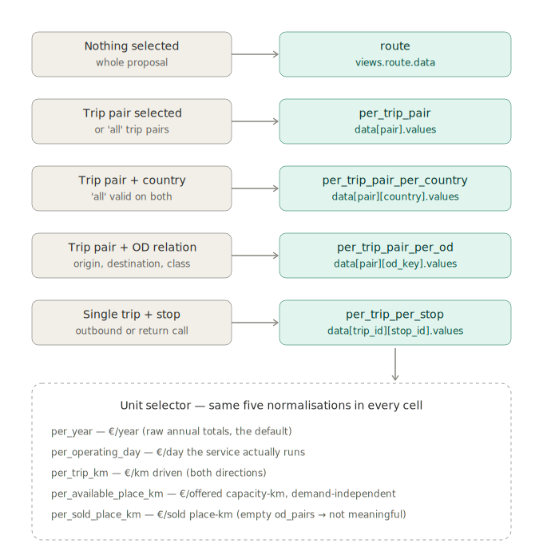

# Night Train — Evaluation Layer

This folder contains the cost and revenue evaluation pipeline for night train routes.
It is the mathematical core of the project — everything that produces a EUR number lives here.

**Related documentation:** API reference (response shapes) —
[`../../api/README.md`](../../api/README.md#evaluation) · model layer overview —
[`../README.md`](../README.md) · energy model (feeds `energy_kwh`) —
[`../energy/README.md`](../energy/README.md) · tests
(`test_30`/`test_31`) — [`../../tests/README.md`](../../tests/README.md)

```
models/evaluation/
├── calc.py      # Cost/revenue calculation → EvaluationResult
├── views.py     # Breakdown aggregation, allocation, normalisation
└── version.py   # CALC_VERSION
```

---

## Concepts

### Canonical unit

Everything in `Breakdown` is **€/year**. Costs computed per-segment or per-event
are multiplied by `operating_days_per_year` at build time. Normalisers then divide
back down to per-day, per-km, or per-place-km as needed.

### Physics vs money

`Trip` and `Route` carry only physics — distances, times, country shares, energy.
All EUR values live exclusively in `calc.py`. This boundary is strict.

### Demand

OD pairs live on `TripPair.od_pairs`. Each `ODPair` specifies annual `places_sold`
and `avg_price` for one origin→destination×class combination on one trip.
The proxy demand model (`distribute_demand()` in `route_factory.py`) distributes
demand uniformly across valid boarding→alighting OD pairs at a given utilisation rate.

---

## calc.py — EvaluationResult

`evaluate_route(route, tracks, stop_infra)` returns a flat `EvaluationResult`
with one entry per segment, stop, parking location, shunting event, composition,
and OD pair. No aggregation, no normalisation — raw per-event costs only.

### Cost structure

| Cost object | Unit | One per |
|---|---|---|
| `SegmentCost` | €/segment | Segment × trip |
| `StopCost` | €/trip-call | Stop × trip (not per adjacent segment) |
| `ParkingCost` | €/operating-day | Parking location (deduplicated by stop) |
| `ShuntingCost` | €/event | Shunting event (one per trip terminal, not deduplicated) |
| `CompositionFleetCost` | €/year (amort/fin/overhead) or €/operating-day (cleaning) | Composition |
| `RouteCost` | €/trip-cycle | Route (loco lease only) |
| `ODPairRevenue` | €/year | OD pair × trip |
| `ODPairCost` | €/year | OD pair × trip (svc_stockings, var_overhead) |
| `ODPairMargin` | €/year | OD pair × trip (EBIT carve-out) |

`SegmentCost` also carries physics fields needed by the view layer:
`driving_time_min`, `country_distance_shares`, `country_time_shares`.

`StopCost` carries `country_code` from `Stop.country_code`.

### Segment passenger loads

`compute_segment_passenger_loads()` pre-computes, for each `(trip_id, segment_index)`,
how many annual passenger place-km and place-hours each OD pair contributes to that
segment. This includes unweighted and density-weighted versions, plus per-country
breakdowns. The result is stored in `EvaluationResult.segment_passenger_loads` and
is the foundation for all OD-proportional cost allocations in the view layer.

---

## views.py — Breakdown tree and views

### Breakdown tree

```
Breakdown (€/year)
├── cost: CostBreakdown
│   ├── operator: OperatorCost
│   │   ├── variable: OperatorVariableCost
│   │   │     driver, crew, coach_maintenance, loco,
│   │   │     svc_stockings, var_overhead
│   │   └── fixed: OperatorFixedCost
│   │         coach_amortisation, financing, fix_overhead,
│   │         cleaning, shunting
│   └── infrastructure: InfrastructureCost
│         tac, energy, station_charge, parking
├── revenue: RevenueBreakdown   ticket_revenue
└── margin:  MarginBreakdown    ebit_margin
```

All nodes support `+=` via `__iadd__` for accumulation. All 17 leaves are €/year.

### Layer 1 — whole route / per trip pair

`build_breakdown(route, result, trip_pair=None)` — canonical annual Breakdown.

`build_breakdown_per_trip_pair(route, result)` — `dict[str, Breakdown]` keyed by
outbound `trip_id`, plus `"all"` for the whole route.

Currently every route holds exactly **one** trip pair (`api/route.py` builds a
single `TripPairInput` from the posted stop list), so this matrix has one real
key and `"all"`, both with the same values as the whole-route Breakdown. The
per-pair dimension exists for the planned X/Y-shaped routes, where several
pairs share a trunk — the code and response shape are already
multi-pair-ready.

### Layer 2A — per trip pair × country

`build_breakdown_per_trip_pair_per_country(route, result)` —
`dict[tuple[str, str], Breakdown]` keyed by `(pair_key, country_code)`.
`"all"` is a wildcard in either position.

Allocation rules per country:

| Cost | Method |
|---|---|
| `driver`, `crew`, `loco`, `cleaning` | `country_time_shares` |
| `coach_maintenance`, `coach_amortisation`, `financing`, `fix_overhead` | `country_distance_shares` |
| `shunting` | 100% to terminal stop's country (`Shunting.country_code`) |
| `tac`, `energy` | Directly from `SegmentCost` (already split in calc.py) |
| `station_charge` | 100% to `StopCost.country_code` |
| `parking` | 100% to `Parking.country_code` |
| `svc_stockings`, `var_overhead`, `revenue`, `margin` | OD weighted place-km share per country |

### Layer 2B — per trip pair × OD pair

`build_breakdown_per_trip_pair_per_od(route, result)` —
`dict[tuple[str, str], Breakdown]` keyed by `(pair_key, od_key)`.

`od_key` is `"{origin_stop_id}__{destination_stop_id}__{class_main}"` — no
`trip_id` in the key, so Copenhagen→Munich aggregates across both trip pairs
in a Y-shaped route.

Allocation rules per OD pair:

| Cost | Method |
|---|---|
| `coach_maintenance`, `tac`, `energy` | Weighted place-km share per segment |
| `driver`, `crew` | Weighted place-hours share per segment |
| `coach_amortisation`, `financing`, `fix_overhead` | Pair fleet share × OD weighted place-km share of the pair |
| `loco`, `cleaning` | OD weighted place-hours share of the pair (both directions) |
| `station_charge`, `dwell_driver`, `dwell_crew` | `places_sold` share at boarding/alighting stop; if nobody boards or alights there, `places_sold` share of the ODs riding through |
| `shunting`, `parking` | Revenue share (`od_revenue / total_trip_revenue`); parking pair-filtered via `ParkingCost.trip_ids` |
| `svc_stockings`, `var_overhead`, `revenue`, `margin` | Direct from `ODPairRevenue/Cost/Margin` |

Every allocation share family sums to exactly 1 across a pair's OD cells, so
**OD cells partition the pair total** — `Σ OD cells == (pair, "all")`, leaf by
leaf (pinned by `test_od_cells_partition_pair_total`).

*Fleet share* (`_pair_fleet_share`): calc.py sums `coaches_required` across
all pairs sharing a `comp_id` (one shared fleet), so every pair-filtered view
scales fleet costs by the pair's own coach count over the fleet total.

### Layer 2B2 — per trip pair × route section

`build_breakdown_per_trip_pair_per_section(route, result)` —
returns **two** dicts: the matrix `dict[tuple[str, str], Breakdown]` keyed by
`(pair_key, section_key)`, and a parallel `dict[tuple[str, str],
NormalisationScope]` carrying each cell's own annual physical denominators.

`section_key` is `"{origin_stop_id}__{destination_stop_id}__{class_main}"`
with `class_main = "all"` for the class-independent section cell. Keys are
**directional** — Hamburg→Berlin and Berlin→Hamburg are separate sections on
separate trips.

A section is a **physical piece of a trip** between two of its stops — not a
ticket relation (that is Layer 2B). Selecting `[Hamburg, Berlin]` on a
`[Copenhagen, Hamburg, Berlin, Munich]` trip means:

- every cost occurring between Hamburg and Berlin, plus a share of
  route-level costs, and
- the **km-proportional revenue of everyone on board there** — a
  Copenhagen→Munich passenger contributes exactly the fraction of their fare
  matching the km they ride within the section.

Allocation rules per section (`__all` cell):

| Cost | Method |
|---|---|
| `driver`, `crew`, `coach_maintenance`, `tac`, `energy` | 100% of the segments inside the section |
| `station_charge`, dwell `driver`/`crew` | 100% of stop calls origin..destination (both boundary stops included) |
| `loco` | Direct: lease rate × section operating minutes (segment total time + dwell) |
| `coach_amortisation`, `financing`, `fix_overhead` | Pair fleet share × section-km / pair-km |
| `cleaning` | Pair fleet share × section driving hours / pair driving hours |
| `shunting`, `parking` | Pair totals × section revenue / pair revenue (parking pair-filtered) |
| `svc_stockings`, `var_overhead`, `revenue`, `margin` | Σ over on-board ticket groups of value × overlap-km / ride-km |

Each section additionally carries **per-class cells** (`__Seat`,
`__Couchette`, …): the passenger-side leaves of that class directly, plus
every train-level leaf of the `__all` cell scaled by the class's
density-weighted place-km share within the section — class cells sum exactly
to the section's `__all` cell.

**Sections overlap by construction** (the full-trip section *is* the whole
trip), so section cells deliberately do **not** sum to the pair total —
unlike every other matrix view. The wildcard cells `(pair, "all")` and
`("all", "all")` are the usual whole-pair / whole-route Breakdowns.

Per-unit normalisations of a section cell divide by the section's **own**
annual physics (its `NormalisationScope`): €/train-km of a section means per
that section's annual train-km, not the whole pair's.

### Layer 2C — per trip × stop

`build_breakdown_per_trip_per_stop(route, result)` —
`dict[tuple[str, str], Breakdown]` keyed by `(trip_id, stop_id)`.

Only boarding and alighting OD pairs are attributed at each stop — through-riders
are invisible at the stop level. Fixed costs are allocated by half the boarding/
alighting OD pairs' weighted place-km relative to the route total (half at origin,
half at destination, so all stops sum to 100%).

### Layer 3 — normalisers

All normalisers take a `Breakdown` and return a new `Breakdown` with every leaf
divided by the denominator. The source `Breakdown` is unchanged.

All denominators are **annual**, matching the Breakdown's €/year leaves. The
optional `scope` parameter (a `NormalisationScope`) carries a route-section
cell's own annual denominators; `scope=None` derives them from
`route`/`trip_pair` as usual.

| Function | Denominator (annual) | Result unit |
|---|---|---|
| `normalise(breakdown, denominator)` | Caller-supplied | Arbitrary |
| `normalise_per_operating_day(breakdown, route)` | `operating_days_per_year` | €/operating-day |
| `normalise_per_train_km(breakdown, route, trip_pair=None, scope=None)` | Cycle distance (both directions) × operating days | €/train-km |
| `normalise_per_available_place_km(breakdown, route, trip_pair=None, scope=None)` | Capacity × cycle distance × operating days | €/available-place-km |
| `normalise_per_sold_place_km(breakdown, route, trip_pair=None, scope=None)` | `places_sold` × distance per OD range (`places_sold` is already annual) | €/sold-place-km |

---

## Views, explained for display

*A non-technical map of the six evaluation views — written for the frontend
filter/selection logic. Every view answers the same question — "how much money?"
— for a different slice of the route. The frontend never computes a slice
itself; it only picks which pre-computed view (and key) to read.*

### The six views in one sentence each

| View | Plain-language meaning | Typical question it answers |
|---|---|---|
| `route` | The **whole proposal** rolled into one figure set — every trip pair, segment, stop and passenger relation together. | "Is this route economically viable overall?" |
| `per_trip_pair` | One **outbound + return leg pair** in isolation. Only differs from `route` on Y/X-shaped routes with several pairs. | "Which branch of the Y carries the network?" |
| `per_trip_pair_per_country` | A trip pair's money **split by country** — costs land where the train drives or where the event happens; revenue where passengers actually sit. | "How much of this route's cost/revenue accrues in Germany?" (→ subsidy discussions per member state) |
| `per_trip_pair_per_od` | Money attributed to one **passenger relation** (origin → destination × class), aggregated across trip pairs sharing it. OD cells partition the pair total. | "Does the Wien → Berlin couchette relation pay for itself, or is it cross-subsidised?" |
| `per_trip_pair_per_section` | Money attributed to a **physical piece of a trip** between two stops: all costs occurring there, and the km-proportional revenue of everyone on board — including through-riders. Per-class sub-cells included. Sections overlap, so they don't sum to the pair total. | "What does the Hamburg → Berlin leg of this route cost and earn, counting everyone riding it?" (→ infrastructure/leg-level discussions) |
| `per_trip_per_stop` | Money attributed to a single **stop call of a single direction**. Only boarding/alighting passengers count at a stop — through-riders are invisible here. | "What does calling at Dresden actually cost and earn?" (→ keep or drop a stop) |

Every dimension additionally carries an `"all"` key — the aggregate across
that dimension — so a filter set to "all countries" reads the same view, key
`"all"`, rather than falling back to a different view.

> **Note — one trip pair per route today.** `POST /api/route/plan` currently
> builds exactly one `TripPair` from the posted stop list, so
> `per_trip_pair` (and the pair dimension in every other view) holds a
> single pair key plus `"all"`, with identical numbers. The frontend should
> still wire the pair filter now — it becomes meaningful once X/Y-shaped
> routes (multiple pairs sharing a trunk) are supported, without any
> response-shape change.

### Filter selection → view (decision tree)



Two orthogonal selectors, always:

1. **Scope** (the filter) — decides *which view and key* to read. Trip pair,
   country, OD relation, and stop are filter dimensions; `"all"` is a valid
   choice on each.
2. **Unit** (the normalisation) — decides *which of the five entries inside
   the cell* to display. Same breakdown tree, divided by a different
   denominator:

| Normalisation | Unit | Use it to… |
|---|---|---|
| `per_year` | €/year | show absolute annual totals (the default) |
| `per_operating_day` | €/operating day | compare against daily operating benchmarks |
| `per_train_km` | €/train-km (annual basis) | compare routes of different lengths |
| `per_available_place_km` | €/place-km offered | compare cost efficiency independent of demand |
| `per_sold_place_km` | €/place-km sold | compare directly against average fares per km |

Inside every cell, `values` (or `data` for `route`) is the same nested
cost/revenue/margin `Breakdown` dict — so one rendering component can serve
all five views. The `filter` dict next to `values` carries ready-made
human-readable labels (e.g. `{"trip_pair": "Berlin Hbf ↔ Wien Hbf",
"country": "AT"}`) so the frontend never needs to reconstruct display names
from keys.

### Three concrete filter settings and their JSON

Values below are illustrative; the structure is exact. A full real response
is checked in at
[`../../scripts/data/tc_1_evaluation_input_output.json`](../../scripts/data/tc_1_evaluation_input_output.json)
(produced by [`../../scripts/test_evaluation_calc.py`](../../scripts/test_evaluation_calc.py)
from [`tc_1_evaluation_input.json`](../../scripts/data/tc_1_evaluation_input.json)).

**1. No filter — whole route, annual totals.** UI state: nothing selected,
unit = €/year. Read `views.route.data.per_year` (the `route` view has no
`filter`/`values` nesting — nothing to filter by):

```json
"views": {
  "route": {
    "description": "Whole-route annual totals — every trip pair, segment, stop and OD pair rolled into one figure.",
    "normalisations": { "per_year": { "...": "..." }, "...": "..." },
    "data": {
      "per_year": {
        "cost":    { "operator": { "...": "..." }, "infrastructure": { "...": "..." }, "total_eur": 5210433.18 },
        "revenue": { "ticket_revenue_eur": 6120000.0, "total_eur": 6120000.0 },
        "margin":  { "ebit_margin_eur": 306000.0, "total_eur": 306000.0 },
        "total_cost_eur": 5210433.18,
        "total_revenue_eur": 6120000.0,
        "net_eur": 603566.82
      },
      "per_operating_day": { "...": "same tree, ÷ operating days" },
      "...": "..."
    }
  }
}
```

**2. All trip pairs + country DE, per km.** UI state: pair filter = "all",
country filter = Germany, unit = €/km. Read
`views.per_trip_pair_per_country.data["all"]["DE"]` and display
`values.per_train_km`; the `filter` dict is the ready-made UI label:

```json
"per_trip_pair_per_country": {
  "description": "Matrix of annual totals by trip pair x country. ...",
  "normalisations": { "...": "..." },
  "data": {
    "all": {
      "DE": {
        "filter": { "trip_pair": "all", "country": "DE" },
        "values": {
          "per_year":    { "...": "..." },
          "per_train_km": {
            "cost": { "...": "...", "total_eur": 14.82 },
            "revenue": { "...": "...", "total_eur": 17.65 },
            "margin": { "...": "...", "total_eur": 0.88 },
            "total_cost_eur": 14.82,
            "total_revenue_eur": 17.65,
            "net_eur": 1.95
          },
          "...": "..."
        }
      },
      "AT":  { "...": "..." },
      "all": { "filter": { "trip_pair": "all", "country": "all" }, "values": { "...": "..." } }
    },
    "P1_V1_R1_D0_T1": { "...": "same country keys, scoped to that pair" }
  }
}
```

**3. One pair + one OD relation, per sold place-km.** UI state: pair =
Berlin ↔ Wien, OD = Wien → Berlin in Couchette, unit = €/sold-place-km.
Read
`views.per_trip_pair_per_od.data["P1_V1_R1_D0_T1"]["AT_WIEN_HBF__DE_BERLIN_HBF__Couchette"]`
and display `values.per_sold_place_km` — comparable 1:1 against the
relation's average fare per km:

```json
"per_trip_pair_per_od": {
  "description": "Matrix of annual totals by trip pair x OD pair ...",
  "normalisations": { "...": "..." },
  "data": {
    "P1_V1_R1_D0_T1": {
      "AT_WIEN_HBF__DE_BERLIN_HBF__Couchette": {
        "filter": {
          "trip_pair": "Berlin Hbf ↔ Wien Hbf",
          "od_pair": "Wien Hbf → Berlin Hbf (Couchette)"
        },
        "values": {
          "per_sold_place_km": {
            "cost": { "...": "...", "total_eur": 0.081 },
            "revenue": { "ticket_revenue_eur": 0.104, "total_eur": 0.104 },
            "margin": { "...": "...", "total_eur": 0.005 },
            "total_cost_eur": 0.081,
            "total_revenue_eur": 0.104,
            "net_eur": 0.018
          },
          "...": "..."
        }
      },
      "all": { "...": "..." }
    },
    "all": { "...": "OD keys aggregated across all pairs" }
  }
}
```

**Caveats worth surfacing in the UI:**

- Country, OD, and stop figures are **allocations**, not bookkeeping facts —
  fixed costs are spread by distance/time/place-km shares (rules in the
  Layer 2 sections above). Sums across a dimension always reproduce the
  parent total.
- `per_sold_place_km` divides by demand — a route with no `od_pairs` has no
  sold place-km, so this normalisation is not meaningful there.
- In `per_trip_per_stop`, through-riders don't appear at intermediate stops;
  a stop's revenue reflects only passengers boarding or alighting there.

---

## API integration

The evaluation pipeline is called by `POST /api/evaluation/calc` in `api/evaluation.py`.
A complete worked example — real request and full response — is checked in
under [`../../scripts/data/`](../../scripts/data/):
`tc_1_evaluation_input.json` (request) and
`tc_1_evaluation_input_output.json` (response), produced by the manual test
script [`../../scripts/test_evaluation_calc.py`](../../scripts/test_evaluation_calc.py).
Serialization and deserialization are handled exclusively by
`api/helpers/route_serialize.py` (route in/out) and
`api/helpers/evaluation_serialize.py` (breakdown/views out, `models`/`input` docs).
Domain objects have no `to_dict()` or `from_dict()` methods.

### Request flow

```
POST /api/evaluation/calc
  │
  ├── [1/5] Validate body + route_from_dict(body["route"], loader)
  │          route_serialize.py: deserializes Route JSON → Route domain object
  │          loader.build_all_compositions() reloads cost params from DB
  │
  ├── [2/5] loader.build_all_tracks() + loader.build_all_stops()
  │
  ├── [3/5] evaluate_route(route, tracks, stop_infra) → EvaluationResult
  │          calc.py: all per-event cost/revenue computation
  │
  ├── [4/5] build_breakdown* functions → Breakdown matrices
  │          views.py: aggregation, allocation, normalisation
  │
  └── [5/5] views_to_dict → JSON response
             evaluation_serialize.py: converts every Breakdown matrix to the
             views block — per view: description + normalisations (VIEW_META)
             + data, all 5 normalisations included per cell
```

### Response structure

The full response shape — `calc_version`, `models`, `input`, and `views` at
the top level — is documented field-by-field in
[`../../api/README.md`](../../api/README.md#evaluation) (the single
authoritative response doc; this README deliberately does not duplicate it).
What `views.py` contributes is the `views` block:

- Five views: `route`, `per_trip_pair`, `per_trip_pair_per_country`,
  `per_trip_pair_per_od`, `per_trip_pair_per_section`, `per_trip_per_stop` — see
  [Views, explained for display](#views-explained-for-display) below.
- Each view is `{description, normalisations, data}`. `description` and
  `normalisations` come from `VIEW_META` in `views.py` — one documentation
  block per view, not repeated per data point.
- `views.route.data` holds the normalised breakdown directly (nothing to
  filter by). Every other view nests `{filter, values}` per key, where
  `filter` is a human-readable label dict (one entry per filter dimension,
  e.g. `{"trip_pair": "Berlin Hbf ↔ Wien Hbf", "country": "AT"}`) and
  `values` holds the normalised breakdown. Each dimension also carries an
  `"all"` aggregate key.
- Each normalised breakdown contains the same `Breakdown` dict under all
  five normalisations (`per_year`, `per_operating_day`, `per_train_km`,
  `per_available_place_km`, `per_sold_place_km`).

Serialization lives in `api/helpers/evaluation_serialize.py`
(`views_to_dict()`, `breakdown_to_dict()`, `normalise_all_to_dict()`).

### Demand in the route JSON

Demand is embedded in the route JSON under `trip_pairs[].od_pairs`. Each OD pair
specifies `trip_id`, `origin_stop_id`, `destination_stop_id`, `class_main`,
`places_sold` (annual), and `avg_price` (EUR). The proxy demand model
(`route_factory.distribute_demand()`) can populate these automatically from a
utilisation rate and per-km fare.

---

## Open items / known limitations

- Energy regression coefficients not yet calibrated — flat 28 kWh/km dummy used
- Y/X-shape routes: `loco_propulsion_min` and `shunting_count` don't yet deduplicate
  shared trunk infrastructure across trip pairs (TODO comments in `route.py`)
- `seat/couchette/sleeper_density` still `0.0` in `DBDataLoader` — deferred
- Per-class normalisation (one `Breakdown` per class) not yet implemented