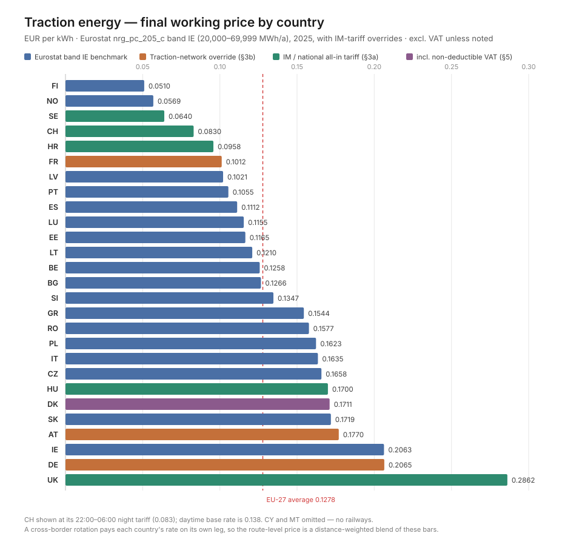

# Traction Energy Prices — Per-Country Calibration

Location: `backend/models/infrastructure/calib/electricity_pricing/ELECTRICITY_PRICING.md`
Companion to `TAC_MODEL.md` — covers the energy components excluded there (traction electricity and use-of-electric-supply-equipment charges). Consumption modelling (kWh per train-km) is a separate concern; this file calibrates **prices**.

**Result of this calibration: §6 gives one working price per country in EUR/kWh.** §2–§5 document how it is built.

---

## 1. Structure and sources

| Layer | What it provides | Source |
|---|---|---|
| Base price (§2) | 9 Eurostat price components + 2 totals | Eurostat `nrg_pc_205_c`, year 2025, **band IE**, extract 27 Jul 2026 |
| Full override (§3a) | Whole row replaced by an IM/national all-in tariff | Network statements (CH, HR, HU, SE) / DESNZ (UK) |
| Network override (§3b) | Only the Network column replaced by a dedicated traction-network tariff | ÖBB SNNB, DB Energie Preisblatt, SNCF Réseau DRR |
| Rail tax overlay (§4) | Rail-specific electricity excise, replacing the generic one | CE Delft 4.K83 (EC data) |
| VAT treatment (§5) | Whether input VAT is a real cost | National VAT law |

**Band choice — resolved.** Band **IE = 20,000–69,999 MWh/a** is the rail-relevant band: a night-train operation at ~15–25 kWh/train-km × 1–3 Mio train-km/a falls inside it. This is also exactly the band definition used by the UK DESNZ "Large" series (§3a), so UK and EU figures are directly comparable. Earlier drafts of this file used band IA (< 20 MWh/a) as a stand-in, which overstated prices by roughly 40–70 %; that is now superseded throughout.

**Band IE is validated by two independent IM tariffs:** Hungary's published all-in traction price (67.4 HUF/kWh ≈ 0.171 EUR) matches Eurostat band IE HU (0.1711) almost exactly, and Sweden's Trafikverket example (0.7156 SEK ≈ 0.064 EUR) sits just below Eurostat band IE SE (0.0696). Neither would match at band IA. This is strong evidence that band IE is the correct proxy.

**Component definitions** (Eurostat's own categories): Energy & supply = generation + supplier margin; Network costs = transmission + distribution; Renewable / Capacity / Environmental / Nuclear / Other = the tax, fee and levy sub-categories; VAT = value-added tax. `Total (excl. VAT)` = sum of all non-VAT columns. `Total (incl. VAT)` = + VAT.

---

## 2. Master price table — Eurostat band IE, 2025, EUR/kWh

| Country | Energy & supply | Network | Renewable tax | Capacity tax | Environmental tax | Nuclear tax | Other | VAT | **Total excl. VAT** | **Total incl. VAT** |
|---|---|---|---|---|---|---|---|---|---|---|
| AT | 0.1112 | 0.0292 → §3b | 0.0047 | 0.0000 | 0.0135 | 0.0000 | 0.0024 | 0.0322 | **0.1610** | **0.1932** |
| BE | 0.0968 | 0.0169 | 0.0113 | 0.0008 | 0.0072 | 0.0000 | 0.0000 | 0.0279 | **0.1330** | **0.1609** |
| BG | 0.1108 | 0.0219 | 0.0000 | 0.0000 | 0.0010 | 0.0000 | −0.0082 | 0.0251 | **0.1255** | **0.1506** |
| CH | — | — | — | — | — | — | — | — | **§3a** | — |
| CZ | 0.1114 | 0.0414 | 0.0129 | 0.0000 | 0.0012 | 0.0000 | 0.0001 | 0.0351 | **0.1670** | **0.2021** |
| DE | 0.0979 | 0.0375 → §3b | 0.0017 | 0.0097 | 0.0205 | 0.0000 | 0.0014 | 0.0321 | **0.1687** | **0.2008** |
| DK | 0.0912 | 0.0261 | 0.0000 | 0.0000 | 0.0011 | 0.0000 | 0.0000 | 0.0534 | **0.1184** | **0.1718** |
| EE | 0.0811 | 0.0209 | 0.0084 | 0.0000 | 0.0018 | 0.0000 | 0.0000 | 0.0269 | **0.1122** | **0.1391** |
| ES | 0.0896 | 0.0100 | 0.0007 | 0.0002 | 0.0035 | 0.0000 | 0.0050 | 0.0222 | **0.1090** | **0.1312** |
| FI | 0.0375 | 0.0134 | 0.0000 | 0.0001 | 0.0005 | 0.0000 | 0.0000 | 0.0131 | **0.0515** | **0.0646** |
| FR | 0.0680 | 0.0175 → §3b | 0.0000 | 0.0012 | 0.0057 | 0.0000 | 0.0000 | 0.0141 | **0.0924** | **0.1065** |
| GR (EL) | 0.1344 | 0.0112 | 0.0028 | 0.0000 | 0.0020 | 0.0000 | 0.0054 | 0.0093 | **0.1558** | **0.1651** |
| HR | 0.1034 | 0.0171 | 0.0111 | 0.0000 | 0.0005 | 0.0000 | 0.0000 | 0.0172 | **0.1321** | **0.1493** |
| HU | 0.1175 | 0.0352 | 0.0135 | 0.0000 | 0.0010 | 0.0000 | 0.0039 | 0.0415 | **0.1711** | **0.2126** |
| IE | 0.1529 | 0.0474 | 0.0019 | 0.0001 | 0.0003 | 0.0000 | 0.0040 | 0.0129 | **0.2066** | **0.2195** |
| IT | 0.1223 | 0.0166 | 0.0147 | 0.0083 | 0.0015 | 0.0000 | 0.0016 | 0.0158 | **0.1650** | **0.1808** |
| LT | 0.0940 | 0.0258 | 0.0002 | 0.0000 | 0.0000 | 0.0000 | 0.0002 | 0.0250 | **0.1202** | **0.1452** |
| LU | 0.1036 | 0.0110 | 0.0003 | 0.0000 | 0.0000 | 0.0000 | 0.0002 | 0.0092 | **0.1151** | **0.1243** |
| LV | 0.0871 | 0.0111 | 0.0000 | 0.0000 | 0.0000 | 0.0000 | 0.0039 | 0.0214 | **0.1021** | **0.1235** |
| NL | 0.0959 | 0.0200 | 0.0000 | 0.0000 | 0.0132 | 0.0000 | 0.0000 | 0.0271 | **0.1291** | **0.1562** |
| NO | 0.0516 | 0.0053 | 0.0000 | 0.0000 | 0.0082 | 0.0000 | 0.0000 | 0.0163 | **0.0651** | **0.0814** |
| PL | 0.0775 | 0.0278 | 0.0022 | 0.0099 | 0.0446 | 0.0000 | 0.0003 | 0.0373 | **0.1623** | **0.1996** |
| PT | 0.0814 | 0.0146 | 0.0079 | 0.0005 | 0.0005 | 0.0000 | 0.0011 | 0.0235 | **0.1060** | **0.1295** |
| RO | 0.1128 | 0.0311 | 0.0128 | 0.0000 | 0.0005 | 0.0000 | 0.0000 | 0.0313 | **0.1572** | **0.1885** |
| SE | 0.0530 | 0.0161 | 0.0000 | 0.0000 | 0.0005 | 0.0000 | 0.0000 | 0.0174 | **0.0696** | **0.0870** |
| SI | 0.1130 | 0.0126 | 0.0050 | 0.0001 | 0.0009 | 0.0000 | 0.0000 | 0.0290 | **0.1316** | **0.1606** |
| SK | 0.1135 | 0.0344 | 0.0111 | 0.0096 | 0.0013 | 0.0033 | 0.0000 | 0.0329 | **0.1732** | **0.2061** |
| UK | — | — | — | — | — | — | — | — | **§3a** | — |
| **EU-27** | 0.0946 | 0.0235 | 0.0044 | 0.0041 | 0.0102 | 0.0000 | 0.0012 | 0.0247 | **0.1380** | **0.1627** |

CH and UK do not report to `nrg_pc_205_c`. BG's "Other" is negative (a net rebate in the 2025 data), reproduced as-is. CY and MT omitted — no railways.

---

## 3. Overrides

### 3a. Full override — IM/national all-in tariff replaces the whole §2 row

| Country | Tariff | Currency | ≈ EUR/kWh | Source |
|---|---|---|---|---|
| CH | 0.078 (22:00–06:00) / 0.130 (base, 2027 transitional) | CHF/kWh | 0.083 / 0.138 | SR 742.122 Art. 20a |
| HR | 0.0826 (NT) / 0.1285 (VT) + 0.0132 renewables levy | EUR/kWh | 0.0958 (night) | HŽ NS 2027 ch. 5.4 item 40 |
| HU | 67.4 (49.0 energy + 10.2 system + 0.4 excise + 7.8 funds) | HUF/kWh | 0.170 | MÁV Annex 5.2-6 |
| SE | 0.7156 (0.6075 energy + 0.1081 grid) | SEK/kWh | 0.064 | Trafikverket NS 2027 §7.3.11 |
| UK | 23.8480 excl. CCL / 24.4008 incl. CCL (2025 annual, "Large" band) | pence/kWh | **0.2862** excl. CCL | DESNZ Table 3.4.1/3.4.2 |

UK notes: "Large" = 20,000–69,999 MWh/a, identical to Eurostat band IE. Rail traction is CCL-exempt (§4) → the **excl.-CCL** figure is the working price. The gap between the two DESNZ columns (0.5527 p/kWh) is a survey average across CCL-liable and CCL-exempt consumers and is *not* the statutory CCL rate (0.775 p/kWh from 2025-04-01); it must not be read as the rail levy. FX 1 GBP = 1.20 EUR is indicative and refreshed at model runtime.

### 3b. Network-column-only override — dedicated traction-current networks

AT, DE and FR each charge separately for use of a traction-current network that is physically distinct from the public grid. These tariffs replace **only** the Network column; Energy & supply and the tax columns stay on the Eurostat basis, because the traction current itself is still market-procured by the RU.

**AT — ÖBB-Infrastruktur Bahnstromnetz, 2026 (SNNB 2026 Tabelle 59, p. 114), excl. 20 % USt:**

| Band | EUR/MWh | EUR/kWh |
|---|---|---|
| Hochtarif 06:00–22:00 | 52.40 | 0.05240 |
| Niedertarif 22:00–06:00 | 43.67 | **0.04367** |

Single-part tariff, billed on total energy drawn. Applied per leg via the same time-band mechanism as `TAC_MODEL.md` §2.1; Niedertarif is the working default for the overnight core.

**DE — DB Energie "Preisblatt Netznutzung Bahnstromnetz", from 01.01.2026, net:**

| Feed-in point | < 2,500 h/a Leistungspreis | < 2,500 h/a Arbeitspreis | ≥ 2,500 h/a Leistungspreis | ≥ 2,500 h/a Arbeitspreis |
|---|---|---|---|---|
| Hochspannung | 23.35 EUR/kWa | 7.21 ct/kWh | 191.68 EUR/kWa | 0.48 ct/kWh |
| Mittelspannung | 0.00 EUR/kWa | 7.24 ct/kWh | 109.63 EUR/kWa | 2.85 ct/kWh |
| Gleichstrom | 51.86 EUR/kWa | 16.66 ct/kWh | 448.23 EUR/kWa | 0.80 ct/kWh |

Plus metering 190.57 EUR/meter/year (alt. 0.0156 ct/kWh). Statutory levies (KWKG-Umlage, Offshore-Netzumlage, StromNEV §19(2)) are charged on top and are not quantified in the Preisblatt (§7).

Two-part tariff → per-kWh equivalent = Arbeitspreis + Leistungspreis / Benutzungsdauer, where Benutzungsdauer = annual energy ÷ annual peak quarter-hour load **of the RU's own fleet** (the price sheet defines the peak as the coincident load of all the RU's traction units, not the substation's). Hochspannung:

| Benutzungsdauer | EUR/kWh |
|---|---|
| 1,500 h/a | 0.0877 |
| **2,000 h/a** | **0.0838** |
| 2,500 h/a | 0.0815 |
| 3,000 h/a | 0.0687 |
| 4,000 h/a | 0.0527 |
| 6,000 h/a | 0.0367 |

The two duration systems join continuously at 2,500 h/a (0.0814 vs 0.0815), confirming the formula.

**Assumption — closed by derivation: 1,900 h/a → 0.0844 EUR/kWh.** Benutzungsdauer reduces to `annual running hours ÷ (peak ÷ average power)`. A night train running ~10 h per night on ~350 nights has ~3,500 running hours a year, and the coincident 15-minute peak of a loco-hauled fleet is roughly 1.7–2.0× its average draw, giving **1,750–2,060 h/a**. Two consequences matter more than the point estimate:

- **The band choice is robust.** Reaching the ≥2,500 h/a system would require more than ~4,250 running hours a year — 12 h every day — which a night-only operation cannot approach. Only an operator also running daytime services would cross over.
- **Within the < 2,500 band the sensitivity is small**, because the Leistungspreis is only 23.35 EUR/kWa there: 1,500 h/a gives 0.0877 and 2,400 h/a gives 0.0818, a spread of ±4 %. The earlier 0.037–0.088 range was an artefact of leaving the band open; once it is fixed, DE's network cost is well determined.

Note also that the **statutory levies** named but not quantified in the Preisblatt (KWKG-Umlage, Offshore-Netzumlage, StromNEV §19(2)) do **not** need to be added on top: they are non-network, non-energy levies and therefore already sit inside Eurostat's tax columns, which §2 retains for Germany (capacity 0.0097 + other 0.0014 + renewable 0.0017 = 0.0128 EUR/kWh, the right order of magnitude for the three levies combined). Substituting only the Network column preserves them exactly once.

**FR — SNCF Réseau, DRR HDS 2024 (Annexes 5.2.2 and 5.4), excl. VAT:**

| Component | Status | EUR/kWh |
|---|---|---|
| RCTE-A (electrical losses, substation → pantograph) | minimum service, mandatory | 0.02912 |
| RCTE-B (transport & distribution to substations, TURPE pass-through) | prestation diverse, mandatory | 0.02003 |
| **Network total (A + B)** | | **0.04915** |
| RFE (supply of traction current) | complementary, non-regulated, optional | 0.18653 |
| All-in if energy also bought from SNCF Réseau | | 0.23568 |

Also: RCE 0.278 EUR/electric train-km — an *infrastructure* charge for use of the catenary, excluded from `TAC_MODEL.md` and belonging here as a per-train-km item, not per kWh.

Only RCTE-A + RCTE-B are used as the Network override, since RFE is optional and an RU may procure energy elsewhere.

**Price basis — closed by derivation to a 2027 basis.** The 2024 figures are crisis-era and must not be mixed with 2025 energy prices, but DRR Annexe 5.1.2 publishes the RCTE-A formula, which makes them forward-derivable:

```
RCTE-A = purchase price × loss rate / (1 − loss rate)
```

Back-solving the 2024 tariff confirms the formula: 0.02912 × (1 − 0.136) / 0.136 = **0.1850 EUR/kWh implied purchase price**, which matches the published 2024 RFE of 0.18653 almost exactly (RFE = purchase price + management fees, a ~0.8 % margin). Applying the same formula forward with the published 2026 loss-rate estimate of **13.4 %** carried into 2027, and the Eurostat 2025 band-IE French energy component of 0.0680 EUR/kWh as the purchase price:

| Component | 2024 (published) | **2027 (derived)** |
|---|---|---|
| RCTE-A | 0.02912 | **0.0105** |
| RCTE-B (TURPE pass-through, indexed) | 0.02003 | **0.0210** |
| **Network override** | 0.04915 | **0.0315** |
| RFE (if bought from SNCF Réseau) | 0.18653 | ~0.0687 |

RCTE-B is a regulated TURPE pass-through and is roughly stable in real terms, so it carries forward with inflation only. The derived 0.0315 replaces the 2024 value in §6. DRR 2027 Appendix 5.4 confirms these prices will not be published until December 2026.

---

## 4. Rail-specific electricity tax

**Source:** CE Delft, *4.K83 — Transport taxes and charges in Europe* (March 2019, European Commission data, 2016 basis), accompanying database, sheet `Rail_Energy taxes_level`. This supersedes the Allianz pro Schiene comparison used in earlier drafts and closes the chart-digitisation gap — the database gives the per-country numbers the report only plotted.

**These values are PPS-adjusted** (purchasing-power-standard corrected, as the workbook title states). Nominal rates differ by each country's price level: the AT value 0.013792 corresponds to the nominal 15.00 EUR/MWh Elektrizitätsabgabe, and DE's 0.010774 to the nominal 11.42 EUR/MWh §9(2) StromStG rate — i.e. PPS-adjusted runs ~6–9 % below nominal in high-price countries and above nominal in low-price ones. Since the largest value in the whole table is 1.4 % of a typical energy price, the PPS-vs-nominal question moves the final working price by well under 0.5 % and is not corrected for.

| Country | Rail electricity tax (EUR/kWh, PPS-adj. 2016) | Note |
|---|---|---|
| AT | 0.013792 | highest in Europe; no rail carve-out (Elektrizitätsabgabe full rate) |
| BE | 0.000000 | exempt |
| BG | 0.002145 | |
| CH | 0.000000 | no electricity tax on rail |
| CZ | 0.000000 | exempt |
| DE | 0.010774 | reduced rail rate, §9(2) StromStG; second highest. **Independently confirmed at the 2027 price basis**: DB InfraGO's Anlagenpreissystem 2027 states the standard StromStG §3 rate as 20.50 EUR/MWh and the §9 reduced rate, available on presentation of an Erlaubnisschein under §9(4), as **11.42 EUR/MWh** — identical to the 2016 figure, so the rate has not moved |
| DK | 0.000372 | **small non-zero rate — resolves the earlier DK conflict, see below** |
| EE | 0.006102 | |
| ES | 0.005677 | ad valorem tax; CE Delft converted to EUR/kWh |
| FI | 0.000000 | no electricity tax levied on rail |
| FR | 0.000457 | reduced TICFE rate, Art. 266 quinquies C 8-C, French customs code |
| GR | 0.000609 | |
| HR | 0.000784 | HŽ's own NS states 0.000000 excise for business use — NS is the newer source and is used in §3a |
| HU | 0.001691 | matches the 0.4 HUF/kWh excise line in MÁV's current tariff |
| IE | 0.000000 | not levied |
| IT | 0.000000 | exempt |
| LT | 0.000848 | |
| LU | 0.000414 | |
| LV | 0.000000 | exempt |
| NL | 0.002332 | |
| NO | 0.000000 | exempt |
| PL | 0.008234 | |
| PT | 0.000000 | exempt |
| RO | 0.001039 | |
| SE | 0.000000 | exempt |
| SI | 0.003968 | |
| SK | 0.000000 | excise of EUR 0/MWh levied on rail electricity |
| UK | 0.000000 | CCL-exempt — handled by using the DESNZ excl.-CCL series in §3a |

**DK conflict resolved.** CE Delft's own database gives Denmark a small non-zero rate (0.000372 EUR/kWh) and reports ~0.17 M EUR of 2016 revenue, even though its descriptive column says "exempt from excise". The numeric value is the more specific evidence and is adopted; the Allianz pro Schiene chart's placement of DK at zero is superseded. The amount is immaterial (0.3 % of the DK energy price) either way.

**Reconciliation with §2 — the rail tax *replaces* the Environmental taxes component.** Eurostat's "Environmental taxes" category is where the national electricity excise sits, at standard (non-rail) rates: for Germany it reads 0.0205 EUR/kWh, exactly the standard Stromsteuer rate of 20.50 EUR/MWh, while the rail rate is 11.42. The two are the same tax at different rates, so they must not be added. Rule applied in §6:

```
working price = Total excl. VAT − Environmental taxes + rail electricity tax
```

**One flagged exception: PL — closed conservatively.** Poland's Eurostat Environmental component (0.0446 EUR/kWh) is roughly 37× the Polish electricity excise, so it evidently bundles other levies (certificate-of-origin and cogeneration obligations). CE Delft's PL value also back-solves to the pre-2019 excise rate, which has since been cut. Rather than guess the split, **no reconciliation is applied to Poland**: neither the environmental column is subtracted nor the rail tax added, and the un-reconciled §2 total is used as the working price. This is the conservative direction (it over-states rather than under-states Polish energy cost) and removes the lower-bound flag.

---

## 5. VAT deductibility

VAT is only a real cost where the operator's own output is VAT-**exempt**, since exemption removes the right to deduct input VAT. Where passenger transport is zero-rated or reduced-rated, input VAT is recoverable and neutral.

**Denmark is the confirmed exception.** Danish law exempts passenger transport from VAT: <cite index="7-1">passenger transport is exempt from VAT, and the exemption generally covers passenger transport by any means of transport</cite> (the only carve-out being tourist-bus services). An exempt operator cannot reclaim input VAT, so **VAT on electricity is a real cost in Denmark** and the DK working price uses Total **incl.** VAT.

For all other countries the default assumption is that passenger rail is taxed (typically at a reduced rate) or zero-rated, so input VAT is recoverable and **excl. VAT** applies. This is the standard position across the EU and in the UK (passenger transport zero-rated), but it has only been positively verified for DK; a per-country confirmation remains open (§7).

---

## 6. Final working price per country

Base = §2 Total excl. VAT (or §3a full override), with §3b network substitution, §4 tax reconciliation, and §5 VAT treatment.

| Country | Base excl. VAT | Network override | − Environmental | + Rail tax | **Working price EUR/kWh** | Mode |
|---|---|---|---|---|---|---|
| AT | 0.1610 | 0.0292 → 0.04367 | −0.0135 | +0.0150 *(nominal)* | **0.1770** | b + c |
| BE | 0.1330 | — | −0.0072 | 0 | **0.1258** | a |
| BG | 0.1255 | — | −0.0010 | +0.002145 | **0.1266** | a |
| CH | — | — | — | — | **0.083** (night) / 0.138 CHF-based | full override |
| CZ | 0.1670 | — | −0.0012 | 0 | **0.1658** | a |
| DE | 0.1687 | 0.0375 → 0.0844 | −0.0205 | +0.01142 *(nominal)* | **0.2065** | b + c |
| DK | 0.1184 | — | −0.0011 | +0.000372 | **0.1711** (incl. non-deductible VAT 0.0534) | a + VAT |
| EE | 0.1122 | — | −0.0018 | +0.006102 | **0.1165** | a |
| ES | 0.1090 | — | −0.0035 | +0.005677 | **0.1112** | a |
| FI | 0.0515 | — | −0.0005 | 0 | **0.0510** | a |
| FR | 0.0924 | 0.0175 → 0.0315 *(2027 derived)* | −0.0057 | +0.000457 | **0.1012** | b + c |
| GR | 0.1558 | — | −0.0020 | +0.000609 | **0.1544** | a |
| HR | — | — | — | — | **0.0958** (night tariff + levy) | full override |
| HU | — | — | — | — | **0.170** | full override |
| IE | 0.2066 | — | −0.0003 | 0 | **0.2063** | a |
| IT | 0.1650 | — | −0.0015 | 0 | **0.1635** | a |
| LT | 0.1202 | — | 0.0000 | +0.000848 | **0.1210** | a |
| LU | 0.1151 | — | 0.0000 | +0.000414 | **0.1155** | a |
| LV | 0.1021 | — | 0.0000 | 0 | **0.1021** | a |
| NL | 0.1291 | — | −0.0132 | +0.002332 | **0.1182** | a |
| NO | 0.0651 | — | −0.0082 | 0 | **0.0569** | a |
| PL | 0.1623 | — | *no reconciliation (§4)* | — | **0.1623** | a |
| PT | 0.1060 | — | −0.0005 | 0 | **0.1055** | a |
| RO | 0.1572 | — | −0.0005 | +0.001039 | **0.1577** | a |
| SE | — | — | — | — | **0.064** | full override |
| SI | 0.1316 | — | −0.0009 | +0.003968 | **0.1347** | a |
| SK | 0.1732 | — | −0.0013 | 0 | **0.1719** | a |
| UK | 0.2862 | — | — | 0 (CCL-exempt) | **0.2862** | full override |
| *EU-27 ref.* | 0.1380 | — | −0.0102 | — | *0.1278* | — |

Range: **0.051 (FI) to 0.286 (UK)**, a factor of 5.6 across the network. The Nordics and France are cheapest; the UK, Ireland and Germany most expensive. Germany's position is driven by the traction-network tariff (§3b), not by the commodity price. France drops sharply once the 2027 derivation replaces the crisis-era 2024 tariff (0.1188 → 0.1012), making it the cheapest large market after the Nordics.

AT and DE use **nominal** rail-tax rates rather than the PPS-adjusted CE Delft figures, because both are independently sourced (15.00 and 11.42 EUR/MWh); all other countries stay on the PPS basis per §4.



*Figure 1 — Final working price per country, EUR/kWh, sorted. Bar colour marks how the value was derived: Eurostat band IE benchmark, traction-network override (§3b), IM/national all-in tariff (§3a), or the Danish case where non-deductible VAT is included (§5). Dashed line is the EU-27 band IE average (0.1278). Regenerate from the §6 table if values change.*

**Reading the spread.** Three groups separate cleanly. The **Nordics plus Switzerland and Croatia (0.051–0.096)** are cheap for two different reasons — hydro- and wind-heavy generation in FI/NO/SE, and explicit night tariffs in CH and HR. The **broad middle (0.10–0.17)** holds twenty countries within a factor of 1.7 of each other, so for most routes energy price is not a discriminating variable. The **expensive tail (IE, DE, UK at 0.21–0.29)** matters: Germany is there because of its dedicated 16.7 Hz traction-network tariff rather than the commodity price, and the UK because DESNZ's large-user series is simply high. Note that the two most expensive markets, DE and UK, are also the two with the highest track access charges — the cost penalties compound rather than offset.

Italy and Romania sit on the Eurostat benchmark by design, not by omission: both IMs supply traction current as an explicit market pass-through rather than at a fixed tariff. RFI publishes its unit energy charge monthly/quarterly on the ePIR portal under the formula `C = C_INDIRECT_UNIT × Σ(electric train-km) + C_ENERGY_UNIT × Σ(kWh)` (NS 2027 §5.4.1, pp. 168 ff.), with the price adjusted quarterly against the PUN market index; CFR does the same. A benchmark market price is therefore the right calibration for both.

---

## 7. Status of former open items — all closed

| # | Item | Resolution |
|---|---|---|
| 1 | DE Benutzungsdauer | **Closed by derivation** (§3b): 1,900 h/a → 0.0844 EUR/kWh. Band choice robust; residual sensitivity ±4 %. |
| 2 | DE statutory levies | **Closed — no action needed** (§3b): KWKG, Offshore and StromNEV §19(2) are non-network levies already carried in Eurostat's tax columns, which §2 retains for DE. Adding them separately would double-count. |
| 3 | FR price basis | **Closed by derivation** (§3b): 2027 network override 0.0315 EUR/kWh from the published RCTE-A loss formula. Actual values publish December 2026. |
| 4 | PL environmental component | **Closed conservatively** (§4): no reconciliation applied; working price 0.1623. |
| 5 | VAT outside DK | **Closed by assumption** (§5): input VAT recoverable everywhere except DK. |
| 6 | PT Annex 5.4.1 | **Closed by classification**: IP supplies traction energy as a market pass-through, like RFI and CFR, so the Eurostat benchmark is the correct calibration rather than a stand-in. |
| 7 | Rail tax vintage | **Closed**: DE confirmed at 11.42 EUR/MWh on the 2027 basis (DB InfraGO APS 2027); AT confirmed at 15.00 EUR/MWh by two independent sources plus the Eurostat note that the temporary 1 EUR/MWh reduction expired 31 Dec 2024. Both now used at nominal rates in §6. |

**Modelling note (not a gap): DE stabling hotel power.** APS 2027 prices energy drawn while stabled separately from traction current — Elektrant 0.23452 EUR/kWh metered (13.533 EUR/h flat if unmetered) and 16.7 Hz train pre-heating 0.36823 EUR/kWh (157.828 EUR/h flat). These are far above the traction price in §6 and apply to the layover, not the run: model them against stabled hours alongside `SHUNTING_PARKING_MODEL.md`, not against train-km.

### The one assumption carrying real risk

**VAT recoverability (§5).** Every other assumption in this file moves the working price by single-digit percentages. This one moves it by 15–30 % for any country it applies to, because a VAT-*exempt* operator cannot deduct input VAT while a zero-rated or reduced-rated one can. Denmark is confirmed exempt; the rest are assumed recoverable. Implement as a per-country boolean `vat_recoverable`, default `True`, `DK = False`, so a single flag flip absorbs any new evidence. The most plausible additional candidates are Ireland and the UK, both of which apply 0 % to passenger transport — but 0 % rating normally preserves the deduction right, which is why they are assumed recoverable here.

---

## 8. What would still be worth downloading

Nothing further is required to run the model. These three would refine it, in descending order of value:

1. **National VAT treatment of international rail passenger transport**, for IE and UK first. The specific question is not the *rate* but whether the supply is **zero-rated (deduction preserved)** or **exempt (deduction lost)**. National tax-authority guidance equivalent to the Danish skat.dk page already used. Impact: up to 15–30 % on the affected country.
2. **SNCF Réseau DRR Appendix 5.2 and 5.4, after December 2026** — replaces the derived FR 2027 network override (0.0315) with published RCTE-A/B values. Impact: FR only, likely a few percent, since the derivation reproduces the 2024 tariff to within 1 %.
3. **netztransparenz.de levy table for the relevant delivery year** — purely a cross-check that Germany's three statutory levies really do sum to about the 0.0128 EUR/kWh that Eurostat's tax columns carry. If they diverge materially, DE's figure moves; if they agree, item 2 above is confirmed rather than assumed.

Explicitly **not** worth chasing: per-IM traction-energy annexes for IT, PT and RO. All three supply traction current as a market pass-through with prices republished monthly or quarterly, so a published annex would contain a formula rather than a price and the Eurostat benchmark would remain the right input.
