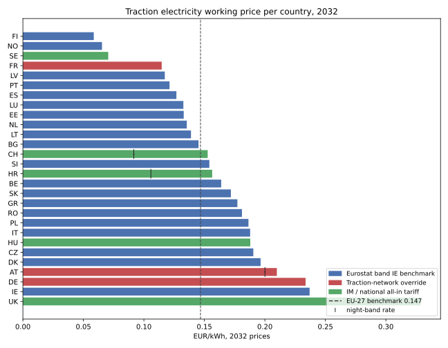

# Traction Energy Pricing — Calibration

The price of the electricity a night train draws while driving, and the
charges levied for supplying it, calibrated per country for
28 European countries.

Generated by `02_energy_pricing_calibration.ipynb` on 2026-08-17 — do not
edit by hand; re-run the notebooks (01 then 02, top to bottom) to regenerate
this document and the CSVs under `data/` and `seed/`. Calibration last
reviewed end to end 2026-08-17.

Consumption modelling lives in `models/energy/`; this document calibrates
**prices**. Implementation:
`backend/models/infrastructure/energy_pricing/calc_energy_price.py`.

**Provenance at a glance:** 35 values read directly from a named
locator, 36 derived by documented arithmetic, 208 from
the Eurostat benchmark, 3 assumed with a mandatory band, and
62 documented as not levied — across 24 cited sources.
20 are `missing`: explicit rather than absent, so a gap cannot be
mistaken for a zero.

---

# Part I — Scope

## What belongs here

The **price of the energy a train uses while driving**, and the charges an
infrastructure manager levies for supplying it. Concretely, per country:

- the traction electricity price in EUR/kWh, day and — where the tariff bands
  it — night;
- the charge for using the catenary and the traction power-supply
  installations, in the unit the IM publishes it in.

Everything else energy-adjacent is calibrated elsewhere, and each boundary is
a decision rather than an omission:

| Not here | Where | Why |
|---|---|---|
| Consumption in kWh per train-km | `models/energy/` | A property of the train and the terrain, not of a national tariff. This domain prices a kWh; that domain counts them |
| Stabling and pre-heating energy | facility domain (shunting and parking) | Drawn while standing, not while driving, and priced very differently: DB InfraGO charges 0.2345 EUR/kWh metered Elektrant power and 0.3682 EUR/kWh for 16.7 Hz pre-heating, two to three times the traction price. Those belong against stabled hours, never against train-km |
| Track access itself | `models/infrastructure/tac/` | The minimum access package. Its calibration excludes every supply-equipment charge per country — this document picks up exactly that list |
| Diesel traction | out of scope | The target network is electric throughout. A route needing diesel haulage would need a fuel price and an emissions factor this domain does not carry |

The TAC boundary is the one worth stating twice, because it is the one where a
charge could be lost or counted twice. `TAC_CALIBRATION.md` records an
"excluded (energy)" line for 18 countries; every one of them
appears below as a priced charge, a documented absence, or an open action with
the document named. Switzerland is the mirror case: its all-in traction price
covers the supply installations, so nothing separate is charged here — while
its *Haltezuschlag* stays with TAC, since a stop consumes path capacity rather
than energy.

---

# Part II — Method

## How a price is built

Three derivation modes, in the order they take precedence:

| Mode | Applies to | What it does |
|---|---|---|
| **(b) full override** | 5 countries with a published traction-energy tariff | Replaces the whole component stack — the tariff is what the RU pays, taxes and network included |
| **(c) network override** | 3 countries running a dedicated traction-current network | Replaces **only** the network column; the current itself is still procured on the market, so commodity and taxes stay on the benchmark |
| **(a) benchmark** | everyone else | Eurostat's nine price components for non-household consumers, band IE |

Then two adjustments apply to modes (a) and (c): the rail-specific electricity
excise replaces Eurostat's standard-rate environmental column, and VAT is
added back wherever the operator cannot deduct it.

### Why band IE

Band IE is 20,000–69,999 MWh a year. A night-train operation drawing
15–25 kWh/train-km over 1–3 million train-km a year lands inside it, and the
UK DESNZ "Large" series is defined identically, so the GB figure is directly
comparable rather than approximately so.

Two independent infrastructure-manager tariffs confirm the band choice, which
matters because it is the single largest methodological lever in the document:
Hungary's published all-in price of 67.4 HUF/kWh is 0.170 EUR against Eurostat
band IE HU at 0.1711, and Sweden's Trafikverket worked example of 0.7156 SEK
is 0.064 EUR against band IE SE at 0.0696. Neither would match band IA
(< 20 MWh/a), which an earlier draft of this calibration used and which
overstated prices by roughly 40–70 %.

### Why the rail tax replaces a column rather than adding to it

Eurostat's "Environmental taxes" category is where the national electricity
excise sits — at the **standard** rate. Germany makes this legible: the
Eurostat column reads 0.0205 EUR/kWh, which is exactly the standard Stromsteuer
of 20.50 EUR/MWh, while rail pays the §9(2) reduced rate of 11.42. Same tax,
different rate, so they must not be added. The rule is therefore

```
working price = Σ(non-VAT components) − environmental + rail electricity tax
```

with one country excepted. **Poland** carries an environmental component of
0.0446 EUR/kWh, around 37 times the Polish electricity excise, so it evidently
bundles certificate-of-origin and cogeneration obligations that are not the
excise at all. Subtracting it would credit Poland with levies it really pays;
splitting it would be a guess. No reconciliation is applied and the
un-reconciled total stands, which overstates rather than understates Polish
energy cost.

### Day and night

Three countries price traction electricity by clock time: Austria's
Bahnstromnetz Niedertarif, Switzerland's reduced NZV rate, and Croatia's NT
tariff. All three discount the window 22:00–06:00, which is most of a night
train's run but not the evening departure or the morning approach.

The night rate is therefore stored as its own column with the band, not folded
into a single blended figure: `calc_energy_price.py` splits each country run
pro rata by the clock minutes it spends inside the band, the same mechanism
`calc_tac.py` uses for the German night rate. Everywhere else the tariff has
one rate around the clock, which the model reads as *no band* — a documented
tariff fact, not a missing band.

### VAT

VAT is only a real cost where the operator's own output is VAT-**exempt**,
since exemption removes the right to deduct input VAT. Zero-rating and reduced
rating both preserve it.

**Denmark is the one confirmed exception**: Danish law exempts passenger
transport, so a Danish operator cannot reclaim input VAT and the DK working
price includes it. Everywhere else input VAT is assumed recoverable. This is
the assumption in the document that carries the most weight — see the closing
section.

## Two conversions, both here

A calibrated value is what the source document says: native currency, at the
document's own price basis. Two conversions stand between that and a number
the cost model can use, and both happen exactly once, in this notebook.
`calc_energy_price.py` never sees a currency or a price basis, and neither does
`seed.py`.

### Currency

4 of the calibrated prices publish in a currency other than
the euro (CHF, GBP, HUF, SEK), so the FX table is a calibration input in its own
right rather than a formatting detail. ECB reference rates, snapshot
**2026-08-11** — deliberately the same snapshot the TAC calibration pins,
so both infrastructure domains reach EUR on identical terms and a scenario
repins one date rather than two:

| Currency | Reference rate | → EUR factor |
|---|---|---|
| CHF | 0.940 CHF = 1 EUR | 1.064000 |
| GBP | 0.833 GBP = 1 EUR | 1.200000 |
| HUF | 396.000 HUF = 1 EUR | 0.002525 |
| SEK | 11.200 SEK = 1 EUR | 0.089286 |

### Price basis → 2032

Energy is escalated at **2.0% a year**, and this is where the
domain deliberately parts company with track access.

Track access rises around 3 %/yr, about a point a year in real terms, because
Directive 2012/34 Art. 31–32 pushes infrastructure managers towards full cost
recovery against a growing renewal burden. A traded commodity has no such
mechanism. European wholesale power forwards run flat to falling in real terms
beyond 2027 as renewable capacity displaces gas at the margin, so carrying the
2025 commodity price forward at nominal HICP is the neutral choice: constant
real price, nominal drift only.

| Price basis | Values | Years to 2032 | 0.0% | 1.5 % | **2.0%** | 3.0% |
|---|---|---|---|---|---|---|
| 2025 | 201 | 7 | 1.000 | 1.110 | **1.149** | 1.230 |
| 2026 | 4 | 6 | 1.000 | 1.093 | **1.126** | 1.194 |
| 2027 | 7 | 5 | 1.000 | 1.077 | **1.104** | 1.159 |

The band brackets the two directions the argument fails in: 0 %/yr if real
prices fall as fast as nominal inflation rises, 3 %/yr if grid reinforcement
and levy growth outpace HICP. Applied across the calibration, the escalation
adds a mean **+15%** to the values carried on the European rate.

Two deviations from that rate are documented rather than buried, and a
parameter-level deviation outranks a country-level one — a statutory tax rate
does not move with a national tariff's escalation, whichever country levies it:

| Deviation | Rate | Reason, with its counter-argument |
|---|---|---|
| parameter `rail_electricity_tax` | 0%/yr | Electricity excise is a statutory rate per kWh, not an indexed tariff: it moves when a legislature moves it and not otherwise. Germany is the direct evidence — the StromStG §9(2) rail rate reads 11.42 EUR/MWh in the 2016 CE Delft database and 11.42 EUR/MWh in DB InfraGO's 2027 price list, unchanged across a decade that included the 2022 energy crisis. Austria's Elektrizitätsabgabe likewise sits at its long-standing 15.00 EUR/MWh once the temporary 2022-2024 reduction expired. COUNTER-ARGUMENT, deliberately recorded: a nominal freeze is a real-terms cut, and the ETS2 and energy-taxation directive files both point at higher minimum rates this decade; if either lands, this becomes the low end rather than the estimate. The exposure is small — the largest rail excise in the calibration is 1.4% of a working price. |
| country SK | 0%/yr | The Slovak supply-equipment charge is component U4 of Measure 2/2018, frozen with the rest of that instrument since 2019. Same deviation, same reason and the same recorded counter-argument as the Slovak track access charges: a fourteen-year freeze is implausible and a revision would likely catch up at once, so treat zero as the low end of a real 0-2%/yr range. |

---

# Part III — The values

## 1. Eurostat band IE components, 2025 (EUR/kWh)

The benchmark layer, reproduced exactly as Eurostat publishes it — nine
components, plus the non-VAT total. Bulgaria's negative "other" is a net
rebate in the 2025 data and is carried through as published. Switzerland and
Great Britain do not report to `nrg_pc_205_c`; Cyprus and Malta have no
railways.

| Country | Energy & supply | Network | VAT | Renewable | Capacity | Environmental | Nuclear | Other | **Total excl. VAT** |
|---|---|---|---|---|---|---|---|---|---|
| AT | 0.1112 | 0.0292 | 0.0322 | 0.0047 | 0 | 0.0135 | 0 | 0.0024 | **0.1610** |
| BE | 0.0968 | 0.0169 | 0.0279 | 0.0113 | 0.0008 | 0.0072 | 0 | 0 | **0.1330** |
| BG | 0.1108 | 0.0219 | 0.0251 | 0 | 0 | 0.0010 | 0 | -0.0082 | **0.1255** |
| CZ | 0.1114 | 0.0414 | 0.0351 | 0.0129 | 0 | 0.0012 | 0 | 0.0001 | **0.1670** |
| DE | 0.0979 | 0.0375 | 0.0321 | 0.0017 | 0.0097 | 0.0205 | 0 | 0.0014 | **0.1687** |
| DK | 0.0912 | 0.0261 | 0.0534 | 0 | 0 | 0.0011 | 0 | 0 | **0.1184** |
| EE | 0.0811 | 0.0209 | 0.0269 | 0.0084 | 0 | 0.0018 | 0 | 0 | **0.1122** |
| ES | 0.0896 | 0.0100 | 0.0222 | 0.0007 | 0.0002 | 0.0035 | 0 | 0.0050 | **0.1090** |
| FI | 0.0375 | 0.0134 | 0.0131 | 0 | 0.0001 | 0.0005 | 0 | 0 | **0.0515** |
| FR | 0.0680 | 0.0175 | 0.0141 | 0 | 0.0012 | 0.0057 | 0 | 0 | **0.0924** |
| GR | 0.1344 | 0.0112 | 0.0093 | 0.0028 | 0 | 0.0020 | 0 | 0.0054 | **0.1558** |
| HR | 0.1034 | 0.0171 | 0.0172 | 0.0111 | 0 | 0.0005 | 0 | 0 | **0.1321** |
| HU | 0.1175 | 0.0352 | 0.0415 | 0.0135 | 0 | 0.0010 | 0 | 0.0039 | **0.1711** |
| IE | 0.1529 | 0.0474 | 0.0129 | 0.0019 | 0.0001 | 0.0003 | 0 | 0.0040 | **0.2066** |
| IT | 0.1223 | 0.0166 | 0.0158 | 0.0147 | 0.0083 | 0.0015 | 0 | 0.0016 | **0.1650** |
| LT | 0.0940 | 0.0258 | 0.0250 | 0.0002 | 0 | 0 | 0 | 0.0002 | **0.1202** |
| LU | 0.1036 | 0.0110 | 0.0092 | 0.0003 | 0 | 0 | 0 | 0.0002 | **0.1151** |
| LV | 0.0871 | 0.0111 | 0.0214 | 0 | 0 | 0 | 0 | 0.0039 | **0.1021** |
| NL | 0.0959 | 0.0200 | 0.0271 | 0 | 0 | 0.0132 | 0 | 0 | **0.1291** |
| NO | 0.0516 | 0.0053 | 0.0163 | 0 | 0 | 0.0082 | 0 | 0 | **0.0651** |
| PL | 0.0775 | 0.0278 | 0.0373 | 0.0022 | 0.0099 | 0.0446 | 0 | 0.0003 | **0.1623** |
| PT | 0.0814 | 0.0146 | 0.0235 | 0.0079 | 0.0005 | 0.0005 | 0 | 0.0011 | **0.1060** |
| RO | 0.1128 | 0.0311 | 0.0313 | 0.0128 | 0 | 0.0005 | 0 | 0 | **0.1572** |
| SE | 0.0530 | 0.0161 | 0.0174 | 0 | 0 | 0.0005 | 0 | 0 | **0.0696** |
| SI | 0.1130 | 0.0126 | 0.0290 | 0.0050 | 0.0001 | 0.0009 | 0 | 0 | **0.1316** |
| SK | 0.1135 | 0.0344 | 0.0329 | 0.0111 | 0.0096 | 0.0013 | 0.0033 | 0 | **0.1732** |
| *EU-27* | 0.0946 | 0.0235 | 0.0247 | 0.0044 | 0.0041 | 0.0102 | 0 | 0.0012 | *0.1380* |

## 2. Mode (b) — full national or IM tariff

| Country | Day, native | Night, native | Day → EUR | Night → EUR | Basis | Source |
|---|---|---|---|---|---|---|
| CH | 0.13 CHF | 0.078 CHF | 0.1383 | 0.0830 | 2027 | `CH-NZV` Art.20a transitional |
| HR | 0.1417 EUR | 0.0958 EUR | 0.1417 | 0.0958 | 2027 | `HR-NS-2027` ch.5.4 item 40 |
| HU | 67.4 HUF | — | 0.1702 | — | 2027 | `HU-NS-2627` Annex 5.2-6 |
| SE | 0.7156 SEK | — | 0.0639 | — | 2027 | `SE-NS-2027` §7.3.11 |
| UK | 0.23848 GBP | — | 0.2862 | — | 2025 | `DESNZ-T341` Table 3.4.1, Large band |

Great Britain's rate is the **excl.-CCL** DESNZ series, because rail traction
is CCL-exempt. The gap between DESNZ's two columns (0.5527 p/kWh) is a survey
average across liable and exempt consumers and must not be read as the
statutory CCL rate of 0.775 p/kWh.

Croatia's figures add the renewables levy of 0.0132 EUR/kWh to the NT and VT
tariffs; its network statement prints excise as 0.000000, which supersedes the
CE Delft PPS estimate for Croatia.

## 3. Mode (c) — traction-network override

Austria, Germany and France each charge for use of a traction-current network
physically distinct from the public grid. Only the network column is replaced:

| Country | Eurostat network | Override day | Override night | Status | Basis | Source |
|---|---|---|---|---|---|---|
| AT | 0.0292 | 0.0524 | 0.0437 | sourced | 2026 | `AT-SNNB-2026` Tab.59 p.114 |
| DE | 0.0375 | 0.0844 | — | assumed | 2026 | `DE-DBE-NETZ-2026` Hochspannung, <2,500 h/a |
| FR | 0.0175 | 0.0315 | — | derived | 2027 | `FR-DRR-A512` loss formula §2.1 |

**Austria** publishes a single-part tariff billed on energy drawn, so it
converts to EUR/kWh with no demand assumption: Hochtarif 52.40 EUR/MWh
06:00–22:00, Niedertarif 43.67 EUR/MWh 22:00–06:00.

**Germany** publishes a two-part tariff, so the per-kWh equivalent is
`Arbeitspreis + Leistungspreis / Benutzungsdauer`, where Benutzungsdauer is
annual energy divided by the annual peak quarter-hour load *of the RU's own
fleet*. A night train running ~10 h per night on ~350 nights has ~3,500
running hours a year, and the coincident peak of a loco-hauled fleet is
roughly 1.7–2.0× its average draw, giving 1,750–2,060 h/a — hence the 1,900
h/a estimate. Two consequences matter more than the point estimate. The band
choice is robust: reaching the ≥ 2,500 h/a tariff system would need more than
~4,250 running hours a year, which a night-only operation cannot approach.
And within the < 2,500 h/a band the sensitivity is small, because the
Leistungspreis is only 23.35 EUR/kWa there — 1,500 h/a gives 0.0877 and
2,400 h/a gives 0.0818, a spread of ±4 %.

Germany's statutory levies (KWKG-Umlage, Offshore-Netzumlage, StromNEV
§19(2)) are named but not quantified in the price sheet, and are deliberately
**not** added: they are non-network levies already carried in Eurostat's tax
columns, which this override leaves intact. Those columns sum to 0.0128
EUR/kWh for Germany, the right order of magnitude for the three levies
combined, so substituting only the network column preserves them exactly once.

**France** is derived rather than read, because the 2024 tariff is crisis-era
and SNCF Réseau does not publish 2027 values until December 2026. DRR Annexe
5.1.2 gives the formula:

```
RCTE-A = purchase price × loss rate / (1 − loss rate)
```

Back-solving the published 2024 tariff validates it: 0.02912 × 0.864 / 0.136
= 0.1850 EUR/kWh implied purchase price, against a published 2024 RFE of
0.18653 — a 0.8 % gap, which is the management margin. Applying it forward at
the published 13.4 % loss rate and the Eurostat 2025 French energy component
of 0.0680 gives RCTE-A 0.0105, plus RCTE-B 0.0210 indexed from 0.02003, for a
network override of 0.0315 against the crisis-era 0.04915. RFE itself — the
supply of traction current by SNCF Réseau — is optional and is not used: an
RU may procure energy elsewhere.

## 4. Rail-specific electricity tax

CE Delft 4.K83's accompanying database, sheet `Rail_Energy taxes_level`, is
the only pan-European source giving per-country rail excise rates rather than
plotting them. Values are PPS-adjusted, so nominal rates differ by national
price level — immaterial here, since the largest entry in the table is 1.4 %
of a working price. Austria and Germany are the two exceptions, both used at
nominal because both are independently published (15.00 and 11.42 EUR/MWh).

| Country | Rail rate | Eurostat environmental (replaced) | Source | Note |
|---|---|---|---|---|
| AT | 0.0150 | 0.0135 | `APS-STROMSTEUER` | Elektrizitätsabgabe at the full rate — Austria grants rail no carve-out, and the temporary 2022-2024 reduction to 1 EUR/MWh expired 31 Dec 2024. Corroborated by CE-DELFT-4K83 at 13.79 EUR/MWh PPS-adjusted |
| BG | 0.0021 | 0.0010 | `CE-DELFT-4K83` | PPS-adjusted 2016 rate; nominal differs by the national price level |
| DE | 0.0114 | 0.0205 | `DE-APS-2027` | StromStG §9(2) reduced rail rate, available on presentation of an Erlaubnisschein, read at the 2027 price basis. Identical to the 2016 CE Delft figure — the direct evidence that a statutory rate does not escalate with a tariff |
| DK | 0.000372 | 0.0011 | `CE-DELFT-4K83` | PPS-adjusted 2016 rate; nominal differs by the national price level. The database rate supersedes the sheet's own 'exempt' label, which contradicts both the value and the reported revenue |
| EE | 0.0061 | 0.0018 | `CE-DELFT-4K83` | PPS-adjusted 2016 rate; nominal differs by the national price level |
| ES | 0.0057 | 0.0035 | `CE-DELFT-4K83` | PPS-adjusted 2016 rate; nominal differs by the national price level |
| FR | 0.000457 | 0.0057 | `CE-DELFT-4K83` | PPS-adjusted 2016 rate; nominal differs by the national price level |
| GR | 0.000609 | 0.0020 | `CE-DELFT-4K83` | PPS-adjusted 2016 rate; nominal differs by the national price level |
| HU | 0.0017 | 0.0010 | `CE-DELFT-4K83` | PPS-adjusted 2016 rate; nominal differs by the national price level |
| LT | 0.000848 | 0 | `CE-DELFT-4K83` | PPS-adjusted 2016 rate; nominal differs by the national price level |
| LU | 0.000414 | 0 | `CE-DELFT-4K83` | PPS-adjusted 2016 rate; nominal differs by the national price level |
| NL | 0.0023 | 0.0132 | `CE-DELFT-4K83` | PPS-adjusted 2016 rate; nominal differs by the national price level |
| PL | 0.0082 | 0.0446 | `CE-DELFT-4K83` | PPS-adjusted 2016 rate; nominal differs by the national price level |
| RO | 0.0010 | 0.0005 | `CE-DELFT-4K83` | PPS-adjusted 2016 rate; nominal differs by the national price level |
| SI | 0.0040 | 0.0009 | `CE-DELFT-4K83` | PPS-adjusted 2016 rate; nominal differs by the national price level |

Positively not levied, or rail-exempt: BE, CH, CZ, FI, HR, IE, IT, LV, NO, PT, SE, SK, UK.

## 5. Electric supply equipment

The other half of the TAC scope decision. 13 infrastructure
managers charge separately for use of the catenary and the traction
power-supply installations, in three different units — which is why the
database carries two columns and one price component rather than one blended
number. Dividing a per-train-km charge by an assumed consumption would bake
`models/energy/`'s placeholder factor into an infrastructure charge and move
every one of these figures the day that model is calibrated.

The last two columns put the charges on one scale for reading only: EUR per
train-km at 2032 prices (per-gross-tonne-km rates at
600 t, the per-kWh rate at 28
kWh/train-km), and that as a share of the same country's traction energy cost.

| Country | As published | Unit | Status | Basis | 2032 EUR/train-km | Share of energy cost | Source |
|---|---|---|---|---|---|---|---|
| BE | 0.01722 EUR | per kWh | sourced | 2026 | **0.5430** | 12% | `BE-NS-2027` §5.3 direct cost catenary |
| FI | 0.000167 EUR | per gross-tonne-km | sourced | 2027 | **0.1106** | 7% | `FI-NS-2027` Tab.2 §5.3 |
| FR | 0.291 EUR | per train-km | sourced | 2027 | **0.3213** | 10% | `FR-DRR-2027-A52` App.5.2.2 RCE |
| GR | 0.001509 EUR | per gross-tonne-km | derived | 2026 | **1.0195** | 21% | `GR-OSE-2026` ch.6 c_wte |
| HR | 0.1 EUR | per train-km | sourced | 2027 | **0.1104** | 3% | `HR-NS-2027` §5.3 items 4-18 |
| HU | 110 HUF | per train-km | sourced | 2027 | **0.3067** | 6% | `HU-NS-2627` Annex 5.2-6 |
| IT | 0.241 EUR | per train-km | assumed | 2027 | **0.2661** | 5% | `IT-LISTINO` Component TA3 |
| LT | 0.1709 EUR | per train-km | sourced | 2027 | **0.1887** | 5% | `LT-LTG-2627` §5.3.2 |
| LU | 0.2583 EUR | per train-km | sourced | 2026 | **0.2909** | 8% | `LU-NS-2027` §5.3.2 c_E |
| LV | 0.15 EUR | per train-km | sourced | 2026 | **0.1689** | 5% | `LV-NS-2027` §5.2 |
| PL | 0.29 PLN | per train-km | sourced | 2027 | **0.0753** | 1% | `PL-PLK-A91` Annex 9.1 |
| RO | 0.676 RON | per train-km | sourced | 2024 | **0.1559** | 3% | `RO-CFR-A25` Annex 26.a Ttse |
| SK | 0.000228 EUR | per gross-tonne-km | sourced | 2019 | **0.1368** | 3% | `SK-ZSR-A52B` Annex 1, component U4 |

Greece is the outlier and is worth a second look rather than a correction: at
600 t its electrification wear works out around a euro per
train-km, a fifth of the Greek traction energy bill. That follows from the
tariff's own shape — OSE charges everything on weight moved, and c_wte is 37 %
of the track-wear rate c_wt it sits beside, so the ratio is internally
consistent. It is a weight-driven charge on a heavy loco-hauled train, not an
arithmetic slip; a lighter consist pays proportionally less.

Positively not levied — each for a different reason, and each worth stating so
a later reader does not "fix" an apparent gap:

| Country | Why |
|---|---|
| AT | The Bahnstromnetz tariff IS the supply-equipment charge and is already priced per kWh as the network override (mode c); a second per-train-km term would charge the same asset twice |
| CH | The NZV Art.20a traction-current price is all-in; Switzerland levies no separate charge for the supply installations |
| DE | The DB Energie Netznutzung tariff is the supply-equipment charge, already priced per kWh as the network override (mode c) |
| IE | The traction-power charge applies to the DART network only, and the Irish intercity network a night train would use is unelectrified |
| SE | The Trafikverket price is energy plus grid together (0.6075 + 0.1081 SEK/kWh), so the supply equipment is inside the working price |

Not yet established. These are NULL in the database and therefore priced at
zero, which understates cost — the first open action:

| Country | Document | What is unresolved |
|---|---|---|
| BG | `BG-NRIC-2026` | Section I lists 17.29 EUR for use of power-supply equipment without a unit that can be read unambiguously — per train-km, per MWh and per path are all consistent with the surrounding text |
| CZ | `CZ-NS-2027` | Charging annex not yet checked for a traction-current term |
| DK | `DK-NS-2027` | Danish charges are set by executive order rather than in the network statement; the order has not been checked for an electrification term |
| EE | `EE-TTJA-2026` | Published rate table not yet checked |
| ES | `ES-BOE-2024` | Modality C covers transformation and distribution of traction electricity; the consulted consolidation names it without a rate table |
| NL | `NL-NS-2027` | Not established whether the train path service price includes catenary use or whether ProRail charges it separately |
| NO | `NO-NS-2027` | §5.3.3 not yet checked for an electrification term |
| PT | `PT-IP-2027` | §5.3 distinguishes electric from diesel traction, so a separate supply-equipment element is plausible and unchecked |
| SI | `SI-NS-2027` | §5.3 factor chain not yet checked |
| UK | `UK-NR-CP7` | The Electrification Asset Usage Charge sits in a price-list sheet not yet extracted |

## 6. Working prices at 2032

Everything above, converted and escalated. The final column is illustrative
only: traction energy at 28 kWh/train-km plus the
supply-equipment charge for a 600 t train, which is how
these numbers will feel in a route total.

| Country | Mode | Day EUR/kWh | Night EUR/kWh | Band | Catenary €/trkm | Catenary €/gtkm | ≈ €/train-km |
|---|---|---|---|---|---|---|---|
| AT | network_override | **0.2099** | 0.2001 | 22:00-06:00 | — | — | 5.88 |
| BE | benchmark | **0.1639** | — | — | — | — | 4.59 |
| BG | benchmark | **0.1452** | — | — | ? | ? | 4.06 |
| CH | im_tariff | **0.1527** | 0.0916 | 22:00-06:00 | — | — | 4.28 |
| CZ | benchmark | **0.1905** | — | — | ? | ? | 5.33 |
| DE | network_override | **0.2336** | — | — | — | — | 6.54 |
| DK | benchmark | **0.1965** | — | — | ? | ? | 5.50 |
| EE | benchmark | **0.1329** | — | — | ? | ? | 3.72 |
| ES | benchmark | **0.1269** | — | — | ? | ? | 3.55 |
| FI | benchmark | **0.0586** | — | — | — | 0.000184 | 1.75 |
| FR | network_override | **0.1147** | — | — | 0.3213 | — | 3.53 |
| GR | benchmark | **0.1773** | — | — | — | 0.0017 | 5.98 |
| HR | im_tariff | **0.1564** | 0.1058 | 22:00-06:00 | 0.1104 | — | 4.49 |
| HU | im_tariff | **0.1879** | — | — | 0.3067 | — | 5.57 |
| IE | benchmark | **0.2370** | — | — | — | — | 6.64 |
| IT | benchmark | **0.1878** | — | — | 0.2661 | — | 5.52 |
| LT | benchmark | **0.1389** | — | — | 0.1887 | — | 4.08 |
| LU | benchmark | **0.1326** | — | — | 0.2909 | — | 4.00 |
| LV | benchmark | **0.1173** | — | — | 0.1689 | — | 3.45 |
| NL | benchmark | **0.1355** | — | — | ? | ? | 3.79 |
| NO | benchmark | **0.0654** | — | — | ? | ? | 1.83 |
| PL | benchmark | **0.1864** | — | — | 0.0753 | — | 5.30 |
| PT | benchmark | **0.1212** | — | — | ? | ? | 3.39 |
| RO | benchmark | **0.1810** | — | — | 0.1559 | — | 5.22 |
| SE | im_tariff | **0.0705** | — | — | — | — | 1.98 |
| SI | benchmark | **0.1541** | — | — | ? | ? | 4.31 |
| SK | benchmark | **0.1719** | — | — | — | 0.000228 | 4.95 |
| UK | im_tariff | **0.3287** | — | — | ? | ? | 9.20 |

In the two catenary columns **—** is a documented absence and **?** an unread
one, which is the difference between a country that charges nothing and a
country nobody has checked. The ≈ €/train-km column adds a supply-equipment
charge priced at zero for every **?**, so those rows read low by 3–10 %.



*Figure 1 — day working price per country, 2032 EUR/kWh, sorted.
Bar colour marks the derivation mode. The dashed line is the EU-27 band IE
benchmark carried to 2032 on the same basis
(0.1468 EUR/kWh). Regenerated by this notebook — do not edit.*

**Reading the spread.** Prices run from FI at 0.0586 to
UK at 0.3287 EUR/kWh, a factor of 5.6, around a
median of 0.1553. Three groups separate cleanly. The Nordics plus
Switzerland and Croatia are cheap for two different reasons — hydro- and
wind-heavy generation in FI, NO and SE, explicit night tariffs in CH and HR.
A broad middle of twenty countries sits within a factor of about 1.7 of each
other, so for most routes energy price is not a discriminating variable. The
expensive tail is where it matters: Germany is there because of its dedicated
16.7 Hz traction-network tariff rather than the commodity price, and Great
Britain because the DESNZ large-user series is simply high. Both are also the
two networks with the highest track access charges, so the cost penalties
compound rather than offset.

Italy and Romania sit on the benchmark by design, not by omission: both
infrastructure managers supply traction current as an explicit market
pass-through, republished monthly or quarterly against a market index, so a
published annex would contain a formula rather than a price. The same applies
to Portugal.

---

# Part IV — What the database receives

`seed/track_energy.csv`, one row per country, all EUR at 2032:

| Column | Meaning | NULL means |
|---|---|---|
| `track_energy_price_eur_kwh` | Day/base traction price | never NULL for a calibrated country |
| `track_energy_price_night_eur_kwh` | Night-band price | one rate around the clock |
| `track_energy_night_band_start` / `_end` | The band, clock time | no band |
| `track_energy_catenary_eur_train_km` | Supply-equipment charge per train-km | not levied in this unit |
| `track_energy_catenary_eur_gross_tonne_km` | Supply-equipment charge per gross-tonne-km | not levied in this unit |

Plus `seed/track_energy_default.csv`, the fallback row for a country the model
routes through but the calibration has no price for: the **median** day price
of the 28 calibrated countries, 0.1553 EUR/kWh. Median
rather than mean — the spread is wide enough that a mean is pulled up by the
expensive tail into a figure no European market charges.

Only the day price is defaulted. A night band and a supply-equipment charge
are national particularities, so handing an uncalibrated country either would
invent tariff structure rather than fill a gap — the same rule the TAC default
follows for the seat-km and per-stop terms.

---

# Part V — Open actions and the assumption that carries the risk

| # | Action | Impact if it moves |
|---|---|---|
| 1 | Resolve the 10 unread supply-equipment positions above. Three are known to exist (BG's unit is ambiguous, ES publishes Modality C without a rate, GB's EAUC is in an unextracted sheet); seven are simply unchecked | Each is 3–10 % of that country's energy cost, currently priced at zero |
| 2 | Confirm the VAT treatment of international rail passenger transport for IE and GB — the question is not the rate but whether the supply is zero-rated (deduction preserved) or exempt (deduction lost) | 15–30 % on the affected country |
| 3 | Replace the derived French 2027 network override with the published values, after December 2026 | FR only, likely a few per cent — the derivation reproduces the 2024 tariff to within 1 % |
| 4 | Confirm Croatia's NT/VT band hours, currently assumed 22:00–06:00 | Fractions of a per cent — HR day and night differ by 0.046 EUR/kWh |
| 5 | Resolve Italy's TA3 rate by line class rather than defaulting to the conventional-network figure | Doubles the Italian catenary charge on any high-speed leg |
| 6 | Cross-check Germany's three statutory levies against netztransparenz.de for the delivery year | Confirms or moves DE by ~0.0128 EUR/kWh |

**The one assumption carrying real risk is VAT recoverability.** Every other
assumption here moves a working price by single-digit per cents. This one moves
it by 15–30 % for any country it applies to, because a VAT-exempt operator
cannot deduct input VAT while a zero-rated one can. Denmark is confirmed
exempt; the rest are assumed recoverable, and the most plausible additional
candidates are Ireland and Great Britain, both of which apply 0 % to passenger
transport — but zero-rating normally preserves the deduction right, which is
why they are assumed recoverable here. It is implemented as a per-country
boolean so that a single flag flip absorbs new evidence.

---

## Sources

Documents a calibrated value leans on directly. Every citation is checked
against the register written by `01_source_extraction.ipynb`, so a source that
does not resolve fails the notebook rather than reaching this document.

| source_id | Document | Publisher | Published | Price basis | Link |
|---|---|---|---|---|---|
| `AT-SNNB-2026` | Schienennetz-Nutzungsbedingungen 2026 | ÖBB-Infrastruktur AG | 2024 | 2026 | [link](https://infrastruktur.oebb.at/de/geschaeftspartner/schienennetz/snnb) |
| `BE-NS-2027` | Network Statement 2027 (version 30 June 2026) | Infrabel | 2026 | 2026 | [link](https://infrabel.be/en/networkstatement) |
| `CH-NZV` | SR 742.122 Eisenbahn-Netzzugangsverordnung (NZV) | Swiss Confederation (Fedlex) | 2026 | 2027 | [link](https://www.fedlex.admin.ch/eli/cc/1999/142/de#a21) |
| `DE-APS-2027` | Anlagenpreissystem 2027 — Entgelte für Serviceeinrichtungen | DB InfraGO | 2025 | 2027 | [link](https://www.dbinfrago.com/web/schienennetz/regelwerke-nutzungsbedingungen/preise) |
| `DE-DBE-NETZ-2026` | Preisblatt Netznutzung Bahnstromnetz, from 01.01.2026 | DB Energie | 2025 | 2026 | [link](https://www.dbenergie.de/dbenergie-de/Produkte/bahnstrom) |
| `FI-NS-2027` | Verkkoselostus / Network Statement 2027 | Väylävirasto (Finnish Transport Infrastructure Agency) | 2026 | 2027 | [link](https://www.doria.fi/bitstream/handle/10024/195216/vj_2026-38eng_978-952-405-425-6.pdf?sequence=1&isAllowed=y) |
| `FR-DRR-2027-A52` | DRR 2027 Appendix 5.2 — scale of minimum services | SNCF Réseau | 2026 | 2027 | [link](https://www.sncf-reseau.com/en/drr/network-statement-national-rail-network-timetable-2027) |
| `FR-DRR-A512` | DRR 2027 Annexe 5.1.2 — tarification de la traction électrique | SNCF Réseau | 2026 | 2027 | [link](https://www.sncf-reseau.com/en/drr/network-statement-national-rail-network-timetable-2027) |
| `GR-OSE-2026` | Network Statement 2026 (EN final) | OSE | 2026 | 2026 | [link](https://ose.gr/wp-content/uploads/2026/02/OSE_2026-ENG_Final.pdf) |
| `HR-NS-2027` | Izvješće o mreži / Network Statement 2027 | HŽ Infrastruktura | 2026 | 2027 | [link](https://eng.hzinfra.hr/?page_id=284) |
| `HU-NS-2627` | Network Statement 2026-2027, Annex 5.2-6 | VPE / MÁV | 2026 | 2027 | [link](https://vpe.kti.hu/en/network-statement/network-statement-2026-2027/) |
| `IT-LISTINO` | Listino Tariffario Pacchetto Minimo di Accesso (PMdA) | RFI | 2026 | 2027 | [link](https://www.rfi.it/en/railway-infrastructure-access-/Network-statement.html) |
| `LT-LTG-2627` | Network Statement 2026-2027 and annexes v1 | LTG Infra | 2026 | 2027 | [link](https://ltginfra.lt/en/railway-infrastructure/map/network-statements/) |
| `LU-NS-2027` | Document de référence du réseau 2027 (EN v1.0) | ACF / CFL | 2026 | 2026 | [link](https://acf.gouvernement.lu/en/sillon/Document-de-reference-du-reseau.html) |
| `LV-NS-2027` | Network Statement 2027 | LDz / LatRailNet | 2026 | 2026 | [link](https://www.ldz.lv/en/network-statement-2027) |
| `PL-PLK-A91` | Network Statement 2026/2027 Annex 9.1 (SMK) | PKP Polskie Linie Kolejowe | 2026 | 2027 | [link](https://en.plk-sa.pl/for-customers-and-partners/the-rules-for-allocating-train-paths/network-statement-2026/2027) |
| `RO-CFR-A25` | Network Statement Annex 25.a / 26.a | CFR SA | 2025 | 2024 | [link](https://cfr.ro/download-drr-2026-network-statement/) |
| `SE-NS-2027` | Network Statement 2027, §7.3.11 | Trafikverket | 2026 | 2027 | [link](https://bransch.trafikverket.se/en/startpage/operations/Operations-railway/Network-Statement/network-statement-2027/) |
| `SK-ZSR-A52B` | Network Statement 2027 Annex 5.2.B (Measure 2/2018) | ŽSR | 2026 | 2019 | [link](https://www.zsr.sk/en/railway-undertaking/infrastructure/network-statement/network-statement-2027/) |

Statistical, method and conversion sources — these do not price one country,
they underpin the benchmark, the tax reconciliation, the FX table and the
escalation rate:

| source_id | Document | Publisher | Published | Price basis | Link |
|---|---|---|---|---|---|
| `APS-STROMSTEUER` | EU-Vergleich Besteuerung von Eisenbahn-Fahrstrom | Allianz pro Schiene | 2016 | 2016 | [link](https://www.allianz-pro-schiene.de/themen/umwelt/energieverbrauch/) |
| `CE-DELFT-4K83` | Transport taxes and charges in Europe (4.K83) and accompanying database | CE Delft for the European Commission | 2019 | 2016 | [link](https://cedelft.eu/publications/transport-taxes-and-charges-in-europe/) |
| `DESNZ-T341` | Prices of fuels purchased by non-domestic consumers, Tables 3.4.1 and 3.4.2 | Department for Energy Security and Net Zero | 2026 | 2025 | [link](https://www.gov.uk/government/statistical-data-sets/gas-and-electricity-prices-in-the-non-domestic-sector) |
| `EUROSTAT-NRG-PC-205-C` | Electricity price components for non-household consumers (nrg_pc_205_c) | Eurostat | 2026 | 2025 | [link](https://ec.europa.eu/eurostat/databrowser/view/nrg_pc_205_c/default/table) |
| `SKAT-DK-VAT` | Services exempt from VAT | Skattestyrelsen (Danish Tax Agency) | 2024 | 2024 | [link](https://skat.dk/en-us/businesses/vat/services-exempt-from-vat) |

Registered but not yet cited — the documents behind open action 1. They are in
the register so the gap is addressable rather than invisible:

| source_id | Document | Publisher | Published | Price basis | Link |
|---|---|---|---|---|---|
| `BG-NRIC-2026` | Charges and Prices, Annex 5.3.2 v.06 | NRIC (National Railway Infrastructure Company) | 2026 | 2026 | [link](https://www.rail-infra.bg/en/353) |
| `CZ-NS-2027` | Network Statement 2027 (EN web version) | Správa železnic | 2026 | 2027 | [link](https://www.spravazeleznic.cz/web/en/network-statement-2027) |
| `DK-NS-2027` | Network Statement 2027 | Banedanmark | 2026 | 2027 | [link](https://www.bane.dk/en/Railway/Network-Statement) |
| `EE-TTJA-2026` | Raudteeinfrastruktuuri kasutustasu määrad (published rate table) | Tarbijakaitse ja Tehnilise Järelevalve Amet (TTJA) | 2026 | 2026 | [link](https://ttja.ee/ariklient/raudtee/kasutustasu-maarad) |
| `ES-BOE-2024` | BOE-A-2024-22140 (consolidated) — railway charges | Boletín Oficial del Estado | 2024 | 2023 | [link](https://www.boe.es/buscar/act.php?id=BOE-A-2024-22140) |
| `NL-NS-2027` | Network Statement 2027 (version 1.1, 6 May 2026) | ProRail | 2026 | 2027 | [link](https://www.prorail.nl/samenwerken/vervoerders/network-statement) |
| `NO-NS-2027` | Network Statement 2027 (EN v1.1) | Bane NOR | 2026 | 2026 | [link](https://oppslagsverk.banenor.no/en/network-statement/) |
| `PT-IP-2027` | 1st Addenda to Network Statement 2027 | Infraestruturas de Portugal | 2026 | 2027 | [link](https://servicos.infraestruturasdeportugal.pt/sites/default/files/1st%20Addenda%20Network%20Statement%202027_0.pdf) |
| `SI-NS-2027` | Program omrežja / Network Statement 2027 | SŽ-Infrastruktura | 2026 | 2027 | [link](https://infrastruktura.sz.si/en/partners/access-to-infrastructure-for-rus/network-statement/) |
| `UK-NR-CP7` | CP7 Track Usage Price List | Network Rail | 2024 | 2024 | [link](https://www.networkrail.co.uk/industry-and-commercial/information-for-operators/network-statement/) |

Stored documents follow `{source_id}.{ext}`, so the filename is derivable from
the register and needs no column of its own.
