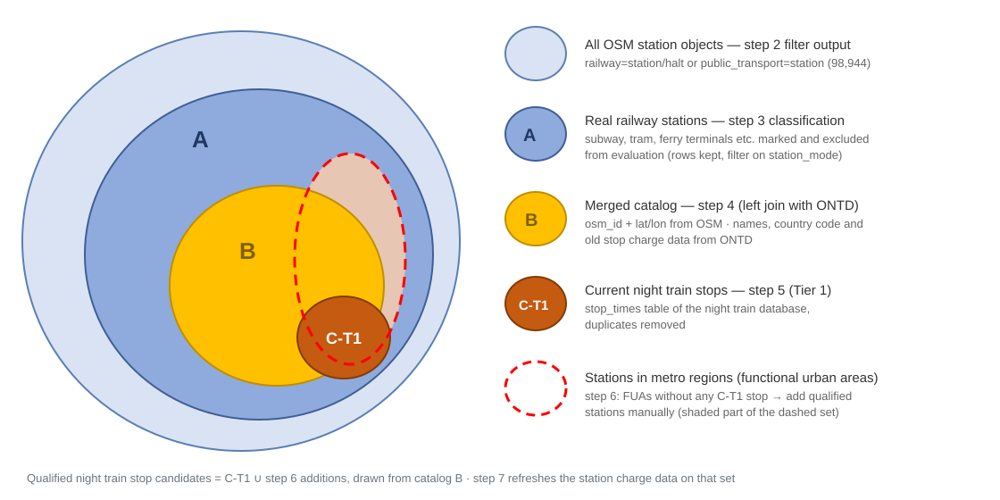

# Stop classification pipeline

> ## Handover — Johanna & Josh
>
> **Where this stands:** the pipeline runs end to end and its output is now the
> app's entire stop catalog — `db/dev/seed.py` no longer carries any stops of
> its own. **700 are current night train stops (step 5) and 358 are the manual
> additions (step 6)**, after the 2026-08-28 input fixes below.
>
> *(2026-08-28: step 5 now reads the schedule from the ONTD workbook the app
> itself loads, step 4 tops its station register up from the same workbook, and
> step 4's output finally reaches step 5 — it had been writing to the wrong
> directory while step 5 read a stale Drive copy. Qualified stops 585 → 700,
> unmatched 17 → 1. 23 step 6 additions that step 5 now qualifies on its own
> were removed, which is the redundancy the caveat below predicted.)*
>
> *(2026-08-24 restructure: 21 step 6 entries that duplicated step 5 stops were
> removed and guards added so the class of error cannot recur; the alt step 5
> notebook was retired into step 5's coverage check; enrichment (step 7) and
> gauges (step 8) are new; the export is now step 10. Numbers and file names
> in this handover are updated; the tasks are unchanged.)*
>
> **What is left is yours**: the *reasons* behind the manual selection, the
> *station charges*, and a decision about the countries we cannot cost yet.
> All three are described under "Your tasks" below, with everything already
> wired up so you only have to supply the data. Please delete this handover
> once you have read it.
>
> ---
>
> ### What David changed during the migration
>
> **Step 5 was dropping 44% of the network.** The wired-in matcher compared
> plain accent-folded names, so the schedule's `Berlin Hbf` never met ONTD's
> `Berlin Hauptbahnhof` — and **267 of 610 schedule stops vanished**, including
> nearly every major German and Austrian hub. Since step 5 is the
> highest-confidence tier ("a night train demonstrably stops here today"), the
> losses fed straight into step 6, which is partly what the metropolitan pass
> was compensating for.
>
> Johanna, your other notebook never had this problem: it matched
> geography-first and used names only for scoring. That is the strategy the
> wired-in step 5 now uses — geo candidates within 1.5 km, scored 70 % name /
> 30 % distance, with `exact` / `geo_name` / `geo_only` / `ambiguous` labels, a
> name fallback, medoid coordinates and abbreviation expansion. **267 unmatched
> became 16**, all accounted for. Your notebook is kept as
> the retired direct schedule→OSM matcher — it was not in the chain (it ran against
> step 3b, so it cannot carry ONTD's country and ids through), but it is the
> cleaner standalone matcher and a useful cross-check.
>
> **Step 6 became a notebook.** It had no script and no record of criteria —
> the only artifact was `step6_metropol.csv`, mixing your picks with an earlier
> step 5 run. `step6_manual_additions.ipynb` now holds the selections as
> editable `stop_id: (name, reason)` dicts grouped by region, and resolves
> name, coordinates and country at run time. The legacy CSV is no longer read.
>
> **The export is new** (`step10_export_seed_stops.py`): it unions step 5 and step 6
> into the exact shape `seed.py` consumes, so a step 5 re-run flows into the
> catalog without touching your manual work.
>
> **Data corrections applied.** Country now comes from ONTD via the step 4
> join, which disagreed with step 6 on seven stops and was right every time:
> the four Crimean stations were coded `RU` against ONTD's `UA` (now `UA`,
> David's call), Narva `RU` though it is in Estonia, Santander `NO`, Lichkov
> `PL`. Timezones are IANA names derived from the country, because step 6's
> timezone column held a bare UTC offset — which cannot express DST and was
> wrong for Ireland. Three junk step 4 matches are excluded (OSM objects named
> `tren`, `A` and `Arad`, 222–2743 km from their ONTD stop).
>
> **Five station choices need your eye.** Four step 6 picks were corrected to
> the station the schedule actually calls at — Nicolina → Iași,
> Миколаїв-Вантажний (freight) → Миколаїв, Кривий Ріг → Кривий Ріг-Головний,
> and Велико Търново added alongside Горна Оряховица — and Poltava (19 trips)
> was added outright. Wien Westbahnhof, Kolín, Česká Třebová and Esbjerg were
> also added because route fixtures referenced them. Please sanity-check those.
>
> **Two Rail Baltica stops stay out** (Pärnu International, Rīga Airport): they
> are not built, and this is a catalog of existing infrastructure.
>
> **Bulk data no longer lives in git.** `data_sources.py` downloads the inputs
> from Drive into `data/` on first use, the same soft-fail pattern `seed.py`
> uses. `data/` is gitignored, as is `charges/data/` and `charges/sources/` —
> the notebooks are the truth in both cases.
>
> ---
>
> ### Your tasks
>
> #### 1. Reasons for the manual additions — Johanna
>
> 341 of the 358 step 6 stops have an unfilled `reason`. The design requires that
> *"why is station X (not) included?"* be answerable from the data alone,
> including by people outside the project; right now, for a stop like
> `Osmaniye` or `Denizli`, nothing distinguishes it from one a night train
> demonstrably serves. This is the single biggest gap in the catalog.
>
> Open `step6_manual_additions.ipynb` and fill the second element of each
> tuple. Suggested vocabulary — keep it short and greppable:
>
> | reason | when |
> |---|---|
> | `fua:<city>` | functional urban area with no qualified stop |
> | `tourism:<region>` | tourism destination |
> | `ferry:<port>` | major ferry hub |
> | `border` | border or interchange station |
> | `network` | needed to make a corridor coherent |
>
> The last cell prints everything still unfilled, so the gap stays visible. Run
> the notebook, then step 10, and each reason's criterion becomes the stop's
> `provenance` category in the published catalog (the detailed reasons stay in
> `data/step6_manual_additions.csv`).
>
> One caveat worth knowing: step 6 was built on the **lossy** step 5 output, so
> some picks were filling gaps that no longer exist (Berlin-Lichtenberg and
> Gesundbrunnen were in while Berlin Hbf was not). Nothing was lost — step 7
> unions both layers — but a few selections may now be redundant, and
> conversely some FUAs you judged "already covered" were covered by a stop step
> 5 had actually dropped. Worth a second pass while you are in there.
>
> #### 2. Station charges — Josh, with Johanna
>
> `charges/` is a calibration domain in the same shape as `tac/calib/`,
> `energy_pricing/calib/` and `facility/calib/`: two notebooks, a source
> register, and generated output. Charges come from documents in several
> formats — PDF price lists, XLSX network statement annexes, figures that can
> only be typed in from a scan — so each source gets its own reader section
> rather than everything being forced through one CSV.
>
> ```
> stops/charges/
> ├── 01_source_extraction.ipynb    the source register
> ├── 02_station_charges.ipynb      one reader for every country file, output
> ├── HANDOVER.md                   which countries are done, which are open
> ├── sources/
> │   ├── TEMPLATE.md               the twelve-column country file contract
> │   ├── de_station_charges.csv    one per country — checked in
> │   └── *.pdf, *.xlsx             the documents themselves — gitignored
> └── data/                         generated — gitignored
>     ├── sources_register.csv
>     └── station_charges.csv       read by step10_export_seed_stops.py
> ```
>
> **To add a source:** register the document in `01` (title, publisher, tariff
> year, kind), drop the file in `sources/`, then copy the nearest reader
> section in `02` and adapt it. Three readers are there to start from —
> manual transcription, XLSX annex, PDF table — each appending rows in one
> shape:
>
> ```python
> {"source_ref": "<source_id from 01>", "station": "<name as printed>",
>  "country_code": "DE", "charge_eur": 9.80, "basis": "per_call", "note": "..."}
> ```
>
> `02` then does the two jobs common to every source: resolve the printed
> station name to a catalog `stop_id` (same normalisation step 5 uses —
> transliteration, abbreviation expansion), and pick one value per stop when
> sources overlap. A name it cannot resolve unambiguously is **reported, not
> guessed**, so a wrong station never gets charged silently.
>
> `pdfplumber` is not a backend dependency; the PDF reader says so and tells
> you how to run with it. If a document is a scan, or the table extraction
> looks unreliable, transcribe the figures by hand with the page cited instead
> — a transcribed number someone can check beats a parsed one nobody can.
>
> **What is in there now:** 13 rows, all from `ILLUSTRATIVE-CURATED`. Those are
> the placeholder values the retired curated catalog carried — `seed.py`
> attributed them to "Illustrative / internal estimate", so they are *not*
> published tariffs. They are registered so the figures are traceable rather
> than silently inherited, and every one should be deleted from the manual
> section as soon as its station has a sourced figure. Each run prints how many
> are still illustrative.
>
> **A stop with no charge is fine.** Its `stop_charge_eur` stays NULL and
> resolves through the global default (11.28 EUR) — currently 949 of 962 stops.
> That is deliberate: a placeholder written into the row would override the
> default and make "which stops still need real data?" unanswerable, whereas
> NULL keeps it a one-line query. So add a row only where there is a real
> figure, and follow the same discipline as the TAC and energy work: only
> sourced values, cite the document and its tariff year, leave a station out
> rather than inventing a number.
>
> #### 3. Infrastructure data for the countries we cannot cost yet
>
> 112 stops are in the catalog but dropped at seed time, because their country
> has no row in `db/dev/seed.py`'s `COUNTRIES` and therefore no track access
> charge, no traction energy price and no service facility tariff behind it:
>
> | country | stops | note |
> |---|---|---|
> | UA | 67 | the largest single gap; Ukraine is central to any target network |
> | TR | 36 | |
> | MK | 5 | |
> | MD | 2 | |
> | XK | 2 | |
>
> Seeding them needs the four infrastructure domains extended, not this
> pipeline changed — `models/infrastructure/tac/calib/`,
> `energy_pricing/calib/`, `facility/calib/` and `route_context/calib/`. Each
> already falls back to the European mean for a country with no sourced value,
> so the minimum is registering the country and letting the mean apply; the
> better version is a network statement per country, which is what the existing
> calibrations do for the 34 already modelled.
>
> That is a modelling decision rather than a data gap, and it is David's to
> take, but it belongs on your radar: until it happens, a route through Lviv or
> Istanbul cannot be costed, and the stops simply are not in the app.
>
> ---
>
> ### How to finish and hand back
>
> ```
> cd backend/models/infrastructure/stops
> uv run --extra dev jupyter lab
> #   step6_manual_additions.ipynb   — the reasons
> #   charges/01_source_extraction.ipynb, then charges/02_station_charges.ipynb
> uv run python step10_export_seed_stops.py
> ```
>
> `02` resolves names against `data/stop_seed_catalog.csv`, so on a clean
> checkout run step 10 once before it, then again afterwards to pick the charges
> up.
>
> Then upload `data/stop_seed_catalog.csv` to Drive as a **new version of the
> same file** (id `1QfkYrX5Fc5N0JqFLx5FWEaaZ6z0YCM6c`, so nothing needs
> repointing), commit `step6_manual_additions.ipynb` and the `charges/`
> notebooks (their `data/` and `sources/` are gitignored — notebooks are truth),
> and tell David so he can reseed and re-run the suite.
>
> ---
>
> ### Still open, for information
>
> - **`Baden` is one schedule name for two stations** — Baden (CH) and Baden
>   bei Wien (AT). They collapse into one match and one is lost. David's
>   defect, introduced by the step 5 rebuild; it needs the schedule stop split
>   by coordinate cluster before matching.
> - **112 stops are dropped at seed time** for want of infrastructure data —
>   see task 3 above.
> - **`Burgas`'s schedule coordinate is in Romania** (45.15 vs the real 42.49)
>   — a latitude typo in `B-o-T_DataBase_stop_times.csv`. Also in that file:
>   Amsterdam Centraal's coordinate is stamped on nine unrelated stops across
>   the Zürich corridor, and Luxembourg sits 31 km off. Worth reporting
>   upstream.
> - **`stop_overrides.csv`** (Stage D) still does not exist.
> - **The schedule is live now.** Step 5 reads the ONTD workbook rather than a
  frozen export, so a re-run picks up whatever ONTD currently says — which is
  the point, but it also means step 5's output can change without anything in
  this repo changing. Compare `unmatched_stops.csv` and the step 5 stop count
  against the previous run and note the difference; a jump is ONTD moving, not
  the pipeline breaking. Delete `data/ontd_stop_times.csv` (or pass
  `refresh=True`) to force a re-fetch.
- **Review the step 5 reports** after any re-run: `unmatched_stops.csv` is
>   the pipeline's own test, since every current night train stop should match.
>   `step5_review_flagged.csv`, `step5_coord_conflicts_report.csv` and
>   `step5_duplicate_matches_report.csv` cover the rest. Extend `ABBREVIATIONS`
>   in the notebook when a naming convention shows up that is not handled.

Builds the catalog of railway stations that qualify as night train stop
candidates, starting from a raw OpenStreetMap (OSM) Europe extract. The
qualified list later drives the frontend station picker and the automatic
stop suggestion along routes — a station missing here is unselectable
everywhere in the app, which is why the pipeline never deletes rows: it marks
them, and every decision stays reviewable (see "Design background" below for
the full design and its principles).



## The pipeline, step by step

| # | Step | Status | File |
|---|------|--------|------|
| 1 | Fetch OSM Europe data (`europe-latest.osm.pbf` from Geofabrik → `data/raw/`) | ✅ done | — (manual download) |
| 2 | Filter all station objects out of the raw extract | ✅ done | `step2_filter_stations.py` |
| 3a | Fetch center coordinates for station ways/relations | ✅ done | `step3a_fetch_missing_centers.py` |
| 3b | Classify "real" railway stations vs. urban transit | ✅ done | `step3b_classify_stations.ipynb` |
| 4 | Merge classified stations with the station register, topped up from ONTD where the register has no row (left join; inspect rows without an OSM match) | ✅ done | `step4_MatchingONTDtoOSM.ipynb` |
| 5 | Qualify stops via current night train stops (`stop_times`), then diagnose the unmatched (ONTD coverage check) | ✅ done | `step5_JoinNTStopsWithOSM.ipynb` |
| 6 | Add stations for [functional urban areas](https://ec.europa.eu/eurostat/web/gisco/geodata/statistical-units/cities-functional-urban-areas) without a qualified stop, plus tourism regions and ferry hubs — guarded against duplicating step 5 | ✅ done, reasons outstanding | `step6_manual_additions.ipynb` |
| 7 | Enrich: Latin/ASCII names, UIC ref, country + city per stop, both in all member-organisation languages | ✅ done, place fetch per machine | `step7_enrich_stops.ipynb` |
| 8 | Tag night-train-capable track gauge(s) per stop from OSM `railway=rail` tracks, ≥ 1435 mm (a stop can carry several — e.g. 1435 + 1668 in Spain) | ✅ done | `step8_stop_gauges.ipynb` |
| 9 | Calibrate station charges from the countries' tariff documents — one CSV per country in `charges/sources/` following `charges/sources/TEMPLATE.md`, joined onto the catalog by step 10 | 🔄 Germany done (105 stops), rest handed over — see `charges/HANDOVER.md` | `charges/01_source_extraction.ipynb`, `charges/02_station_charges.ipynb` |
| 10 | Export the catalog for the DB seed — one CSV: seed contract columns, provenance category, enrichment, gauges | ✅ done | `step10_export_seed_stops.py` |

Numbering note: 9 is the charges sub-pipeline (its own directory, previously
"7b") and the export sits at 10, leaving room for further per-stop derivation
steps without renumbering everything again.

Steps 2 and 3 only need re-running when the OSM source data is refreshed.
Step 2 takes ~9 hours for all of Europe — do not re-run it casually; its
output is checked into `data/` handover packages instead.

## How to run

All commands from this directory (`backend/models/infrastructure/stop_classification/`):

```
uv run python step3a_fetch_missing_centers.py     # needs internet (Overpass API)
uv run jupyter lab                                # then run step3b, step4, step5 (first run
                                                  #   fetches the ONTD workbook), step6,
                                                  #   step7 (first run fetches place nodes
                                                  #   via Overpass), step8 (Overpass)
uv run python step10_export_seed_stops.py         # writes data/stop_seed_catalog.csv
                                                  #   (single file, all attributes)
```

Inputs resolve through `data_sources.py`, which draws a line between two kinds
of file:

- **`ensure_local(name)`** — comes from outside this machine, so it syncs the
  Drive folder into `data/` when the file is absent. That is the external
  station export (`bahnhoefe_stops_sorted.csv`) and the OSM-derived
  intermediates you cannot rebuild without the ~60 GB Europe extract, an
  osmium pass and hours of Overpass calls (steps 2, 3a, 3b). One folder id,
  `STOPS_DRIVE_FOLDER_ID` in `backend/docker/.env`, covers all of them;
  syncing uses `gdown` (in the `dev` extra), since Drive cannot list a folder
  over plain HTTP. The sync only fills gaps — a local file always wins, so a
  file a step just wrote is never overwritten.
- **`ontd_stops()`** — the stops a night train actually calls at, taken from
  the same workbook and emitted in the station register's own column shape.
  Step 4 concatenates the ones the register does not carry: it is a
  third-party OSM-derived list, and Sighișoara, Iași, Roma Ostiense, Veliko
  Tarnovo, Hässleholm C, Åre and Briançon are absent from all three of its
  name columns, so step 5 could not qualify them however good its own match
  was. Restricted to called stops rather than all ~28k ONTD stops — step 4
  bridges stops that could be qualified, and matching 28k against OSM to
  reach a few dozen would only slow it and swell its ambiguity reports.
- **`ontd_stop_times()`** — the night train schedule step 5 qualifies against,
  read from the ONTD workbook `db/ontd/loader.py` loads (`ONTD_WORKBOOK_ID`),
  and cached at `data/ontd_stop_times.csv` under the same local-file-wins
  rule. It used to be a hand-made Drive export, `B-o-T_DataBase_stop_times.csv`
  — correct on the day it was made, but nothing kept it level with the
  workbook, and the two drifted **in both directions**: of the 239 active ONTD
  stops with no catalog row, **224 were simply absent from that export**,
  while it still carried stops no active train serves. The catalog was built
  from one snapshot of ONTD while the app ran on another. Reading the same
  workbook removes the second snapshot instead of rescheduling its refresh.
- **`local_input(name, produced_by)`** — written by an earlier step of this
  pipeline, so it is never downloaded: a Drive copy could silently override
  what your own notebook just produced. Missing means that step has not been
  run, and the error says which one. **Step 4's output belongs here** and was
  misfiled as downloadable until 2026-08-28: step 4 wrote it to the notebook's
  working directory while step 5 read `data/`, where `ensure_local` had put a
  stale Drive copy — so a step 4 re-run changed nothing downstream and said
  nothing about it. Running step 5 now requires step 4 to have been run.

Nothing under `data/` is tracked in git. If the sync can't work (no id set,
`gdown` not installed, folder not shared), place the file in `data/` by hand —
the message names the file and the reason.

## Why this is not regenerated at seed time

`db/dev/seed.py` runs the calibration notebooks itself when their seed CSVs are
missing (`_ensure_seed_csvs`, used by `compositions/calib`, `tac/calib`,
`energy_pricing/calib`, `facility/calib` and `route_context/calib`). This
pipeline deliberately does not work that way, and the difference is worth
stating because it is the first thing anyone asks.

Those domains are **derivations**: given the source register in the repo, the
notebook recomputes the same values every time, in seconds, offline. A
container can reproduce them, so it does.

This pipeline is neither cheap nor fully deterministic:

- step 2 needs the ~60 GB OSM Europe extract, downloaded by hand from Geofabrik
- step 3a makes hours of calls to a public, rate-limited Overpass instance
- step 6 is a **human selection** — 379 stations chosen by judgement. The
  notebook is a record of those decisions, not a derivation of them, and
  re-running it cannot reproduce judgement it was never given

So it runs offline on a workstation, publishes exactly one artifact
(`stop_seed_catalog.csv`) to Drive, and `seed.py` downloads that. The rule:

> If a container can reproduce it from what is in the repo, `seed.py`
> regenerates it. If it needs external bulk data or human judgement, it runs
> offline and publishes one artifact.

The charge calibration in `charges/` is the near-miss: it *is* a derivation in
the calib mould and could follow that pattern. It does not, because step 10
joins its output into the catalog before upload — by the time `seed.py` sees
the CSV the charges are already in it, and a second path would mean two places
deciding a stop's charge.

## Data inventory

Everything under `data/` is gitignored (bulk data). What each file is:

| File | What it is | Needed by |
|------|-----------|-----------|
| `data/raw/europe-latest.osm.pbf` | Raw OSM Europe extract (~32 GB, Geofabrik). Only needed to re-run step 2. | step 2 |
| `data/step2_output_eu_stations.osm.pbf` | **The step 2 output.** Every OSM station object in Europe (98,944), with all tags. | steps 3a, 3b |
| `data/step3a_output_way_relation_centers.csv` | Step 3a output: center lat/lon per station way/relation. | step 3b |
| `data/step3b_output_osm_stations_classified.csv` | Step 3b output: all stations with `station_mode` classification. | steps 4, 5 |
| `data/step5_JoinedNTStops.csv` | Step 5 output: one row per qualified ONTD stop — step 4 columns plus schedule name, medoid coordinate, spread, distance, `match_confidence`, `name_score`. | steps 6, 7, 8, 10 |
| `data/unmatched_stops.csv` | Step 5 output: schedule stops with no accepted match — review, don't drop. | manual review |
| `data/step5_review_flagged.csv` | Step 5 output: `geo_only` / `ambiguous` / `name_coords_conflict` matches — review before trusting the run. | manual review |
| `data/step5_coord_conflicts_report.csv` | Step 5 output: schedule stops whose own coordinate reports disagree by more than GPS jitter. | manual review, upstream data fix |
| `data/step5_duplicate_matches_report.csv` | Step 5 output: ONTD stops claimed by more than one schedule name (alternate spellings). | manual review |
| `data/step5_ontd_coverage_gaps.csv` | Step 5 output: each unmatched schedule stop diagnosed — `station_absent_from_ontd` (the silent ONTD coverage debt), `osm_object_matched_to_other_ontd_row`, or `no_osm_station_within_radius`. | manual review, ONTD upstream fixes |
| `data/step6_manual_additions.csv` | Step 6 output: the 379 hand-picked stops with `reason`. | steps 7, 8, 10 |
| `data/step6_overlap_review.csv` | Step 6 output: `fua:` additions with a qualified stop within 15 km — judgement calls to re-reason or drop, written on every run. | manual review |
| `data/step7_place_nodes.csv` | Step 7 cache: OSM `place=city\|town` nodes per catalog country with population and `name:<lang>` tags, fetched once from Overpass. Delete to re-fetch. | step 7 |
| `data/step7_enriched_stops.csv` | Step 7 output: per catalog stop — Latin/ASCII name, UIC ref, country and city, each in all member-organisation languages. | step 10 |
| `data/step8_stop_gauges.csv` | Step 8 output: night-train-capable track gauge(s) per stop (`railway=rail`, ≥ 1435 mm — trams/Stadtbahn/narrow gauge are filtered out) with evidence level (`tagged` / `untagged_tracks` / `narrow_gauge_only` / `no_tracks_nearby`). Append-mode: re-running fills gaps. | step 10 |
| `data/stop_seed_catalog.csv` | Step 10 output, **the one published file**: the seven seed contract columns first (`seed.py` validates them as a header prefix), then a human-readable `provenance` category, then the step 7 name/city/language columns and step 8 gauges. All 29 columns are consumed by `seed.py` into `input_params.stop_infrastructures` and exposed per stop via `GET /api/params/StopInfrastructures`. | DB seed |
| `charges/sources/<cc>_station_charges.csv` | Step 9 input, one per country: the transcribed tariff keyed by catalog `stop_id`, carrying the charge net, the VAT rate and the charge gross. Twelve columns, defined in `charges/sources/TEMPLATE.md`. Checked in — these are the record of what each document says. | step 9 |
| `charges/data/station_charges.csv` | Step 9 output, generated by `charges/02_station_charges.ipynb`: one charge per stop with its full provenance — VAT rate, gross figure, basis, price basis year, tariff class and source document, all of which step 10 joins onto the catalog beside the figure. A stop absent here is seeded NULL and resolves via the global default. Gitignored — the notebooks are the source of truth. | step 10 |
| `charges/data/sources_register.csv` | Generated by `charges/01_source_extraction.ipynb`: the tariff documents behind those charges. | `charges/02` |
| `data/bahnhoefe_stops_sorted.csv` | ONTD export (48,617 stations): names (real/Latin/ASCII), country code, timezone, lat/lon, and the ID linking to the old stop charge data. | step 4 |
| `data/B-o-T_DataBase_stop_times.csv` | `stop_times` export from the night train database — defines where night trains stop today. | step 5 |
| `data/eu_stations_{light_rail,subway,tram,train_yes,uic_name,uic_ref}.osm.pbf` | Exploration-only side outputs of the step 2 run. Each contains *every* OSM object with that tag (not just stations) — for QGIS tag-coverage analysis. **Not pipeline inputs**; safe to delete. | — |

access via: https://drive.google.com/drive/folders/1iAjxVKRn1qhgR-yhfczO91M41KIIIIVd?usp=sharing

Step 3b's why-a-centers-file explanation, the classification rules, and the
matching strategy are documented in the notebooks themselves and in the
"Design background" section below — read those in that order.

## Known open items

- **Country column is nearly empty after step 3b** (`addr:country` covers <1%
  of OSM stations). Filling it from coordinates is a prerequisite for step 4's
  within-country matching — use the project's existing `CountryIndex` helper
  rather than adding a new reverse-geocoding dependency.
- **`undecided` classification bucket is large (~41%)** — mostly minimal
  `railway=halt` objects. They stay in per the keep-it-in principle; the
  design doc's track-proximity second pass ("Design background" §3 Stage A) is
  the planned refinement if the bucket causes noise downstream.
- **Step 3a depends on the Overpass API**, which reflects current OSM (slightly
  newer than the extract). Objects deleted since the extract date come back
  without a center and are reported — expect a small handful. The public
  instance occasionally answers a batch with a transient server error; the
  script retries those automatically, and if a batch still fails it's skipped
  and listed in `<output>.failed_ids.csv` rather than aborting the whole run —
  just re-run the script to catch those up (Overpass is stateless per request,
  so this is cheap).
- **Gauge cross-validation against OpenRailRouting** — step 8 reads what OSM
  *tags* near the stop; the routing graph knows what the router will actually
  *use*. Comparing the two per stop is the planned second signal, and feeds
  the composition-level gauge filter in `custom_models/night_train.json`.
- **The step 6 fua-overlap check uses a 15 km radius as a proxy** for "same
  functional urban area". The honest test is the GISCO FUA polygons themselves
  (link in the step table) — point-in-polygon against the qualified stops
  would turn `step6_overlap_review.csv` from a heuristic into a verdict.
- Visual QA of the step 3b output in QGIS (load
  `data/step3b_output_osm_stations_classified.csv` as a point layer, color by
  `station_mode`) before anyone builds on it. Sanity anchor from the design
  doc: roughly 300–500 qualified stops expected for Germany at the end of the
  pipeline.

---

## Design background

The pipeline follows the design below, written before implementation started. Kept as-is for the reasoning and the open decisions (§6); deviations from it should be noted inline as they're made.

### 1. The problem

We need a catalog of stops that are realistic candidates for night trains.

Our source is OSM (OpenStreetMap). A raw OSM extract contains **every** station
object — heavy rail, subway, tram, light rail mixed together. For Germany alone
that is well over 5,700 objects once urban transit is included, while only a
few hundred are plausible night train stops.

So the task has two parts:

1. **Find the "real" railway stations** in the OSM data (and drop subway/tram).
2. **Decide which of those qualify** as night train stop candidates.

**Why this matters downstream:** the qualified list becomes the only set of
stations users can pick from at all — it drives two concrete things:

- **Frontend stop selection** (Bjarne's side): the station picker should only
  offer stops where a night train could realistically stop. Right now that
  picker effectively has access to the full unfiltered OSM list, so someone
  planning a route could select a random suburban halt or subway stop.
- **Automatic stop addition** (`auto_stop_addition="add"`/`"suggest"` on
  `POST /api/route/plan`): the candidate search that proposes extra stops along
  a route must search this same qualified set — not all ~5,700+ raw stations.
  This also directly shrinks the per-candidate mini-reroute cost that is the
  known bottleneck there (see `OPEN_TODOS["auto_stop_nuts1_prefilter"]`).

In short: this list *is* the definition of "a valid night train stop" for the
rest of the system. That is also why the keep-it-in-when-in-doubt principle
matters so much — a station missing here is not just "hidden" in an edge case,
it becomes permanently unselectable everywhere in the app until the catalog is
regenerated.

Suggested output: **one CSV with every station from the extract**, where each
row says whether the stop is in or out, and *which rule* decided that. Nothing
is deleted — filtering happens later at import, based on these columns.

Three principles behind this:

- **Non-destructive:** keep all rows, mark them. Makes every decision reviewable.
- **When in doubt, keep it in.** A wrongly excluded stop can never be routed to
  or suggested later. A wrongly included one just sits unused. Cheap mistake
  vs. expensive mistake.
- **Auditable:** "why is station X (not) included?" must be answerable from the
  CSV alone — also for external stakeholders.

### 2. Prerequisites

Things to have ready before starting:

1. **An OSM extract.** Download country extracts as `.osm.pbf` from Geofabrik
   (e.g. `germany-latest.osm.pbf`). Keep these files **untracked** (gitignored),
   like other bulk data in this repo.

   *How to list all stations from it?* Suggested approach: first shrink the file
   with the `osmium` command-line tool, then read it in Python:

   ```
   osmium tags-filter germany-latest.osm.pbf nwr/railway=station nwr/railway=halt nwr/public_transport=station -o stations_de.osm.pbf
   ```

   This cuts a multi-GB file down to a few MB. Then a small **pyosmium** script
   (already used in this project for OSM work) reads the small file into a
   pandas DataFrame: one row per station with id, name, lat/lon and all tags.
   For exploration and tuning, a **Jupyter notebook** on top of that DataFrame
   works well (same pattern as the calibration notebooks). The final pipeline
   should be a plain script, so it can be re-run when data updates.

   `step2_filter_stations.py` (same folder) does the shrinking step in pure Python
   instead of the CLI, so it stays reproducible without requiring the
   `osmium` CLI tool to be installed separately — only the `osmium`/`tqdm`/
   `psutil` Python packages, which are already project dependencies.

   Only the `station` filter (the default) feeds this pipeline. The script
   also supports further tag-based filters (`light_rail`, `subway`, `tram`,
   `train_yes`, `uic_name`, `uic_ref`) for exploratory QGIS analysis — note
   these match their tag on *any* object in the input, not just on stations.
   All selected filters run in a single shared pass over the input, since a
   continent-sized extract can take hours to scan:

   ```
   uv run python step2_filter_stations.py data/raw/europe-latest.osm.pbf -o data/step2_output_eu_stations
   uv run python step2_filter_stations.py data/raw/europe-latest.osm.pbf --filters all -o data/eu_stations
   ```

   `-o`/`--output` sets an output *prefix*, not a full filename — each
   selected filter writes `<prefix>_<filtername>.osm.pbf`. Default prefix is
   the input filename with `.osm.pbf` stripped. A continent-sized extract can
   take several hours, more so with multiple filters selected at once — the
   progress bar reports objects processed, total matches, and current RAM
   usage so a long run doesn't look stalled.

2. **The current night train stop list** as CSV in GTFS-like format:
   `stop_name, stop_country, stop_timezone, stop_lat, stop_lon`.
   Note: it has **no station IDs** (no UIC/IBNR), so matching to OSM must work
   via coordinates + names (see Stage B).

3. **GTFS feeds per country** (timetable data), used to detect where
   long-distance trains stop today. Start with Germany: the **DELFI** feed
   (free, registration required). Finding good feed sources for further
   countries is part of onboarding each country — check what the
   demand-modelling research already collected before searching from scratch.

4. **A map tool for visual checks — QGIS.** Load the output CSV as a point
   layer (it has lat/lon), color by classification, and check visually:
   Are the big hubs in? Are subway stations gone? QGIS is also the practical
   way to spot stops for the manual override list (see Stage D).

### 3. Suggested pipeline

```
OSM extract (.osm.pbf, untracked)
        │
        ▼
[A] Extract stations & drop urban transit ──► station_mode per row
        ▼
[B] Match external sources to OSM stops ────► match confidence per source
        ▼
[C] Qualification signals (3 tiers) ────────► signals per row
        ▼
[D] Manual overrides (include/exclude) ─────► final say
        ▼
[E] Resolve: qualified yes/no + tier ───────► classified_stops.csv
```

A stop qualifies if it matched **any** positive signal and is not manually
excluded. Signals are independent — a stop can match several, and all of them
are recorded.

#### Stage A — Real railway stations vs. subway/tram

Don't expect one perfect tag query — OSM tagging is inconsistent. Suggested:
simple rules plus an explicit "undecided" bucket.

Take all objects with `railway=station`, `railway=halt`, or
`public_transport=station`, then classify:

- **Heavy rail (keep):** has `train=yes`, **or** has a `uic_ref` tag
  (subway stops almost never have UIC references — strong signal),
  **or** has no subway/tram indicators at all.
- **Urban transit (drop from further evaluation):** `station=subway`,
  `station=light_rail`, or `subway=yes`/`tram=yes` *without* `train=yes`.
- **Ferry terminals (mark as `other`):** `amenity=ferry_terminal` without
  heavy-rail evidence — ferry piers carry `public_transport=station`
  surprisingly often and would otherwise flood the undecided bucket. Rows
  stay in the CSV (`mode_rule=ferry_terminal`), so the set remains
  retrievable later.
- **Mixed (keep):** big hubs often serve rail *and* metro under one OSM object.
  Rule of thumb: never drop because a subway tag is *present* — only because
  heavy-rail evidence is *absent*.
- **Undecided (keep for now):** everything else. Mark it, don't guess. If this
  bucket turns out large, a second pass can check whether the station lies near
  `railway=rail` tracks (needs track geometry, so only do this for the
  undecided bucket, not for everything).

Each row gets `station_mode` (`heavy_rail` / `mixed` / `urban_transit` /
`undecided`) and `mode_rule` (which rule fired), so the results can be checked
in QGIS and the rules tuned. Urban-transit rows stay in the CSV but skip the
following stages. (Base fields per row — `stop_id`, `stop_name`, `stop_lat`,
`stop_lon`, etc. — follow the GTFS `stops.txt` format described in §4.)

#### Stage B — Matching external data to OSM stops

Both the night train list and GTFS feeds name stations in their own way — they
don't know OSM ids. Matching them to OSM rows is **the trickiest part of the
whole pipeline**, so budget time for it.

Since the night train list has no IDs, match **coordinates first, names
second**:

1. Only compare within the same country (`stop_country`) — plus a small buffer
   across borders for border stations.
2. Find OSM stations within ~500 m of the source coordinate; if nothing found,
   widen to ~1.5 km (big stations can have their OSM center point far from the
   source coordinate).
3. If several candidates: compare **normalized names** — lowercase, remove
   accents, expand common abbreviations per country ("Hbf" ↔ "Hauptbahnhof",
   "Gare de …", "Centraal", "Główny"), then fuzzy string similarity
   (e.g. `rapidfuzz` token-set ratio). Best score wins; low score → mark
   as ambiguous instead of guessing.
4. Record per match: distance, name score, and a confidence label
   (`exact` / `geo_name` / `geo_only` / `ambiguous`). Low-confidence matches
   still count (keep-it-in principle) but go into a review report.

For GTFS feeds: use stable IDs where the feed has them (check per feed —
DELFI stop ids relate to IBNR), matched against `uic_ref` in OSM; otherwise
fall back to the same coordinates+name procedure. Write the matcher **once**
and reuse it for both sources.

**Important:** external stops with no OSM match must be written to
`unmatched_stops.csv` (or `step5_output_unmatched_report.csv` for the alt notebook), never silently dropped. An unmatched night train stop
is always a data problem worth fixing — either bad source coordinates (a known
issue) or missing/mistagged OSM data. Bonus: since *every* current night train
stop should find a match, this list is a free test — use it to tune the
thresholds in step 2 and 3.

#### Stage C — Qualification signals (three tiers)

**Tier 1 — stop of a current night train.** Matched via Stage B against the
night train list. Signal: `current_night_train`. Highest confidence, but by
design only covers today's network — it is the floor, not the ceiling.

**Tier 2 — long-distance trains stop there today.** From the GTFS feed: filter
to rail (`route_type = 2`), then keep only long-distance services. What counts
as "long distance" differs per feed — for Germany, filter by route names/agency
(ICE, IC, EC, NJ, FLX, …). This per-country filter list must be documented per
country. Signal: `gtfs_long_distance:<feed>`, e.g. `gtfs_long_distance:DELFI`.
This is the strongest general signal: if an IC stops there, platforms and
access are adequate.

**Tier 3 — importance signals.** Where a country has a good national signal,
use it directly: Germany's DB station categories (suggest classes 1–3;
whether class 4 adds anything — check overlap with Tier 2 first). Signal:
`station_category:DE:<class>`.

For everything else, use the same **anchor-first pattern** rather than a
per-station radius rule, and treat population as just the first of several
possible anchor types — the pattern generalizes:

- Take a list of "anchors" of a given kind (cities above a population
  threshold; known tourism regions/resorts; whatever else turns out useful —
  see below).
- For each anchor, find its nearest heavy-rail/mixed station (or its small
  number of best-connected stations, where picking one is clearly wrong —
  decide per anchor type during tuning).
- Only that station gets the signal, tagged with the anchor type, e.g.
  `population_city:<city_name>` or `tourism_area:<area_name>`.

Why anchor-first instead of radius-first: a naive "any station within X km of
[anchor]" rule over-qualifies — Berlin alone has 300+ stations, and a radius
rule around it would pull in nearly all of them, even though only a handful
are realistic long-distance/night-train candidates. Anchor-first also flips
the review question usefully: instead of "why did this random station
qualify?", you get a list of anchors with **no** station assigned — worth
checking whether that is a genuine gap or expected.

Anchor types worth adding, roughly in order of expected value:
1. **Population** (city ≥ threshold) — broadest coverage, easiest data
   (GeoNames/Wikidata), good default everywhere.
2. **Tourism areas** — ski resorts, coastal/lake regions, national parks:
   exactly the kind of small-population destinations that real night trains
   serve but population alone would miss (e.g. Alpine resort towns). No single
   clean European data source for this is known yet — likely needs a curated
   list per country/region rather than an automated feed; start small and
   extend as gaps are found via review.
3. **Others as they come up** — e.g. major border-crossing points, ferry/hub
   connections. Add as a new anchor type only when a concrete case justifies
   it, using the same pattern (anchor list → nearest station → signal).

Each anchor type is independent and additive — a station can be pulled in by
several anchors, all of them recorded in `signals` like any other tier.

Per country the chain is: GTFS signal → national category → anchor-based
signals. A country nobody onboarded yet still gets Tier 1 + population as the
default anchor type, so no country ends up empty.

**Documentation step6:**
Stops which lay in urban areas were selected manually, for every area 1-2 stops each. Furthermore Tourism areas & major ferry hubs were added.


#### Stage D — Manual overrides

A tracked file `stop_overrides.csv` with columns `stop_ref, action, reason`
(`action` = `include` or `exclude`; `reason` is **mandatory**).

- `include` qualifies a stop no automatic rule caught — e.g. small tourist
  stations (ski resorts, coastal towns) that are classic night train stops
  *precisely because* they are small.
- `exclude` always wins over every positive signal.
- The reason strings double as the ready-made answer when stakeholders ask
  "why is X (not) on the list?" — one file edit instead of a pipeline change.

Unlike the bulk data, this file **is tracked in git** — it is curated content.

#### Stage E — Resolve

`qualified = (any positive signal) AND (no manual exclude)`, plus
`candidate_tier` = best (lowest) tier among matched signals
(1 = night train, 2 = GTFS long-distance, 3 = category/anchor-based,
4 = manual include only).

### 4. Output

`classified_stops.csv` — **one row per station in the extract, nothing dropped.**

Suggested format: standard **GTFS `stops.txt`** columns, so the file can be fed
directly into GTFS-based tooling (and into the frontend/`params` endpoints
later without another mapping step), plus our own classification columns
appended at the end as an extension — this is a normal GTFS pattern.

| Column | GTFS standard? | Description |
|---|---|---|
| `stop_id` | yes | **OSM id used as the identifier**, type-prefixed (e.g. `osm:n123456`) so it's recognizable as OSM-sourced and won't collide with IDs from other sources later |
| `stop_code` | yes | `uic_ref` if tagged in OSM, else empty |
| `stop_name` | yes | Station name from OSM |
| `stop_lat`, `stop_lon` | yes | Coordinates from OSM |
| `stop_timezone` | yes | Derived from country (matches the format used in the night train list) |
| `location_type` | yes | `1` (station) for all rows here |
| — *(extension columns below, not part of GTFS spec)* | | |
| `country` | | ISO-2 code |
| `station_mode` | | `heavy_rail` / `mixed` / `urban_transit` / `undecided` |
| `mode_rule` | | Which Stage-A rule decided that |
| `qualified` | | Final in/out |
| `candidate_tier` | | 1–4, empty if not qualified |
| `signals` | | e.g. `current_night_train;gtfs_long_distance:DELFI` |
| `signals_negative` | | e.g. `manual_exclude` |
| `match_notes` | | Match confidence, distances, name scores |

Plus a report of external stops without an OSM match (`unmatched_stops.csv`
for the night train stop_times source — see "How to run" above) — this one
does not need to follow the GTFS format since it never feeds downstream tooling.

Both outputs live next to the input data and are gitignored.

**Sanity check:** for Germany, expect roughly **300–500 qualified** stops. If
the number lands far outside that range, revisit thresholds before importing —
and do a visual pass in QGIS either way.

### 5. Downstream integration

- The CSV feeds the existing stop import/seed path; only `qualified = true`
  rows get imported into the versioned stop catalog.
- Suggestion: carry `candidate_tier` and `signals` into the stop table (as
  `qualification_sources`) so provenance survives into the catalog. This means
  a new infrastructure table version and scenario re-pinning — **needs David's
  sign-off first.**
- Since stop tables are snapshot-versioned, a stricter and a looser filter are
  simply two catalog versions — scenarios can pin either, so filter variants
  can be compared like any other scenario difference.
- Side effects: a smaller catalog speeds up the `auto_stop_addition` candidate
  search and reduces exposure to the known coordinate-quality issues in the
  current stop source.

### 6. Open decisions (check with David before/while implementing)

1. Stop table schema extension (`candidate_tier`, `qualification_sources`) —
   implies a new table version.
2. Location/format of the current night train stop list.
3. GTFS feed sources per country (reuse demand-modelling research findings).
4. DE Preisklasse 4: in or out — decide after checking overlap with Tier 2.
5. Matching thresholds (500 m / 1.5 km, name-score cutoff) — tune using the
   night train list as the validation set.
6. Undecided `station_mode` bucket: let it into tier evaluation (default: yes,
   keep-it-in principle) or run the track-proximity pass first? Depends on size.
7. Anchor-based signals (§3, Stage C): one nearest station per anchor, or top
   few "best-connected" ones for larger anchors (e.g. Berlin, Paris)? Also:
   which anchor types beyond population are worth building first (tourism
   areas is the obvious next candidate) and where does a curated list for
   those come from?

### 7. Deferred ideas

- Platform length check from OSM platform geometry (night trains are long;
  OSM data too patchy today). Add `OPEN_TODOS["stop_classification_platform_length"]`
  to `model.py` when starting implementation.
- More country adapters beyond Germany.
- Re-run strategy when OSM/GTFS sources update; record source timestamps in a
  small metadata sidecar file.

### 8. Project conventions (short version)

- Standalone script(s), runnable without the API. Python 3.12, Black formatting.
- Meaningful comments only; longer explanations belong in this file, not in
  code blocks.
- Check for existing helpers before writing new ones.
- Bulk data untracked; `stop_overrides.csv` tracked.
- Tests: integration-style against a small real OSM fixture, numbered per the
  existing `test_NN_` convention.
